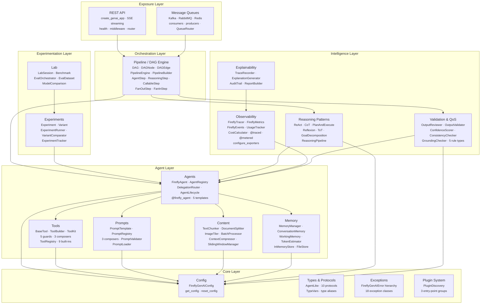

[](https://github.com/fireflyframework/fireflyframework-genai/actions/workflows/ci.yml)

```
  _____.__ _____.__
_/ ____\__|______ _____/ ____\ | ___.__.
\ __\| \_ __ \_/ __ \ __\| |< | |
 | | | || | \/\ ___/| | | |_\___ |
 |__| |__||__| \___ >__| |____/ ____|
                       \/ \/
  _____ __ /\
_/ ____\___________ _____ ______ _ _____________| | __ \ \
\ __\\_ __ \__ \ / \_/ __ \ \/ \/ / _ \_ __ \ |/ / \ \
 | | | | \// __ \| Y Y \ ___/\ ( <_> ) | \/ < \ \
 |__| |__| (____ /__|_| /\___ >\/\_/ \____/|__| |__|_ \ \ \
                   \/ \/ \/ \/ \/
  ________ _____ .__
 / _____/ ____ ____ / _ \ |__|
/ \ ____/ __ \ / \ / /_\ \| |
\ \_\ \ ___/| | \/ | \ |
 \______ /\___ >___| /\____|__ /__|
        \/ \/ \/ \/
```

# fireflyframework-genai
**The production-grade GenAI metaframework built on [Pydantic AI](https://ai.pydantic.dev/).**

[](https://www.python.org/downloads/)
[](LICENSE)
[]()
[](https://docs.astral.sh/ruff/)

Copyright 2026 Firefly Software Solutions Inc. Licensed under the Apache License 2.0.

---

## Table of Contents

- [Why fireflyframework-genai?](#why-fireflyframework-genai)
- [Key Principles](#key-principles)
- [Architecture at a Glance](#architecture-at-a-glance)
- [Feature Highlights](#feature-highlights)
- [Requirements](#requirements)
- [Installation](#installation)
  - [One-Line Installer (Recommended)](#one-line-installer-recommended)
  - [Install from Source](#install-from-source)
  - [Optional Extras](#optional-extras)
  - [Verify Installation](#verify-installation)
  - [Uninstall](#uninstall)
- [5-Minute Quick Start](#5-minute-quick-start)
- [Using in Jupyter Notebooks](#using-in-jupyter-notebooks)
- [Learn the Framework](#learn-the-framework)
- [Development](#development)
- [Contributing](#contributing)
- [License](#license)

---

## Why fireflyframework-genai?

[Pydantic AI](https://ai.pydantic.dev/) provides an excellent foundation: type-safe,
model-agnostic agents with structured output. But a production GenAI system demands
far more than a single agent call. You need to orchestrate multi-step reasoning,
validate and retry LLM outputs against schemas, manage conversation memory across
turns, observe every call with traces and metrics, run A/B experiments to compare
models, and expose the whole thing over REST or message queues — all without coupling
your domain logic to infrastructure concerns.

**fireflyframework-genai is the production framework built on top of Pydantic AI.**
It extends the engine with six composable layers — from core configuration through
agent management, intelligent reasoning, experimentation, pipeline orchestration,
and service exposure — so that every concern has a dedicated, protocol-driven module.
You write your business logic; the framework provides the architecture.

**What "metaframework" means in practice:**

- You keep Pydantic AI's familiar `Agent`, `Tool`, and `RunContext` APIs unchanged.
- The framework wraps them with lifecycle hooks, registries, delegation routers,
  memory managers, reasoning patterns, validation loops, DAG pipelines, and exposure
  endpoints — all optional, all composable, all swappable through Python protocols.
- No vendor lock-in: switch models, swap memory backends, or replace the REST layer
  without touching your agent code.

---

## Key Principles

1. **Protocol-driven contracts** — Every extension point is defined as a
   `@runtime_checkable` `Protocol` or abstract base class. The framework ships eleven
   protocols (`AgentLike`, `ToolProtocol`, `GuardProtocol`, `ReasoningPattern`,
   `DelegationStrategy`, `StepExecutor`, `CompressionStrategy`, `MemoryStore`,
   `ValidationRule`, `Chunker`, `QueueConsumer` / `QueueProducer`) so you can swap or
   extend any component without modifying framework internals.

2. **Convention over configuration** — Sensible defaults everywhere.
   `FireflyGenAIConfig` is a Pydantic Settings singleton that reads from environment
   variables prefixed with `FIREFLY_GENAI_` and `.env` files. One config object
   governs model defaults, retry counts, token limits, observability endpoints,
   memory backends, and validation thresholds — override only what you need.

3. **Layered composition** — Six layers with strict top-down dependency flow:
   **Core → Agent → Intelligence → Experimentation → Orchestration → Exposure**.
   Higher layers depend on lower layers but never the reverse, keeping the
   dependency graph acyclic and each module independently testable.

4. **Optional dependencies** — Heavy libraries (`fastapi`, `aiokafka`, `aio-pika`,
   `redis`) are declared as pip extras (`[rest]`, `[kafka]`, `[rabbitmq]`, `[redis]`,
   `[all]`). The core framework imports them lazily inside factory functions so that
   you install only what your deployment requires.

---

## Architecture at a Glance



### Protocol Hierarchy

Every extension point is a `@runtime_checkable` protocol. Implement the protocol to
create your own components; the framework discovers them via duck typing.

```mermaid
classDiagram
    class AgentLike {
        <<Protocol>>
        +run(prompt, **kwargs) Any
    }
    class ToolProtocol {
        <<Protocol>>
        +name: str
        +description: str
        +execute(**kwargs) Any
    }
    class GuardProtocol {
        <<Protocol>>
        +check(tool_name, kwargs) GuardResult
    }
    class ReasoningPattern {
        <<Protocol>>
        +execute(agent, input, **kwargs) ReasoningResult
    }
    class StepExecutor {
        <<Protocol>>
        +execute(context, inputs) Any
    }
    class DelegationStrategy {
        <<Protocol>>
        +select(agents, prompt, **kwargs) Any
    }
    class CompressionStrategy {
        <<Protocol>>
        +compress(text, max_tokens) str
    }
    class MemoryStore {
        <<Protocol>>
        +save(namespace, entry)
        +load(namespace) list
        +delete(namespace, entry_id)
        +clear(namespace)
    }
    class ValidationRule {
        <<Protocol>>
        +name: str
        +validate(value) ValidationRuleResult
    }
    class QueueConsumer {
        <<Protocol>>
        +start()
        +stop()
    }
    class QueueProducer {
        <<Protocol>>
        +publish(message)
    }

    AgentLike <|.. FireflyAgent
    AgentLike <|.. pydantic_ai.Agent
    ToolProtocol <|.. BaseTool
    ToolProtocol <|.. SequentialComposer
    ToolProtocol <|.. FallbackComposer
    ToolProtocol <|.. ConditionalComposer
    GuardProtocol <|.. ValidationGuard
    GuardProtocol <|.. RateLimitGuard
    GuardProtocol <|.. ApprovalGuard
    GuardProtocol <|.. SandboxGuard
    GuardProtocol <|.. CompositeGuard
    ReasoningPattern <|.. AbstractReasoningPattern
    ReasoningPattern <|.. ReasoningPipeline
    StepExecutor <|.. AgentStep
    StepExecutor <|.. ReasoningStep
    StepExecutor <|.. CallableStep
    StepExecutor <|.. FanOutStep
    StepExecutor <|.. FanInStep
    DelegationStrategy <|.. RoundRobinStrategy
    DelegationStrategy <|.. CapabilityStrategy
    CompressionStrategy <|.. TruncationStrategy
    CompressionStrategy <|.. SummarizationStrategy
    CompressionStrategy <|.. MapReduceStrategy
    MemoryStore <|.. InMemoryStore
    MemoryStore <|.. FileStore
    ValidationRule <|.. RegexRule
    ValidationRule <|.. FormatRule
    ValidationRule <|.. RangeRule
    ValidationRule <|.. EnumRule
    ValidationRule <|.. CustomRule
    QueueConsumer <|.. KafkaAgentConsumer
    QueueConsumer <|.. RabbitMQAgentConsumer
    QueueConsumer <|.. RedisAgentConsumer
    QueueProducer <|.. KafkaAgentProducer
    QueueProducer <|.. RabbitMQAgentProducer
    QueueProducer <|.. RedisAgentProducer
```



---

## Feature Highlights

- **Agents** — `FireflyAgent` wraps `pydantic_ai.Agent` with metadata, lifecycle hooks,
  and automatic registration. `AgentRegistry` provides singleton name-based discovery.
  `DelegationRouter` routes prompts across agent pools via `RoundRobinStrategy` or
  `CapabilityStrategy`. The `@firefly_agent` decorator defines an agent in one
  statement. Five template factories (`create_summarizer_agent`,
  `create_classifier_agent`, `create_extractor_agent`, `create_conversational_agent`,
  `create_router_agent`) cover common use cases out of the box.

- **Tools** — `ToolProtocol` (duck-typed) and `BaseTool` (inheritance) let you choose
  your extensibility style. `ToolBuilder` provides a fluent API for building tools
  without subclassing. Five guard types (`ValidationGuard`, `RateLimitGuard`,
  `ApprovalGuard`, `SandboxGuard`, `CompositeGuard`) intercept calls before execution.
  Three composition patterns (`SequentialComposer`, `FallbackComposer`,
  `ConditionalComposer`) build higher-order tools. `ToolKit` groups tools for
  bulk registration. Nine built-in tools (calculator, datetime, filesystem, HTTP,
  JSON, search, shell, text, database) are ready to attach to any agent.

- **Prompts** — `PromptTemplate` renders Jinja2 templates with variable validation
  and token estimation. `PromptRegistry` maps names to versioned templates.
  Three composers (`SequentialComposer`, `ConditionalComposer`, `MergeComposer`)
  combine templates at render time. `PromptValidator` enforces token limits and
  required sections. `PromptLoader` loads templates from strings, files, or
  entire directories.

- **Reasoning** — Six pluggable patterns implement `AbstractReasoningPattern`'s
  template-method loop (`_reason` → `_act` → `_observe` → `_should_continue`):
  **ReAct** (observe-think-act), **Chain of Thought** (step-by-step),
  **Plan-and-Execute** (goal → plan → steps with optional replanning),
  **Reflexion** (execute → critique → retry), **Tree of Thoughts** (branch →
  evaluate → select), and **Goal Decomposition** (goal → phases → tasks).
  All produce structured `ReasoningResult` with `ReasoningTrace`. Prompts are
  slot-overridable. `OutputReviewer` can validate final outputs. `ReasoningPipeline`
  chains patterns sequentially.

- **Content** — `TextChunker` splits by tokens, sentences, or paragraphs with
  configurable overlap. `DocumentSplitter` detects page breaks and section
  separators. `ImageTiler` computes tile coordinates for VLM processing.
  `BatchProcessor` runs chunks through an agent concurrently with a semaphore.
  `ContextCompressor` delegates to pluggable strategies (`TruncationStrategy`,
  `SummarizationStrategy`, `MapReduceStrategy`). `SlidingWindowManager` maintains
  a rolling token-budgeted context window.

- **Memory** — `ConversationMemory` stores per-conversation turn history with
  token-budget enforcement (newest-first FIFO eviction). `WorkingMemory` provides
  a scoped key-value scratchpad backed by `MemoryStore` (`InMemoryStore` or
  `FileStore`). `MemoryManager` composes both behind a unified API and supports
  `fork()` for isolating working memory in delegated agents or pipeline branches
  while sharing conversation context.

- **Validation** — Five composable rules (`RegexRule`, `FormatRule`, `RangeRule`,
  `EnumRule`, `CustomRule`) feed into `FieldValidator` and `OutputValidator`.
  `OutputReviewer` wraps agent calls with parse-then-validate retry logic: on
  failure it builds a feedback prompt and retries up to N times. QoS guards
  (`ConfidenceScorer`, `ConsistencyChecker`, `GroundingChecker`) detect
  hallucinations and low-quality extractions before they propagate downstream.

- **Pipeline** — `DAG` holds `DAGNode` and `DAGEdge` objects with cycle detection
  and topological sort. `PipelineEngine` executes nodes level-by-level via
  `asyncio.gather` for maximum concurrency, with per-node condition gates, retries,
  and timeouts. `PipelineBuilder` offers a fluent API (`add_node` / `add_edge` /
  `chain`). Five step types (`AgentStep`, `ReasoningStep`, `CallableStep`,
  `FanOutStep`, `FanInStep`) adapt agents, patterns, and functions to DAG nodes.

- **Observability** — `FireflyTracer` creates OpenTelemetry spans scoped to agents,
  tools, and reasoning steps. `FireflyMetrics` records tokens (total, prompt,
  completion), latency, cost, errors, and reasoning depth via the OTel metrics API.
  `FireflyEvents` emits structured log records. `@traced` and `@metered` decorators
  instrument any function with one line. `configure_exporters` sets up OTLP or
  console exporters. `UsageTracker` automatically records token usage, cost
  estimates, and latency for every agent run, reasoning step, and pipeline
  execution. `CostCalculator` supports a built-in static price table and optional
  `genai-prices` integration. Budget enforcement logs warnings when configurable
  thresholds are exceeded.

- **Explainability** — `TraceRecorder` captures every LLM call, tool invocation,
  and reasoning step as `DecisionRecord` objects. `ExplanationGenerator` turns
  records into human-readable narratives. `AuditTrail` provides an append-only,
  immutable log with JSON export for compliance. `ReportBuilder` produces
  Markdown and JSON reports with statistics.

- **Experiments** — `Experiment` defines variants with model, temperature, and
  prompt overrides. `ExperimentRunner` executes all variants against a dataset.
  `ExperimentTracker` persists results with optional JSON export.
  `VariantComparator` computes latency, output length, and comparison summaries.

- **Lab** — `LabSession` manages interactive agent sessions with history.
  `Benchmark` runs agents against standardised inputs and reports p95 latency.
  `EvalOrchestrator` scores agent outputs with pluggable `Scorer` functions.
  `EvalDataset` loads/saves test cases from JSON. `ModelComparison` runs the
  same prompts across multiple agents for side-by-side analysis.

- **Exposure** — `create_genai_app()` produces a FastAPI application with
  auto-generated `POST /agents/{name}/run` endpoints, SSE streaming via
  `sse_stream`, health/readiness/liveness checks, CORS and request-ID middleware,
  and multimodal input support. Queue consumers (`KafkaAgentConsumer`,
  `RabbitMQAgentConsumer`, `RedisAgentConsumer`) route messages to agents.
  Queue producers (`KafkaAgentProducer`, `RabbitMQAgentProducer`,
  `RedisAgentProducer`) publish results back. `QueueRouter` provides
  pattern-based message routing across agents.

---

## Requirements

**Runtime:**

- **Python 3.13** or later
- [Git](https://git-scm.com/) for cloning the repository
- [UV](https://docs.astral.sh/uv/) package manager (recommended) or pip

**Core dependencies** (installed automatically):

- [pydantic-ai](https://ai.pydantic.dev/) `>=1.56.0` — Agent engine (model calls, tool dispatch, streaming)
- [pydantic](https://docs.pydantic.dev/) `>=2.10.0` — Data validation and settings
- [pydantic-settings](https://docs.pydantic.dev/latest/concepts/pydantic_settings/) `>=2.7.0` — Environment-based configuration
- [Jinja2](https://jinja.palletsprojects.com/) `>=3.1.0` — Prompt template engine
- [OpenTelemetry API](https://opentelemetry.io/docs/languages/python/) `>=1.29.0` — Tracing and metrics
- [OpenTelemetry SDK](https://opentelemetry.io/docs/languages/python/) `>=1.29.0` — Telemetry exporters

**Optional dependencies** (installed via extras):

- `[rest]` — [FastAPI](https://fastapi.tiangolo.com/) `>=0.115.0`, [Uvicorn](https://www.uvicorn.org/) `>=0.34.0`, [sse-starlette](https://github.com/sysid/sse-starlette) `>=2.0.0`
- `[kafka]` — [aiokafka](https://aiokafka.readthedocs.io/) `>=0.12.0`
- `[rabbitmq]` — [aio-pika](https://aio-pika.readthedocs.io/) `>=9.5.0`
- `[redis]` — [redis-py](https://redis-py.readthedocs.io/) `>=5.2.0`
- `[costs]` — [genai-prices](https://pypi.org/project/genai-prices/) for up-to-date LLM pricing data
- `[queues]` — All queue backends (Kafka + RabbitMQ + Redis)
- `[all]` — Everything (REST + all queues + costs + security + HTTP)

**LLM provider keys** (at least one):

- `OPENAI_API_KEY` for OpenAI models
- `ANTHROPIC_API_KEY` for Anthropic models
- `GEMINI_API_KEY` for Google Gemini models
- `GROQ_API_KEY` for Groq models
- Or any [Pydantic AI-supported provider](https://ai.pydantic.dev/models/)

---

## Installation

### One-Line Installer (Recommended)

The interactive installer detects your platform, checks Python and UV, lets you
choose extras, and installs everything with progress indicators and verification.

**macOS / Linux:**

```bash
curl -fsSL https://raw.githubusercontent.com/fireflyframework/fireflyframework-genai/main/install.sh | bash
```

**Windows (PowerShell):**

```powershell
irm https://raw.githubusercontent.com/fireflyframework/fireflyframework-genai/main/install.ps1 | iex
```

Both installers support non-interactive mode for CI/CD:

```bash
# macOS / Linux — install with all extras, no prompts
curl -fsSL https://raw.githubusercontent.com/fireflyframework/fireflyframework-genai/main/install.sh | bash
```

```powershell
# Windows — install with all extras, no prompts
.\install.ps1 -NonInteractive -Extras all
```

### Install from Source

```bash
git clone https://github.com/fireflyframework/fireflyframework-genai.git
cd fireflyframework-genai
uv sync --all-extras # or: pip install -e ".[all]"
```

### Optional Extras

| Extra | What it adds | When you need it |
|---|---|---|
| `rest` | FastAPI, Uvicorn, SSE | Exposing agents as REST endpoints |
| `kafka` | aiokafka | Consuming/producing via Apache Kafka |
| `rabbitmq` | aio-pika | Consuming/producing via RabbitMQ |
| `redis` | redis-py | Consuming/producing via Redis Pub/Sub |
| `queues` | All of the above | Any message queue integration |
| `all` | REST + all queues + costs | Full deployment with all integrations |

### Verify Installation

```bash
python -c "import fireflyframework_genai; print(fireflyframework_genai.__version__)"
# 26.01.01
```

### Uninstall

**macOS / Linux:**

```bash
curl -fsSL https://raw.githubusercontent.com/fireflyframework/fireflyframework-genai/main/uninstall.sh | bash
```

**Windows (PowerShell):**

```powershell
irm https://raw.githubusercontent.com/fireflyframework/fireflyframework-genai/main/uninstall.ps1 | iex
```

Or manually remove the cloned directory and its virtual environment.

---

## 5-Minute Quick Start

### 1. Configure

Create a `.env` file (or set environment variables):

```bash
# Provider API key (Pydantic AI reads these automatically)
OPENAI_API_KEY=sk-...
# ANTHROPIC_API_KEY=sk-ant-...
# GEMINI_API_KEY=...
# GROQ_API_KEY=gsk_...

# Framework settings
FIREFLY_GENAI_DEFAULT_MODEL=openai:gpt-4o
FIREFLY_GENAI_DEFAULT_TEMPERATURE=0.3
```

The model string format is `"provider:model_name"` — e.g. `"openai:gpt-4o"`,
`"anthropic:claude-sonnet-4-20250514"`, `"google:gemini-2.0-flash"`. Pydantic AI resolves
the matching API key from environment variables automatically. For programmatic credential
management (Azure, Bedrock, custom endpoints), pass a Pydantic AI `Model` object directly
to `FireflyAgent(model=...)` — see the [tutorial](docs/tutorial.md#model-providers--authentication).

### 2. Define an Agent

```python
from fireflyframework_genai.agents import firefly_agent

@firefly_agent(name="assistant", model="openai:gpt-4o")
def assistant_instructions(ctx):
    return "You are a helpful conversational assistant."
```

### 3. Register a Tool

```python
from fireflyframework_genai.tools import firefly_tool

@firefly_tool(name="lookup", description="Look up a term")
async def lookup(query: str) -> str:
    return f"Result for {query}"
```

### 4. Add Memory for Multi-Turn Conversations

```python
from fireflyframework_genai.agents import FireflyAgent
from fireflyframework_genai.memory import MemoryManager

memory = MemoryManager(max_conversation_tokens=32_000)
agent = FireflyAgent(name="bot", model="openai:gpt-4o", memory=memory)

cid = memory.new_conversation()
result = await agent.run("Hello!", conversation_id=cid)
result = await agent.run("What did I just say?", conversation_id=cid)
```

### 5. Apply a Reasoning Pattern

```python
from fireflyframework_genai.reasoning import ReActPattern

react = ReActPattern(max_steps=5)
result = await react.execute(agent, "What is the weather in London?")
print(result.output)
```

### 6. Validate Output

```python
from pydantic import BaseModel
from fireflyframework_genai.validation import OutputReviewer

class Answer(BaseModel):
    answer: str
    confidence: float

reviewer = OutputReviewer(output_type=Answer, max_retries=2)
result = await reviewer.review(agent, "What is 2+2?")
print(result.output) # Answer(answer="4", confidence=0.99)
```

### 7. Wire a Pipeline

```python
from fireflyframework_genai.pipeline.builder import PipelineBuilder
from fireflyframework_genai.pipeline.steps import AgentStep, CallableStep

pipeline = (
    PipelineBuilder("my-pipeline")
    .add_node("classify", AgentStep(classifier_agent))
    .add_node("extract", AgentStep(extractor_agent))
    .add_node("validate", CallableStep(validate_fn))
    .chain("classify", "extract", "validate")
    .build()
)
result = await pipeline.run(inputs="Process this document")
```

### 8. Expose via REST

```python
from fireflyframework_genai.exposure.rest import create_genai_app

app = create_genai_app(title="My GenAI Service")
# uvicorn myapp:app --reload
```

### 9. Expose via Queues (Consumer)

```python
from fireflyframework_genai.exposure.queues.kafka import KafkaAgentConsumer

consumer = KafkaAgentConsumer("assistant", topic="requests", bootstrap_servers="localhost:9092")
await consumer.start()
```

### 10. Publish via Queues (Producer)

```python
from fireflyframework_genai.exposure.queues.kafka import KafkaAgentProducer

producer = KafkaAgentProducer(topic="results", bootstrap_servers="localhost:9092")
await producer.publish({"agent": "assistant", "output": "Done processing."})
await producer.close()
```

## Using in Jupyter Notebooks

firefly-genai works seamlessly in Jupyter notebooks and JupyterLab.
Since the framework is async-first, use `await` directly in notebook cells
(Jupyter provides a running event loop automatically).

### Setup

```bash
# From your clone directory
cd fireflyframework-genai
source .venv/bin/activate # activate the venv created by the installer
pip install ipykernel # install Jupyter kernel support
python -m ipykernel install --user --name fireflygenai --display-name "Firefly GenAI"
jupyter lab # or: jupyter notebook
```

Then select the **Firefly GenAI** kernel when creating a new notebook.

### Example Notebook

```python
# Cell 1 — configure
import os
os.environ["OPENAI_API_KEY"] = "sk-..." # or set in .env
os.environ["FIREFLY_GENAI_DEFAULT_MODEL"] = "openai:gpt-4o"
```

```python
# Cell 2 — create an agent
from fireflyframework_genai.agents import FireflyAgent

agent = FireflyAgent(name="notebook-bot", model="openai:gpt-4o")
result = await agent.run("Explain quantum entanglement in two sentences.")
print(result.output)
```

```python
# Cell 3 — use memory for multi-turn conversations
from fireflyframework_genai.memory import MemoryManager

memory = MemoryManager(max_conversation_tokens=32_000)
agent_with_mem = FireflyAgent(name="chat", model="openai:gpt-4o", memory=memory)

cid = memory.new_conversation()
result = await agent_with_mem.run("My name is Alice.", conversation_id=cid)
print(result.output)

result = await agent_with_mem.run("What is my name?", conversation_id=cid)
print(result.output) # Alice
```

```python
# Cell 4 — reasoning patterns
from fireflyframework_genai.reasoning import ReActPattern

react = ReActPattern(max_steps=5)
result = await react.execute(agent, "What are the top 3 uses of Python in 2026?")
print(result.output)
```

```python
# Cell 5 — structured output with validation
from pydantic import BaseModel
from fireflyframework_genai.validation import OutputReviewer

class Summary(BaseModel):
    title: str
    bullet_points: list[str]
    confidence: float

reviewer = OutputReviewer(output_type=Summary, max_retries=2)
result = await reviewer.review(agent, "Summarize the benefits of async Python.")
result.output # displays the structured Summary object in the notebook
```

> **Tip:** You do not need `asyncio.run()` or `nest_asyncio` in Jupyter — `await`
> works at the top level of any cell because Jupyter runs its own event loop.

---

## Learn the Framework

### The Complete Tutorial ("The Bible")

**[docs/tutorial.md](docs/tutorial.md)** is a 20-chapter, hands-on guide that teaches
every concept from zero to expert through a real-world **Intelligent Document Processing**
pipeline. Start here if you want to learn the framework thoroughly.

### Use Case: IDP Pipeline

**[docs/use-case-idp.md](docs/use-case-idp.md)** is a focused walkthrough of building a
7-phase IDP pipeline that ingests, splits, classifies, extracts, validates, assembles,
and explains data from corporate documents — using agents, reasoning, document splitting,
content processing, validation, explainability, pipelines, and REST exposure.

### Module Reference

Detailed guides for each module:

- [Architecture](docs/architecture.md) — Design principles and layer diagram
- [Agents](docs/agents.md) — Lifecycle, registry, delegation, decorators
- [Template Agents](docs/templates.md) — Summarizer, classifier, extractor, conversational, router
- [Tools](docs/tools.md) — Protocol, builder, guards, composition, built-ins
- [Prompts](docs/prompts.md) — Templates, versioning, composition, validation
- [Reasoning Patterns](docs/reasoning.md) — 6 patterns, structured outputs, custom patterns
- [Content](docs/content.md) — Chunking, compression, batch processing
- [Memory](docs/memory.md) — Conversation history, working memory, storage backends
- [Validation](docs/validation.md) — Rules, QoS guards, output reviewer
- [Pipeline](docs/pipeline.md) — DAG orchestrator, parallel execution, retries
- [Observability](docs/observability.md) — Tracing, metrics, events
- [Explainability](docs/explainability.md) — Decision recording, audit trails, reports
- [Experiments](docs/experiments.md) — A/B testing, variant comparison
- [Lab](docs/lab.md) — Benchmarks, datasets, evaluators
- [Exposure REST](docs/exposure-rest.md) — FastAPI integration, SSE streaming
- [Exposure Queues](docs/exposure-queues.md) — Kafka, RabbitMQ, Redis integration
---

## Development

```bash
git clone https://github.com/fireflyframework/fireflyframework-genai.git
cd fireflyframework-genai
uv sync --all-extras
```

```bash
uv run pytest # Run 367+ tests
uv run ruff check src/ tests/ # Lint
uv run pyright src/ # Type check
```

**Dev dependencies** (installed with `uv sync`):
[pytest](https://docs.pytest.org/) `>=8.3.0`,
[pytest-asyncio](https://pytest-asyncio.readthedocs.io/) `>=0.24.0`,
[pytest-cov](https://pytest-cov.readthedocs.io/) `>=6.0.0`,
[ruff](https://docs.astral.sh/ruff/) `>=0.9.0`,
[pyright](https://microsoft.github.io/pyright/) `>=1.1.0`,
[httpx](https://www.python-httpx.org/) `>=0.28.0`.

## Contributing

See [CONTRIBUTING.md](CONTRIBUTING.md) for guidelines.

## Changelog

See [CHANGELOG.md](CHANGELOG.md) for notable changes.

## License

Apache License 2.0. See [LICENSE](LICENSE) for the full text.
