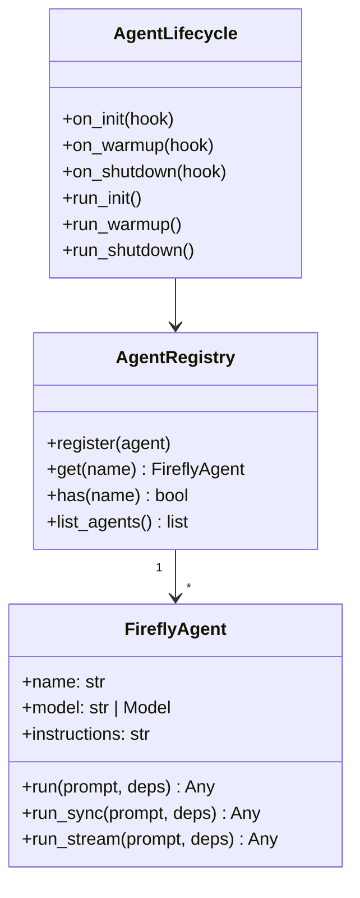
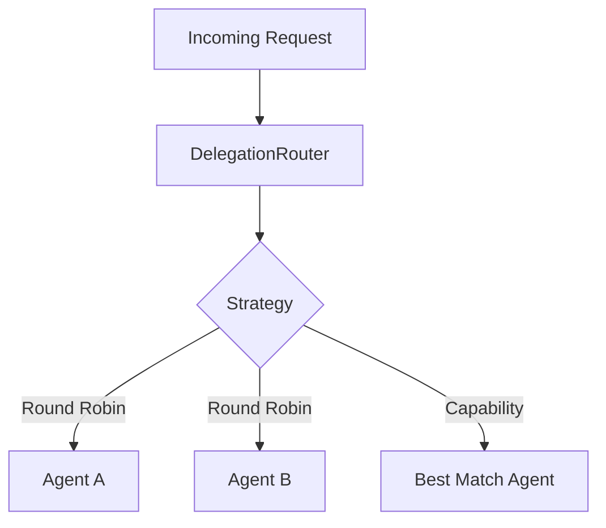
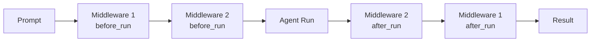
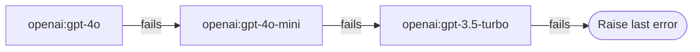

# Agents Guide

Copyright 2026 Firefly Software Solutions Inc. Licensed under the Apache License 2.0.

The Agents module wraps Pydantic AI's `Agent` class and adds lifecycle management,
a global registry, multi-agent delegation, execution context, and a decorator API.

---

## Concepts

An agent in fireflyframework-genai is a named, configured wrapper around a Pydantic AI
agent. The framework manages its lifecycle (creation, startup, invocation, shutdown)
and makes it discoverable through a central registry.



---

## Creating an Agent

### Using the Decorator

The simplest way to create and register an agent is with the `@firefly_agent` decorator:

```python
from fireflyframework_genai.agents import firefly_agent

@firefly_agent(name="writer", model="openai:gpt-4o")
def writer_instructions(ctx):
    return "You are a writer."
```

The decorator creates a `FireflyAgent`, registers the decorated function as its
dynamic instructions provider, and registers the agent in the global `AgentRegistry`.

### Using the Class Directly

```python
from fireflyframework_genai.agents import FireflyAgent
from fireflyframework_genai.agents.registry import agent_registry

agent = FireflyAgent(name="analyst", model="openai:gpt-4o")
agent_registry.register(agent)
```

### Using a Pydantic AI Model Object

When you need explicit credential management (Azure, Bedrock, self-hosted, or vault-based
keys), pass a pre-configured Pydantic AI `Model` instance instead of a string:

```python
from pydantic_ai.models.openai import OpenAIChatModel
from pydantic_ai.providers.openai import OpenAIProvider
from fireflyframework_genai.agents import FireflyAgent

model = OpenAIChatModel("gpt-4o", provider=OpenAIProvider(api_key="sk-..."))
agent = FireflyAgent(name="analyst", model=model)
```

This also works with the `@firefly_agent` decorator and all template agents. See the
[tutorial](tutorial.md#model-providers--authentication) for full provider coverage
including Azure OpenAI, Anthropic, Google, and OpenAI-compatible endpoints.

---

## Tool Auto-Conversion

`FireflyAgent` automatically converts framework tool types when passed in the `tools`
parameter:

- **`BaseTool`** instances are wrapped into `pydantic_ai.Tool` objects.
- **`ToolKit`** instances are expanded into their individual `pydantic_ai.Tool` objects.
- **Plain async functions** and **`pydantic_ai.Tool`** objects pass through unchanged.

This means you can mix and match all tool types freely:

```python
from fireflyframework_genai.agents import FireflyAgent
from fireflyframework_genai.tools.builtins import DateTimeTool, CalculatorTool

async def custom_lookup(query: str) -> str:
    return f"Result for {query}"

agent = FireflyAgent(
    name="smart-assistant",
    model="openai:gpt-4o",
    tools=[DateTimeTool(), CalculatorTool(), custom_lookup],
)
```

---

## Agent Registry

The `AgentRegistry` is a singleton that maps agent names to `FireflyAgent` instances.
Any part of the framework -- REST endpoints, queue consumers, delegation routers --
can look up an agent by name.

```python
from fireflyframework_genai.agents.registry import agent_registry

agent = agent_registry.get("writer")
result = await agent.run("Write a haiku about Python.")
```

---

## Lifecycle Management

`AgentLifecycle` lets you attach init, warmup, and shutdown hooks to agents. This is
useful for initialising resources (database connections, caches) before the first
invocation and cleaning up afterwards.

```python
from fireflyframework_genai.agents.lifecycle import AgentLifecycle

lifecycle = AgentLifecycle()
lifecycle.on_init(lambda: print("Initialising"))
lifecycle.on_warmup(lambda: print("Warming up"))
lifecycle.on_shutdown(lambda: print("Shutting down"))
await lifecycle.run_init()
await lifecycle.run_warmup()
```

---

## Multi-Agent Delegation

When a task requires multiple specialised agents, the delegation system routes work
to the right agent based on a configurable strategy.



### Round Robin

Distributes requests evenly across a pool of agents:

```python
from fireflyframework_genai.agents.delegation import RoundRobinStrategy, DelegationRouter

strategy = RoundRobinStrategy()
router = DelegationRouter([agent_a, agent_b, agent_c], strategy)
result = await router.route("Summarise this document.")
```

### Capability-Based

Selects the first agent whose tags include a required capability:

```python
from fireflyframework_genai.agents.delegation import CapabilityStrategy, DelegationRouter

strategy = CapabilityStrategy(required_tag="translation")
router = DelegationRouter([agent_a, agent_b], strategy)
result = await router.route("Translate this text to French.")
```

### Content-Based (LLM Routing)

Uses a lightweight LLM call to analyse the prompt and pick the best-suited
agent from the pool. Ideal when agents have overlapping capabilities and
simple tag matching is insufficient:

```python
from fireflyframework_genai.agents.delegation import ContentBasedStrategy, DelegationRouter

strategy = ContentBasedStrategy(model="openai:gpt-4o-mini")
router = DelegationRouter([agent_a, agent_b, agent_c], strategy)
result = await router.route("Translate this legal document to French.")
```

The strategy builds a short description of each agent (from its `name` and
`description` attributes) and asks the routing model to pick the most
suitable one.

### Cost-Aware

Selects the agent backed by the cheapest model. Agents are ranked by
approximate cost tiers derived from their `model_name` attribute:

```python
from fireflyframework_genai.agents.delegation import CostAwareStrategy, DelegationRouter

strategy = CostAwareStrategy()
router = DelegationRouter([expensive_agent, cheap_agent], strategy)
result = await router.route("Simple classification task.")
# Selects cheap_agent (lower cost tier)
```

Unknown models are assigned a middle-tier cost.

---

## Memory

Attach a `MemoryManager` to an agent to enable multi-turn conversation history and a working-memory scratchpad. When you pass `conversation_id` to `run()`/`run_sync()`/`run_stream()`, the agent automatically loads and persists `message_history`.

```python
from fireflyframework_genai.memory import MemoryManager

memory = MemoryManager(max_conversation_tokens=32_000)
agent = FireflyAgent(name="assistant", model="openai:gpt-4o", memory=memory)

cid = memory.new_conversation()
result = await agent.run("Hello!", conversation_id=cid)
result = await agent.run("What did I say?", conversation_id=cid)
```

## Reasoning Patterns

Use `run_with_reasoning()` to execute a reasoning pattern through the agent.
When memory is attached, it is automatically forwarded to the pattern and the
final output is persisted as a conversation turn.

```python
from fireflyframework_genai.agents import FireflyAgent
from fireflyframework_genai.memory import MemoryManager
from fireflyframework_genai.reasoning import ReActPattern

memory = MemoryManager()
agent = FireflyAgent(name="thinker", model="openai:gpt-4o", memory=memory)
cid = memory.new_conversation()

result = await agent.run_with_reasoning(
    ReActPattern(max_steps=5),
    "What is the population of Tokyo?",
    conversation_id=cid,
)
print(result.output)
```

See the [Reasoning Patterns Guide](reasoning.md) for all available patterns,
structured output models, and prompt customisation.

---

## Template Agents

The framework ships with five pre-built template agents as factory functions:

- **`create_summarizer_agent`** -- Configurable text summarisation.
- **`create_classifier_agent`** -- Categorise text into user-defined labels.
- **`create_extractor_agent`** -- Extract structured data into a Pydantic model.
- **`create_conversational_agent`** -- Multi-turn assistant with memory support.
- **`create_router_agent`** -- Intent-based routing to child agents.

See the [Template Agents Guide](templates.md) for full documentation and examples.

```python
from fireflyframework_genai.agents.templates import create_summarizer_agent

agent = create_summarizer_agent(model="openai:gpt-4o", max_length="short")
result = await agent.run("Summarize this document: ...")
```

---

## Logging & Debugging

Every `FireflyAgent` automatically includes a `LoggingMiddleware` instance that
emits structured log lines at the start and end of every `run()`, `run_sync()`,
`run_stream()`, and `run_with_reasoning()` call — no configuration needed beyond
enabling the framework logger.

### Enabling Logging

```python
from fireflyframework_genai import configure_logging

configure_logging("INFO") # agent calls, reasoning progress, timing
configure_logging("DEBUG") # + memory injection, turn persistence, LLM timing
```

Or use the shortcut:

```python
from fireflyframework_genai import enable_debug

enable_debug()
```

### Format Styles

`configure_logging` supports three output formats via the `format_style` parameter:

- **`"text"`** (default) — standard `logging.Formatter` output.
- **`"json"`** — single-line JSON objects via `JsonFormatter` (for log aggregation).
- **`"colored"`** — ANSI-coloured terminal output via `ColoredFormatter`. Falls
  back to plain text automatically when the stream is not a TTY.

```python
# Coloured terminal output
configure_logging("INFO", format_style="colored")

# Structured JSON for production log pipelines
configure_logging("INFO", format_style="json")
```

The `ColoredFormatter` applies the following colour scheme:

- **Level names** — DEBUG dim, INFO green, WARNING yellow, ERROR red.
- **Symbols** — `▸` (entry) cyan, `✓` (success) green, `✗` (failure) red.
- **Agent name** (first word after a symbol) — bold cyan.
- **Timing values** (e.g. `123.4ms`) — yellow.
- **Token/cost brackets** (e.g. `[tokens=150, cost=$0.0023]`) — dim.

### What Gets Logged

At **INFO** level (from `LoggingMiddleware`):

- **Entry**: `▸ agent-name.run(prompt=Hello, how...)` with a prompt preview.
- **Completion**: `✓ agent-name.run completed in 1234.5ms [tokens=150, cost=$0.0023]`.
- For `run_with_reasoning`, the completion line includes pattern and step count:
  `✓ agent-name.run_with_reasoning completed in 5000ms (pattern=ReAct, steps=3)`.

At **DEBUG** level:

- Memory injection and turn persistence with conversation ID.
- Usage tracking failures (when cost tracking is active).

The logging uses the `fireflyframework_genai` logger hierarchy, so it does
not affect application-level or third-party loggers.

---

## Usage Tracking

When cost tracking is enabled (the default), `FireflyAgent.run()` and `run_sync()`
automatically extract token usage from Pydantic AI results, compute estimated cost
via the configured `CostCalculator`, and feed a `UsageRecord` to the global
`default_usage_tracker`. This happens transparently — no code changes are needed.

```python
from fireflyframework_genai.observability import default_usage_tracker

# After running agents, inspect usage
summary = default_usage_tracker.get_summary()
print(f"Total tokens: {summary.total_tokens}, Cost: ${summary.total_cost_usd:.4f}")

# Filter by agent name
agent_summary = default_usage_tracker.get_summary_for_agent("my-agent")
```

Configure via environment variables:

```bash
FIREFLY_GENAI_COST_TRACKING_ENABLED=true # default
FIREFLY_GENAI_BUDGET_ALERT_THRESHOLD_USD=5.00
FIREFLY_GENAI_BUDGET_LIMIT_USD=10.00
FIREFLY_GENAI_COST_CALCULATOR=auto # auto | static | genai_prices
```

See the [Observability Guide](observability.md#usage-tracking) for full details.

---

## Middleware

`FireflyAgent` supports a pluggable middleware system for cross-cutting concerns
(validation, guardrails, cost tracking, retries) without modifying the agent
itself. Middleware hooks run **before** and **after** every execution path:
`run()`, `run_sync()`, `run_stream()`, and `run_with_reasoning()`.



### Defining Middleware

Implement the `AgentMiddleware` protocol — both hooks are optional:

```python
from fireflyframework_genai.agents.middleware import AgentMiddleware, MiddlewareContext
import time

class AuditMiddleware:
    async def before_run(self, context: MiddlewareContext) -> None:
        context.metadata["audit_start"] = time.monotonic()

    async def after_run(self, context: MiddlewareContext, result):
        elapsed = time.monotonic() - context.metadata["audit_start"]
        print(f"Agent {context.agent_name} took {elapsed*1000:.1f}ms")
        return result
```

### Attaching Middleware

Pass middleware at construction time, via the `@firefly_agent` decorator, or
add to the chain dynamically:

```python
from fireflyframework_genai.agents import FireflyAgent, firefly_agent

# At construction
agent = FireflyAgent(
    name="audited",
    model="openai:gpt-4o",
    middleware=[AuditMiddleware()],
)

# Via decorator
@firefly_agent("qa-bot", model="openai:gpt-4o", middleware=[AuditMiddleware()])
def qa_instructions(ctx):
    return "Answer questions accurately."

# Dynamically
agent.middleware.add(AuditMiddleware())
```

`MiddlewareContext` carries the agent name, prompt, deps, kwargs, and an
arbitrary `metadata` dict for sharing state between `before_run` and `after_run`.
`before_run` hooks execute in order; `after_run` hooks execute in **reverse**
order (LIFO).

### Built-in Middleware: RetryMiddleware

`RetryMiddleware` injects rate limit retry configuration into the middleware
context. It is auto-wired by default alongside `LoggingMiddleware`.

```python
from fireflyframework_genai.agents.builtin_middleware import RetryMiddleware

# Custom retry settings
agent = FireflyAgent(
    name="high-retry",
    model="openai:gpt-4o",
    middleware=[RetryMiddleware(max_retries=5, base_delay=2.0, max_delay=120.0)],
)
```

The retry is applied inside `FireflyAgent.run()` — see
[Automatic Rate Limit Retry](observability.md#automatic-rate-limit-retry) for
full details on how 429 errors are handled.

### Auto-Wired Default Middleware

By default, every `FireflyAgent` is auto-wired with `LoggingMiddleware` and
`RetryMiddleware` prepended to the middleware chain. This provides structured
logging and transparent rate limit retry for every execution path without any
explicit configuration.

Disable auto-wiring by passing `default_middleware=False`:

```python
agent = FireflyAgent(
    name="silent-agent",
    model="openai:gpt-4o",
    default_middleware=False,
)
```

If you provide your own `LoggingMiddleware` instance in the `middleware` list,
the framework will not add a second one (no duplication):

```python
from fireflyframework_genai.agents import FireflyAgent, LoggingMiddleware
import logging

# Custom logging level — only one LoggingMiddleware ends up in the chain
agent = FireflyAgent(
    name="verbose-agent",
    model="openai:gpt-4o",
    middleware=[LoggingMiddleware(level=logging.DEBUG, preview_length=120)],
)
```

### Built-in Middleware

The framework ships **ten** built-in middleware classes in
`agents.builtin_middleware` and `agents.prompt_cache`, `resilience.circuit_breaker`:

#### LoggingMiddleware

Structured logging for every agent run. Auto-wired by default (see above).
Emits an entry log line in `before_run` and a completion log line in `after_run`
with elapsed time, token count, and estimated cost.

Parameters:

- **`level`** — Logging level for entry/completion lines (default: `INFO`).
- **`preview_length`** — Maximum characters of prompt to include (default: 80).
- **`include_usage`** — Whether to extract token/cost data from the result (default: `True`).

```python
from fireflyframework_genai.agents import FireflyAgent, LoggingMiddleware
import logging

agent = FireflyAgent(
    name="debug-agent",
    model="openai:gpt-4o",
    middleware=[LoggingMiddleware(level=logging.DEBUG)],
)
```

#### PromptGuardMiddleware

Scans prompts for injection patterns before the agent runs. By default, unsafe
prompts raise a `PromptGuardError`. Set `sanitise=True` to redact suspicious
fragments instead of rejecting.

```python
from fireflyframework_genai.agents import FireflyAgent, PromptGuardMiddleware

agent = FireflyAgent(
    name="safe-agent",
    model="openai:gpt-4o",
    middleware=[PromptGuardMiddleware()], # reject mode
)

# Or sanitise mode — replaces matched patterns with [REDACTED]
agent = FireflyAgent(
    name="sanitised-agent",
    model="openai:gpt-4o",
    middleware=[PromptGuardMiddleware(sanitise=True)],
)
```

You can also supply a custom `PromptGuard` instance with extra patterns:

```python
from fireflyframework_genai.security import PromptGuard

guard = PromptGuard(custom_patterns=[r"(?i)drop\s+table"], sanitise=True)
agent = FireflyAgent(
    name="custom-guard",
    model="openai:gpt-4o",
    middleware=[PromptGuardMiddleware(guard=guard, sanitise=True)],
)
```

#### OutputGuardMiddleware

Scans LLM output for PII, secrets, harmful content, and custom patterns
**after** the agent runs. By default, unsafe outputs raise an
`OutputGuardError`. Set `sanitise=True` to redact matches instead.

```python
from fireflyframework_genai.agents.builtin_middleware import OutputGuardMiddleware

agent = FireflyAgent(
    name="safe-output",
    model="openai:gpt-4o",
    middleware=[OutputGuardMiddleware()], # reject mode
)

# Or sanitise mode — replaces matched content with [REDACTED]
agent = FireflyAgent(
    name="redacted-output",
    model="openai:gpt-4o",
    middleware=[OutputGuardMiddleware(sanitise=True)],
)
```

Optionally restrict blocking to specific categories:

```python
OutputGuardMiddleware(block_categories=["secrets", "pii"]) # ignore "harmful"
```

See the [Security Guide](security.md#outputguard) for full pattern details.

#### CostGuardMiddleware

Enforces a cumulative cost budget. Before each run, it checks the global
`UsageTracker` and raises `BudgetExceededError` if spending has reached the
limit.

Parameters:

- **`budget_usd`** — Maximum cumulative spend in USD.
- **`warn_only`** — When `True`, log a warning instead of raising on budget
  overrun. Useful for soft enforcement / monitoring.
- **`per_call_limit_usd`** — Optional per-call spending cap. After each run,
  the middleware checks whether a single call exceeded this limit.

```python
from fireflyframework_genai.agents import FireflyAgent, CostGuardMiddleware

agent = FireflyAgent(
    name="budget-agent",
    model="openai:gpt-4o",
    middleware=[CostGuardMiddleware(budget_usd=5.0)],
)

# Soft enforcement with per-call limit
agent = FireflyAgent(
    name="monitored-agent",
    model="openai:gpt-4o",
    middleware=[
        CostGuardMiddleware(
            budget_usd=10.0,
            warn_only=True,
            per_call_limit_usd=1.0,
        ),
    ],
)
```

#### ObservabilityMiddleware

Emits OpenTelemetry spans, metrics, and structured events for every agent run.
Auto-wired by default when `config.observability_enabled` is `True`.

#### ExplainabilityMiddleware

Records decision traces via `TraceRecorder` for audit and explainability.
Not auto-wired — enable it explicitly.

```python
from fireflyframework_genai.agents.builtin_middleware import ExplainabilityMiddleware

agent = FireflyAgent(
    name="audited-agent",
    model="openai:gpt-4o",
    middleware=[ExplainabilityMiddleware()],
)
```

#### CacheMiddleware

Caches agent results via a `ResultCache`. On `before_run`, checks the cache;
on `after_run`, stores the result on miss.

```python
from fireflyframework_genai.agents.cache import ResultCache
from fireflyframework_genai.agents.builtin_middleware import CacheMiddleware

cache = ResultCache(ttl_seconds=300)
agent = FireflyAgent(
    name="cached-agent",
    model="openai:gpt-4o",
    middleware=[CacheMiddleware(cache=cache)],
)
```

#### ValidationMiddleware

Validates agent output using an `OutputReviewer`. After the agent runs, the
output is parsed and validated without re-running the agent.

```python
from fireflyframework_genai.validation import OutputReviewer
from fireflyframework_genai.agents.builtin_middleware import ValidationMiddleware

reviewer = OutputReviewer(output_type=MyModel, max_retries=0)
agent = FireflyAgent(
    name="validated-agent",
    model="openai:gpt-4o",
    middleware=[ValidationMiddleware(reviewer=reviewer)],
)
```

#### PromptCacheMiddleware

Enables provider-specific prompt caching for significant cost savings (90-95%
reduction on cached tokens). Supports Anthropic, OpenAI, and Gemini prompt
caching features.

Parameters:

- **`cache_system_prompt`** — Cache the system prompt/instructions (default: `True`).
- **`cache_min_tokens`** — Minimum tokens required to enable caching (default: 1024).
- **`cache_ttl_seconds`** — Cache TTL in seconds (default: 300).
- **`enabled`** — Enable/disable caching (default: `True`).

```python
from fireflyframework_genai.agents.prompt_cache import PromptCacheMiddleware

agent = FireflyAgent(
    name="cached-agent",
    model="anthropic:claude-opus-4",
    instructions="Long system prompt here..." * 10, # Long prompt benefits from caching
    middleware=[PromptCacheMiddleware(cache_system_prompt=True)],
)
```

The middleware automatically configures caching based on the **model family**
(resolved via `detect_model_family()`), not the provider string. This means
proxy providers route correctly:

- **Anthropic** (including `bedrock:anthropic.claude-*`): Uses `cache_control` blocks
- **OpenAI** (including `azure:gpt-*`): Uses `cached_content` for supported models
- **Google**: Uses `cachedContent` for Gemini models

Cache statistics are tracked and can be retrieved via `get_cache_stats()`:

```python
# After multiple requests
stats = middleware.get_cache_stats()
print(f"Cache hit rate: {stats.cache_hit_rate:.1%}")
print(f"Estimated savings: ${stats.estimated_savings_usd:.2f}")
```

#### CircuitBreakerMiddleware

Implements the circuit breaker pattern to prevent cascading failures by
monitoring agent execution health and fast-failing when issues are detected.

Parameters:

- **`failure_threshold`** — Number of failures before opening circuit (default: 5).
- **`recovery_timeout`** — Seconds to wait before testing recovery (default: 60).
- **`success_threshold`** — Consecutive successes needed to close circuit (default: 2).
- **`enabled`** — Enable/disable circuit breaker (default: `True`).

```python
from fireflyframework_genai.resilience.circuit_breaker import CircuitBreakerMiddleware

agent = FireflyAgent(
    name="resilient-agent",
    model="openai:gpt-4o",
    middleware=[CircuitBreakerMiddleware(failure_threshold=3, recovery_timeout=30.0)],
)
```

Circuit states:
- **CLOSED**: Normal operation (healthy)
- **OPEN**: Too many failures, rejecting requests
- **HALF_OPEN**: Testing recovery with limited requests

When the circuit is open, requests fail immediately with `CircuitBreakerOpenError`
instead of waiting for timeouts. This protects downstream services and allows
the failing service time to recover.

```python
from fireflyframework_genai.resilience.circuit_breaker import CircuitBreakerOpenError

try:
    result = await agent.run("Question")
except CircuitBreakerOpenError:
    # Circuit is open, use fallback
    result = get_cached_response()
```

#### Defence-in-Depth Example

Combine multiple middleware for production:

```python
from fireflyframework_genai.agents import FireflyAgent
from fireflyframework_genai.agents.builtin_middleware import (
    LoggingMiddleware,
    PromptGuardMiddleware,
    OutputGuardMiddleware,
    CostGuardMiddleware,
    ObservabilityMiddleware,
)
from fireflyframework_genai.agents.prompt_cache import PromptCacheMiddleware
from fireflyframework_genai.resilience.circuit_breaker import CircuitBreakerMiddleware

agent = FireflyAgent(
    name="production-agent",
    model="anthropic:claude-opus-4",
    instructions="Long system prompt for production agent..." * 5,
    middleware=[
        LoggingMiddleware(), # Structured logging
        ObservabilityMiddleware(), # Distributed tracing
        PromptGuardMiddleware(sanitise=True), # Input validation
        OutputGuardMiddleware(sanitise=True), # Output sanitization
        CostGuardMiddleware(budget_usd=100.0), # Budget enforcement
        PromptCacheMiddleware(cache_system_prompt=True), # 90%+ cost savings
        CircuitBreakerMiddleware(failure_threshold=5), # Resilience
    ],
)
```

---

## Streaming Modes

`FireflyAgent` supports two streaming modes for real-time response delivery:
**buffered** (default) and **incremental** (token-by-token).

### Buffered Streaming (Default)

Streams complete message chunks as they're generated. Best for most use cases
with balanced latency and reliability.

```python
async with await agent.run_stream("Explain async/await") as stream:
    async for chunk in stream.stream_text():
        print(chunk, end="", flush=True)
```

### Incremental Streaming

Streams individual tokens as they're generated for lowest possible latency.
Useful for real-time applications where immediate feedback is critical.

```python
async with await agent.run_stream(
    "Explain async/await",
    streaming_mode="incremental"
) as stream:
    async for token in stream.stream_tokens():
        print(token, end="", flush=True)
```

Parameters:

- **`streaming_mode`** — Either `"buffered"` (default) or `"incremental"`.
- **`debounce_ms`** — For incremental mode, minimum milliseconds between tokens (default: 0).

The incremental mode provides access to `stream_tokens()` which yields individual
tokens, while buffered mode provides `stream_text()` for complete chunks.

### Streaming with Middleware

All middleware work seamlessly with both streaming modes:

```python
from fireflyframework_genai.agents.prompt_cache import PromptCacheMiddleware
from fireflyframework_genai.resilience.circuit_breaker import CircuitBreakerMiddleware

agent = FireflyAgent(
    name="streaming-agent",
    model="openai:gpt-4o",
    middleware=[
        PromptCacheMiddleware(),
        CircuitBreakerMiddleware(failure_threshold=3),
    ],
)

# Middleware applies to both modes
async with await agent.run_stream("Question", streaming_mode="incremental") as stream:
    async for token in stream.stream_tokens(debounce_ms=50):
        print(token, end="", flush=True)
```

### REST API Integration

The framework's REST API exposes both streaming modes:

- **`POST /agents/{name}/stream`** — Buffered streaming (SSE)
- **`POST /agents/{name}/stream/incremental`** — Incremental streaming (SSE)

See [REST API Guide](exposure-rest.md) for details.

---

## Run Timeout

`FireflyAgent.run()` and `run_sync()` accept an optional `timeout` parameter
(in seconds) that wraps the underlying LLM call in `asyncio.wait_for`. If the
call exceeds the timeout, an `asyncio.TimeoutError` is raised.

```python
# Timeout after 30 seconds
result = await agent.run("Summarise this document.", timeout=30.0)
```

This is useful for enforcing SLAs and preventing runaway LLM calls in
production pipelines.

---

## Model Fallback

The `FallbackModelWrapper` provides automatic retry with backup models when
the primary model is unavailable or returns an error. The fallback chain
accepts both `"provider:model"` strings **and** pre-configured `Model` objects,
so you can mix providers freely (e.g. fall from Azure to direct OpenAI to a
local Ollama instance).



```python
from fireflyframework_genai.agents.fallback import FallbackModelWrapper, run_with_fallback

fallback = FallbackModelWrapper(
    models=["openai:gpt-4o", "openai:gpt-4o-mini", "openai:gpt-3.5-turbo"],
)

agent = FireflyAgent(name="resilient", model=fallback.primary)
result = await run_with_fallback(agent, "Hello!", fallback)
```

`run_with_fallback()` tries the current model, advances through the fallback
chain on failure, and resets to the primary after completion. The
`max_fallback_attempts` parameter limits how many models are tried.

When falling back, the framework automatically updates the agent's
`_model_identifier` so that cost tracking and rate-limit backoff keys remain
accurate for whichever model is currently active.

### Cross-Provider Fallback

You can mix `Model` objects and strings for cross-provider failover:

```python
from pydantic_ai.models.openai import OpenAIChatModel
from pydantic_ai.providers.azure import AzureProvider

azure_model = OpenAIChatModel(
    "my-gpt4o-deployment",
    provider=AzureProvider(
        azure_endpoint="https://my-resource.openai.azure.com",
        api_version="2025-03-01-preview",
        api_key="...",
    ),
)

fallback = FallbackModelWrapper(
    models=[azure_model, "openai:gpt-4o", "anthropic:claude-3-5-sonnet-latest"],
)
```

---

## Result Caching

`ResultCache` provides an in-memory LRU cache keyed by a SHA-256 hash of
the model name and prompt text. Useful for deduplicating identical requests
in batch pipelines or high-traffic REST endpoints.

```python
from fireflyframework_genai.agents.cache import ResultCache

cache = ResultCache(ttl_seconds=300, max_size=100)

# Check cache before running
cached = cache.get("openai:gpt-4o", prompt)
if cached is None:
    result = await agent.run(prompt)
    cache.put("openai:gpt-4o", prompt, result)
else:
    result = cached

# Inspect hit/miss stats
print(cache.stats) # {"hits": 5, "misses": 2, "size": 2}
```

Parameters:

- **ttl_seconds** -- Time-to-live for entries (0 = no expiry). Default: 300.
- **max_size** -- Maximum entries before LRU eviction (0 = unlimited). Default: 256.

The cache is thread-safe and suitable for use in async web servers.

---

## Agent Context

`AgentContext` carries request-scoped data (correlation ID, experiment ID, trace IDs)
through an agent's invocation chain. It is available to tools and reasoning patterns
during execution.

```python
from fireflyframework_genai.agents.context import AgentContext

ctx = AgentContext(correlation_id="req-123", metadata={"user": "alice"})
```

---

## Examples

The `examples/` directory contains runnable scripts for agents and templates:

- `basic_agent.py` — FireflyAgent basics
- `conversational_memory.py` — Multi-turn conversation with memory
- `summarizer.py` — Summarizer template
- `classifier.py` — Classifier template with structured output
- `extractor.py` — Extractor template with custom Pydantic model
- `router.py` — Router template with routing decisions

Run any example with:

```bash
export OPENAI_API_KEY="sk-..."
uv run python examples/basic_agent.py
```

See [examples/README.md](../examples/README.md) for the full list.
