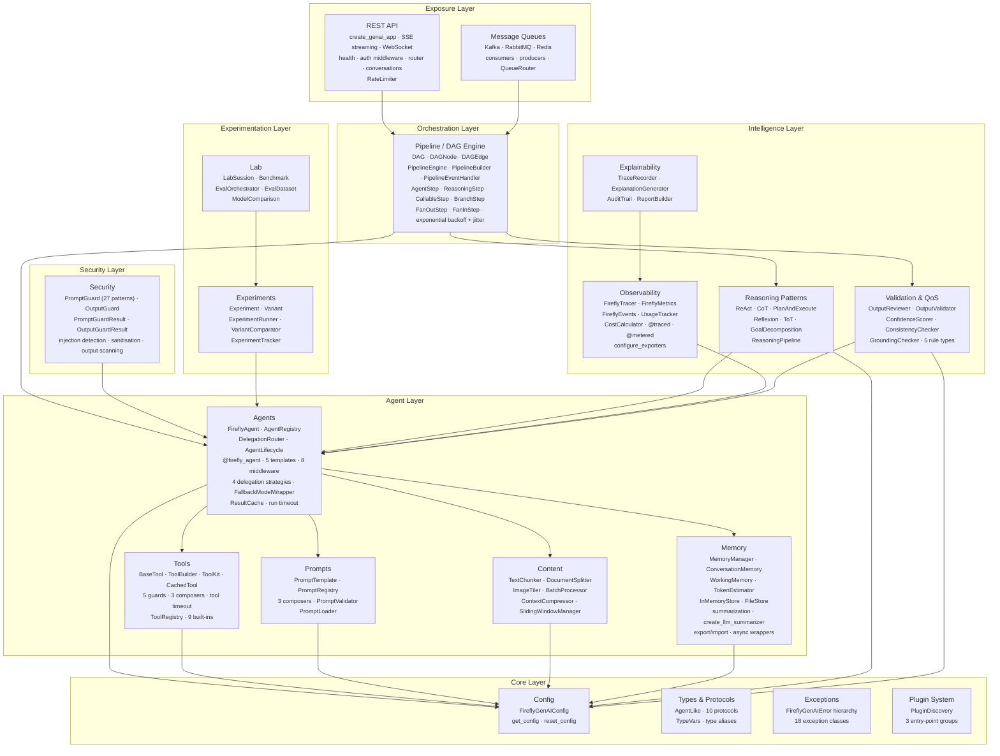
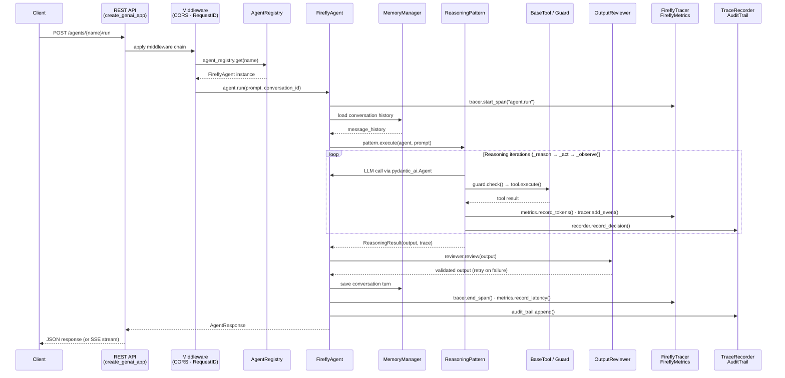
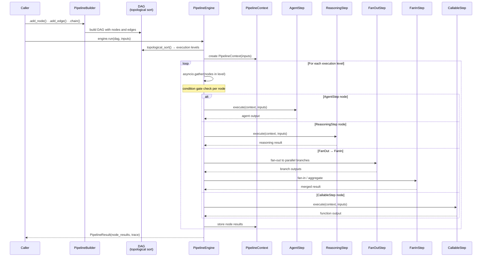
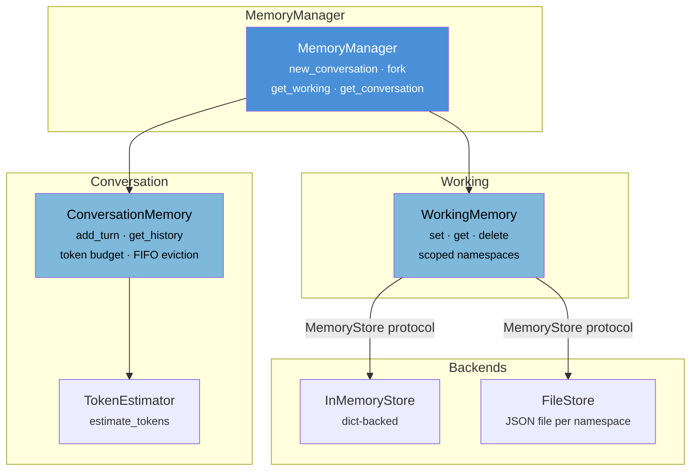
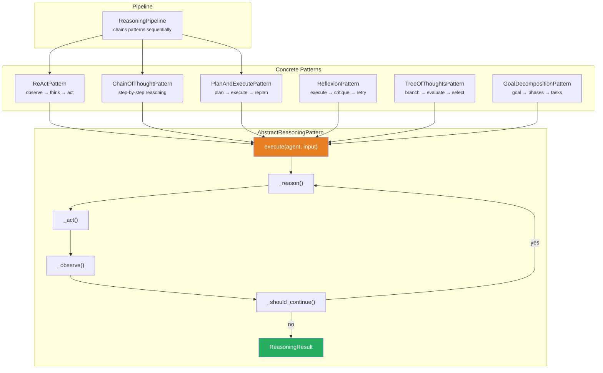
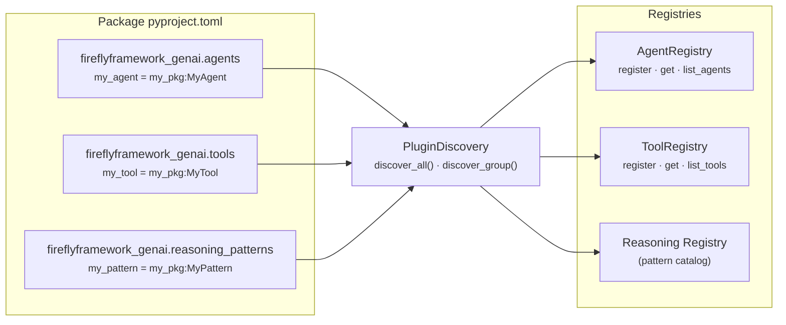

# Architecture Guide

Copyright 2026 Firefly Software Solutions Inc. Licensed under the Apache License 2.0.

This document describes the high-level architecture of fireflyframework-genai, the
relationships between its modules, and the design principles that guided its construction.

---

## Design Principles

The framework follows four guiding principles:

1. **Protocol-driven contracts** -- Public APIs are defined as Python `Protocol` classes
   or abstract base classes. This allows any module to be replaced or extended without
   modifying framework internals.

2. **Convention over configuration** -- Sensible defaults are provided for every setting.
   A single `FireflyGenAIConfig` object (backed by Pydantic Settings) centralises
   configuration and supports environment-variable overrides.

3. **Layered composition** -- Modules are organised into layers (Core, Agent, Intelligence,
   Experimentation, Exposure). Higher layers depend on lower layers but never the reverse.

4. **Optional dependencies** -- Heavy third-party libraries (FastAPI, aiokafka, aio-pika,
   redis) are declared as extras. The core framework imports them lazily so that users
   only install what they need.

---

## Layer Diagram



### Protocol & Class Hierarchy

Every extension point is a `@runtime_checkable` protocol. Implement the protocol to
provide your own components; the framework discovers them via duck typing.

```mermaid
classDiagram
    class AgentLike {
        <<Protocol>>
        +run(prompt, **kwargs) Any
    }
    class ToolProtocol {
        <<Protocol>>
        +name: str
        +description: str
        +execute(**kwargs) Any
    }
    class GuardProtocol {
        <<Protocol>>
        +check(tool_name, kwargs) GuardResult
    }
    class ReasoningPattern {
        <<Protocol>>
        +execute(agent, input, **kwargs) ReasoningResult
    }
    class StepExecutor {
        <<Protocol>>
        +execute(context, inputs) Any
    }
    class DelegationStrategy {
        <<Protocol>>
        +select(agents, prompt, **kwargs) Any
    }
    class CompressionStrategy {
        <<Protocol>>
        +compress(text, max_tokens) str
    }
    class MemoryStore {
        <<Protocol>>
        +save(namespace, entry)
        +load(namespace) list
        +delete(namespace, entry_id)
        +clear(namespace)
    }
    class ValidationRule {
        <<Protocol>>
        +name: str
        +validate(value) ValidationRuleResult
    }
    class QueueConsumer {
        <<Protocol>>
        +start()
        +stop()
    }
    class QueueProducer {
        <<Protocol>>
        +publish(message)
    }

    AgentLike <|.. FireflyAgent
    AgentLike <|.. pydantic_ai.Agent
    ToolProtocol <|.. BaseTool
    ToolProtocol <|.. SequentialComposer
    ToolProtocol <|.. FallbackComposer
    ToolProtocol <|.. ConditionalComposer
    GuardProtocol <|.. ValidationGuard
    GuardProtocol <|.. RateLimitGuard
    GuardProtocol <|.. ApprovalGuard
    GuardProtocol <|.. SandboxGuard
    GuardProtocol <|.. CompositeGuard
    ReasoningPattern <|.. AbstractReasoningPattern
    ReasoningPattern <|.. ReasoningPipeline
    StepExecutor <|.. AgentStep
    StepExecutor <|.. ReasoningStep
    StepExecutor <|.. CallableStep
    StepExecutor <|.. BranchStep
    StepExecutor <|.. FanOutStep
    StepExecutor <|.. FanInStep
    DelegationStrategy <|.. RoundRobinStrategy
    DelegationStrategy <|.. CapabilityStrategy
    DelegationStrategy <|.. ContentBasedStrategy
    DelegationStrategy <|.. CostAwareStrategy
    CompressionStrategy <|.. TruncationStrategy
    CompressionStrategy <|.. SummarizationStrategy
    CompressionStrategy <|.. MapReduceStrategy
    MemoryStore <|.. InMemoryStore
    MemoryStore <|.. FileStore
    ValidationRule <|.. RegexRule
    ValidationRule <|.. FormatRule
    ValidationRule <|.. RangeRule
    ValidationRule <|.. EnumRule
    ValidationRule <|.. CustomRule
    QueueConsumer <|.. KafkaAgentConsumer
    QueueConsumer <|.. RabbitMQAgentConsumer
    QueueConsumer <|.. RedisAgentConsumer
    QueueProducer <|.. KafkaAgentProducer
    QueueProducer <|.. RabbitMQAgentProducer
    QueueProducer <|.. RedisAgentProducer
```



---

## Module Responsibilities

### Core Layer

The Core layer provides foundational types, configuration, exceptions, and the plugin
system. Every other module depends on at least one Core component.

- **types.py** -- Enumerations for model providers, agent states, and log levels.
- **config.py** -- `FireflyGenAIConfig`, a Pydantic Settings singleton that reads
  from environment variables and `.env` files.
- **exceptions.py** -- A structured exception hierarchy rooted at `FireflyGenAIError`.
- **plugin.py** -- `PluginDiscovery` discovers and loads entry-point plugins at startup.

### Security Layer

The Security layer provides input sanitisation and prompt injection defence.

- **security/prompt_guard.py** -- `PromptGuard` scans user prompts for 27 known injection
  patterns (including encoding bypass, zero-width evasion, multi-language, jailbreak,
  and system prompt extraction), reports matches, and optionally sanitises suspicious
  fragments.
- **security/output_guard.py** -- `OutputGuard` scans LLM responses for PII (6 patterns),
  secrets (9 patterns), harmful content (4 patterns), custom patterns, and deny
  patterns. See the [Security Guide](security.md).

### Agent Layer

The Agent layer wraps Pydantic AI's `Agent` class and adds lifecycle management,
a global registry, delegation strategies, and declarative decorators.

- **base.py** -- `FireflyAgent` wraps `pydantic_ai.Agent` with metadata, hooks,
  middleware chain, run timeout, and streaming usage tracking.
- **registry.py** -- `AgentRegistry` is a thread-safe singleton that maps names to agents.
- **lifecycle.py** -- `AgentLifecycle` handles init, warmup, and shutdown hooks.
- **delegation.py** -- Multi-agent delegation via `RoundRobinStrategy`,
  `CapabilityStrategy`, `ContentBasedStrategy` (LLM routing), and
  `CostAwareStrategy` (cheapest model), coordinated by `DelegationRouter`.
- **context.py** -- `AgentContext` carries request-scoped data through an agent run.
- **decorators.py** -- `@firefly_agent` registers an agent declaratively.
- **middleware.py** -- `AgentMiddleware` protocol and `MiddlewareChain` for
  pluggable before/after hooks on every agent run.
- **fallback.py** -- `FallbackModelWrapper` and `run_with_fallback()` for
  automatic model failover.
- **cache.py** -- `ResultCache` with TTL, LRU eviction, and thread-safe access.
- **templates/** -- Pre-built template agents (summarizer, classifier, extractor,
  conversational, router) available as factory functions. See the
  [Template Agents Guide](templates.md).

### Intelligence Layer

- **reasoning/** -- Pluggable reasoning patterns (ReAct, Chain of Thought, etc.)
  with a pipeline for chaining patterns sequentially.
- **observability/** -- OpenTelemetry tracing, custom metrics, event emission,
  usage tracking, cost calculation, and budget enforcement.
- **explainability/** -- Decision recording, natural-language explanation generation,
  audit trails, and report building.

### Experimentation Layer

- **experiments/** -- Define experiments with named variants, run them, track metrics,
  and compare results with statistical tests.
- **lab/** -- Interactive sessions, benchmarks, datasets, side-by-side comparisons,
  and pluggable evaluators.

### Memory Layer

- **memory/conversation.py** -- `ConversationMemory`: token-aware, per-conversation
  chat history wrapping pydantic-ai's `message_history` mechanism.
- **memory/working.py** -- `WorkingMemory`: scoped key-value scratchpad for session
  facts, entities, and intermediate state.
- **memory/store.py** -- `MemoryStore` protocol with `InMemoryStore` and `FileStore`.
- **memory/manager.py** -- `MemoryManager` facade composing conversation and working
  memory, with `fork()` for multi-agent scope isolation.

### Content Layer

- **content/chunking.py** -- `TextChunker`, `DocumentSplitter`, `ImageTiler`, and
  `BatchProcessor` for splitting large inputs into model-friendly chunks.
- **content/compression.py** -- `ContextCompressor` with pluggable strategies
  (truncation, summarisation, map-reduce) and `SlidingWindowManager`.

### Validation Layer

- **validation/rules.py** -- Composable validation rules (`Regex`, `Format`, `Range`,
  `Enum`, `Custom`), `FieldValidator`, `OutputValidator`, and `ValidationReport`.
- **validation/qos.py** -- `ConfidenceScorer`, `ConsistencyChecker`,
  `GroundingChecker`, and `QoSGuard` for post-generation quality checks.

### Orchestration Layer

- **pipeline/dag.py** -- `DAG`, `DAGNode`, `DAGEdge` with topological sort, cycle
  detection, execution-level grouping, and per-node `FailureStrategy`.
- **pipeline/engine.py** -- `PipelineEngine` runs DAGs with eager scheduling, concurrency,
  retries, timeouts, condition gates, and failure strategy enforcement.
- **pipeline/builder.py** -- Fluent `PipelineBuilder` for constructing pipelines.
- **pipeline/steps.py** -- Step executors: `AgentStep`, `ReasoningStep`,
  `CallableStep`, `FanOutStep`, `FanInStep`.
- **pipeline/context.py** -- `PipelineContext` shared data bus.
- **pipeline/result.py** -- `NodeResult`, `PipelineResult`, `ExecutionTraceEntry`.

### Exposure Layer

- **exposure/rest/** -- FastAPI application factory that auto-generates REST endpoints
  for every registered agent, with rate limiting, authentication middleware,
  WebSocket support, and conversation CRUD endpoints.
- **exposure/queues/** -- Abstract consumer/producer with Kafka, RabbitMQ, and Redis
  implementations and a pattern-based message router.

---

## Request Flow

The following diagram shows the typical lifecycle of a request entering through the
REST exposure layer, being processed by an agent with reasoning, and producing
observability and explainability artefacts.



### Pipeline Execution Flow

When agents are orchestrated through a `DAG` pipeline, `PipelineEngine` executes
nodes level-by-level. Each node wraps a `StepExecutor` implementation.



### Memory Architecture

`MemoryManager` composes `ConversationMemory` and `WorkingMemory`, delegating
persistence to a pluggable `MemoryStore` backend.



### Reasoning Pattern Architecture

All six reasoning patterns extend `AbstractReasoningPattern`, which provides a
template-method loop: `_reason` → `_act` → `_observe` → `_should_continue`.



---

## Plugin System

Plugins are discovered via Python entry points under three well-known groups:
`fireflyframework_genai.agents`, `fireflyframework_genai.tools`, and
`fireflyframework_genai.reasoning_patterns`. The `PluginDiscovery` class scans
these groups and loads the referenced objects so they can self-register with
their respective registries.



To create a plugin, add entry points in your package's `pyproject.toml`:

```toml
[project.entry-points."fireflyframework_genai.agents"]
my_agent = "my_package.agents:MyAgent"

[project.entry-points."fireflyframework_genai.tools"]
my_tool = "my_package.tools:MyTool"
```

Then call discovery at startup:

```python
from fireflyframework_genai.plugin import PluginDiscovery

result = PluginDiscovery.discover_all()
print(f"Loaded {len(result.successful)} plugins, {len(result.failed)} failed")
```

---

## Configuration

All configuration is managed through `FireflyGenAIConfig`, which reads values from
environment variables prefixed with `FIREFLY_GENAI_`. For example:

```bash
export FIREFLY_GENAI_DEFAULT_MODEL=openai:gpt-4o
export FIREFLY_GENAI_LOG_LEVEL=DEBUG
export FIREFLY_GENAI_OTEL_ENDPOINT=http://localhost:4317
```

The configuration singleton is available via:

```python
from fireflyframework_genai.core import FireflyGenAIConfig

config = FireflyGenAIConfig()
print(config.default_model)
```
