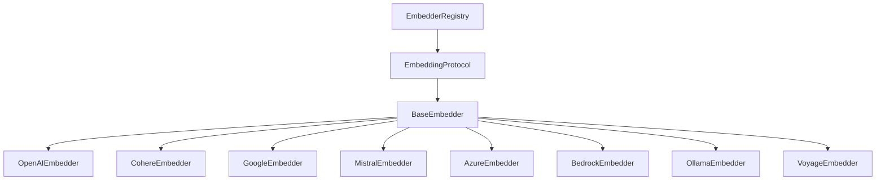

# Embeddings Guide

Copyright 2026 Firefly Software Solutions Inc. Licensed under the Apache License 2.0.

The Embeddings module provides provider-agnostic text embedding generation with
auto-batching, token estimation, and a pluggable provider registry. It supports
8 embedding providers out of the box and integrates with vector stores for
RAG and similarity search workflows.

---

## Architecture

The embedding subsystem follows the framework's three-layer extensibility model:



- **EmbeddingProtocol** -- Duck-typed `@runtime_checkable` protocol with `embed()` and `embed_one()`.
- **BaseEmbedder** -- Abstract base class providing auto-batching, token estimation, and error wrapping.
- **Concrete Providers** -- Provider-specific implementations that override `_embed_batch()`.
- **EmbedderRegistry** -- Named registry for managing multiple embedder instances.

---

## Quick Start

```python
from fireflyframework_genai.embeddings.providers import OpenAIEmbedder

# Create an embedder
embedder = OpenAIEmbedder(model="text-embedding-3-small")

# Embed multiple texts (auto-batched)
result = await embedder.embed(["Hello world", "How are you?"])
print(result.embeddings)      # [[0.012, -0.034, ...], [0.056, ...]]
print(result.dimensions)       # 1536
print(result.usage.total_tokens)  # 8

# Embed a single text (returns raw vector)
vector = await embedder.embed_one("Hello world")
print(len(vector))  # 1536
```

---

## Providers

### OpenAI

```python
from fireflyframework_genai.embeddings.providers import OpenAIEmbedder

embedder = OpenAIEmbedder(
    model="text-embedding-3-small",  # or "text-embedding-3-large"
    dimensions=512,                   # optional dimension reduction
    api_key="sk-...",                 # falls back to OPENAI_API_KEY env var
)
```

Install: `pip install fireflyframework-genai[openai-embeddings]`

### Azure OpenAI

```python
from fireflyframework_genai.embeddings.providers import AzureEmbedder

embedder = AzureEmbedder(
    model="my-embedding-deployment",
    azure_endpoint="https://my-resource.openai.azure.com/",
    api_version="2024-02-01",
    api_key="...",                    # falls back to AZURE_OPENAI_API_KEY env var
    dimensions=512,                   # optional
)
```

Install: `pip install fireflyframework-genai[azure-embeddings]`

### Cohere

```python
from fireflyframework_genai.embeddings.providers import CohereEmbedder

embedder = CohereEmbedder(
    model="embed-english-v3.0",
    api_key="...",                    # falls back to COHERE_API_KEY env var
    input_type="search_document",     # or "search_query", "classification", "clustering"
)
```

Install: `pip install fireflyframework-genai[cohere-embeddings]`

### Google Generative AI

```python
from fireflyframework_genai.embeddings.providers import GoogleEmbedder

embedder = GoogleEmbedder(
    model="models/text-embedding-004",
    api_key="...",                    # falls back to GOOGLE_API_KEY env var
)
```

Install: `pip install fireflyframework-genai[google-embeddings]`

### Mistral

```python
from fireflyframework_genai.embeddings.providers import MistralEmbedder

embedder = MistralEmbedder(
    model="mistral-embed",
    api_key="...",                    # falls back to MISTRAL_API_KEY env var
)
```

Install: `pip install fireflyframework-genai[mistral-embeddings]`

### Voyage AI

```python
from fireflyframework_genai.embeddings.providers import VoyageEmbedder

embedder = VoyageEmbedder(
    model="voyage-3",
    api_key="...",                    # falls back to VOYAGE_API_KEY env var
)
```

Install: `pip install fireflyframework-genai[voyage-embeddings]`

### AWS Bedrock

```python
from fireflyframework_genai.embeddings.providers import BedrockEmbedder

embedder = BedrockEmbedder(
    model="amazon.titan-embed-text-v2:0",
    region_name="us-east-1",
)
```

Install: `pip install fireflyframework-genai[bedrock-embeddings]`

### Ollama (Local)

```python
from fireflyframework_genai.embeddings.providers import OllamaEmbedder

embedder = OllamaEmbedder(
    model="nomic-embed-text",
    base_url="http://localhost:11434",  # default
)
```

Install: `pip install fireflyframework-genai[ollama-embeddings]`

---

## Similarity Utilities

Built-in functions for comparing embedding vectors:

```python
from fireflyframework_genai.embeddings import cosine_similarity, euclidean_distance, dot_product

a = [0.1, 0.2, 0.3]
b = [0.4, 0.5, 0.6]

cosine_similarity(a, b)    # 0.0 to 1.0 (higher = more similar)
euclidean_distance(a, b)   # 0.0+ (lower = more similar)
dot_product(a, b)          # raw dot product
```

---

## Registry

Manage multiple named embedder instances:

```python
from fireflyframework_genai.embeddings import EmbedderRegistry
from fireflyframework_genai.embeddings.providers import OpenAIEmbedder, CohereEmbedder

registry = EmbedderRegistry()
registry.register("openai", OpenAIEmbedder())
registry.register("cohere", CohereEmbedder())

embedder = registry.get("openai")
result = await embedder.embed(["test"])

print(registry.list_names())  # ["openai", "cohere"]
registry.unregister("cohere")
```

---

## Auto-Batching

`BaseEmbedder` automatically splits large text lists into provider-sized batches
(default: 100, configurable via `FireflyGenAIConfig.embedding_batch_size`).
Subclasses only need to implement `_embed_batch()` for a single batch.

```python
# This automatically splits into batches of 100
texts = ["text"] * 500
result = await embedder.embed(texts)
assert len(result.embeddings) == 500
```

---

## Configuration

Global defaults via environment variables (prefix `FIREFLY_GENAI_`):

| Setting | Env Variable | Default |
|---------|-------------|---------|
| `default_embedding_model` | `FIREFLY_GENAI_DEFAULT_EMBEDDING_MODEL` | `openai:text-embedding-3-small` |
| `embedding_batch_size` | `FIREFLY_GENAI_EMBEDDING_BATCH_SIZE` | `100` |
| `embedding_max_retries` | `FIREFLY_GENAI_EMBEDDING_MAX_RETRIES` | `3` |

---

## Custom Provider

To create a custom embedding provider, subclass `BaseEmbedder` and implement `_embed_batch()`:

```python
from fireflyframework_genai.embeddings.base import BaseEmbedder

class MyEmbedder(BaseEmbedder):
    def __init__(self, model: str = "my-model", **kwargs):
        super().__init__(model=model, **kwargs)

    async def _embed_batch(self, texts: list[str], **kwargs) -> list[list[float]]:
        # Call your embedding API here
        return [[0.0] * 384 for _ in texts]
```

---

## Pipeline Integration

Use embeddings in DAG pipelines:

```python
from fireflyframework_genai.pipeline import Pipeline, PipelineStep, EmbeddingStep

pipeline = Pipeline(
    steps=[
        PipelineStep(name="embed", executor=EmbeddingStep(embedder=my_embedder)),
    ]
)
result = await pipeline.execute("Hello world")
```

See also: [Vector Stores Guide](vectorstores.md) for RAG workflows with `RetrievalStep`.
