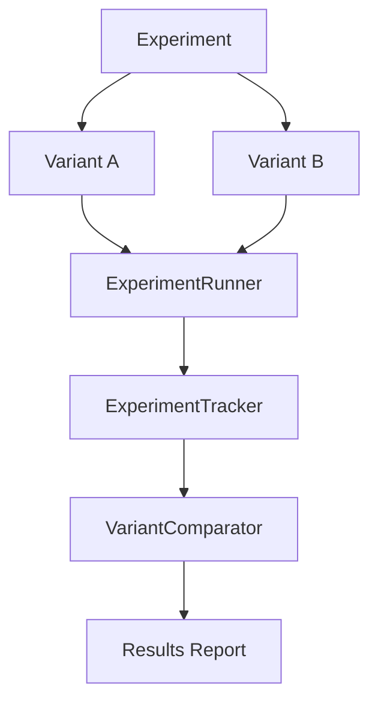
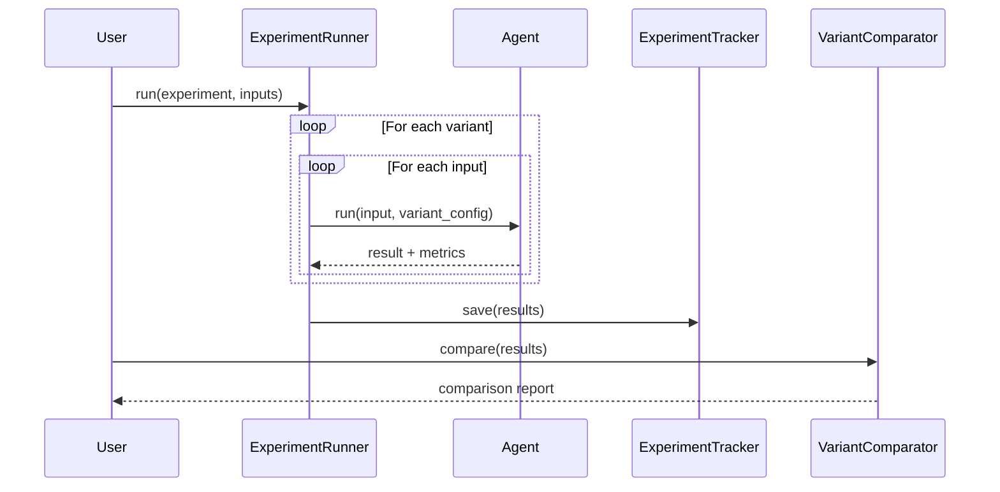

# Experiments Guide

Copyright 2026 Firefly Software Solutions Inc. Licensed under the Apache License 2.0.

The Experiments module provides A/B testing for agent variants, metric tracking,
and statistical comparison.

---

## Concepts

An experiment compares two or more variants of an agent configuration. Each variant
defines a different model, system prompt, temperature, or any other parameter. The
`ExperimentRunner` executes all variants against the same inputs, the `ExperimentTracker`
persists the results, and the `VariantComparator` analyses the differences.



---

## Defining an Experiment

```python
from fireflyframework_genai.experiments import Experiment, Variant

experiment = Experiment(
    name="model_comparison",
    description="Compare GPT-4o and Claude 3.5 on summarisation tasks.",
    variants=[
        Variant(name="gpt4o", config={"model": "openai:gpt-4o"}),
        Variant(name="claude", config={"model": "anthropic:claude-3-5-sonnet"}),
    ],
)
```

---

## Running an Experiment

The `ExperimentRunner` executes each variant against a list of test inputs and
collects metrics (latency, token usage, quality scores).

```python
from fireflyframework_genai.experiments import ExperimentRunner

runner = ExperimentRunner()
results = await runner.run(
    experiment,
    inputs=["Summarise this article.", "Explain quantum computing."],
)
```

---

## Tracking Results

The `ExperimentTracker` persists experiment results to disk (JSON) for later analysis
and reproducibility.

```python
from fireflyframework_genai.experiments import ExperimentTracker

tracker = ExperimentTracker(storage_dir="./experiment_results")
tracker.save(results)
loaded = tracker.load("model_comparison")
```

---

## Comparing Variants

The `VariantComparator` computes comparison metrics across experiment variants to
determine which variant performs better.

```python
from fireflyframework_genai.experiments import VariantComparator

comparator = VariantComparator()
metrics = comparator.compare(results)
print(comparator.summary(results))
```

The comparison report includes:

- Average latency, total runs, and average output length per variant.
- A human-readable summary for quick comparison.

---

## Workflow Diagram


