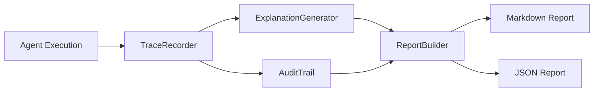
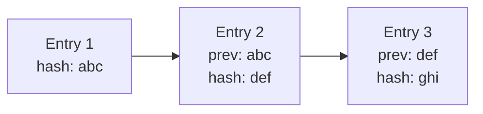

# Explainability Guide

Copyright 2026 Firefly Software Solutions Inc. Licensed under the Apache License 2.0.

The Explainability module records agent decisions, generates human-readable explanations,
maintains audit trails, and produces reports.

---

## Architecture



---

## Trace Recorder

The `TraceRecorder` captures every decision an agent makes during execution: which
tool it chose, what reasoning path it followed, what alternatives it considered.

```python
from fireflyframework_genai.explainability import TraceRecorder

recorder = TraceRecorder()
recorder.record_decision(
    agent_name="writer",
    action="tool_selection",
    chosen="search_tool",
    alternatives=["database_tool", "http_tool"],
    rationale="The query requires web search.",
)
```

Each recorded decision is a `DecisionRecord` that includes a timestamp, the agent
name, the action taken, alternatives considered, and the rationale.

---

## Explanation Generator

The `ExplanationGenerator` transforms raw decision records into natural-language
explanations suitable for end users or auditors.

```python
from fireflyframework_genai.explainability import ExplanationGenerator

generator = ExplanationGenerator()
explanation = generator.generate(recorder.decisions)
print(explanation)
```

---

## Audit Trail

The `AuditTrail` provides a tamper-evident log of all decisions and actions. Each
entry includes a hash of the previous entry, forming a chain that can be verified
for integrity.



```python
from fireflyframework_genai.explainability import AuditTrail

trail = AuditTrail()
trail.append(decision_record)
is_valid = trail.verify()
```

---

## Report Builder

The `ReportBuilder` compiles decisions, explanations, and audit entries into a
structured report in Markdown or JSON format.

```python
from fireflyframework_genai.explainability import ReportBuilder

builder = ReportBuilder()
builder.add_decisions(recorder.decisions)
builder.add_explanation(explanation)

markdown = builder.build_markdown()
json_data = builder.build_json()
```

---

## Integration Example

A typical integration records decisions during agent execution, generates an
explanation afterward, and archives the audit trail:

```python
recorder = TraceRecorder()
# ... agent executes, decisions are recorded ...

generator = ExplanationGenerator()
explanation = generator.generate(recorder.decisions)

trail = AuditTrail()
for decision in recorder.decisions:
    trail.append(decision)
assert trail.verify()

report = ReportBuilder()
report.add_decisions(recorder.decisions)
report.add_explanation(explanation)
print(report.build_markdown())
```
