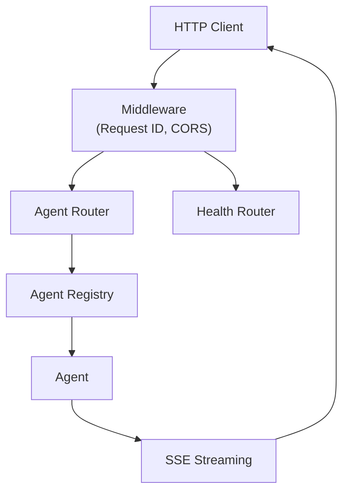
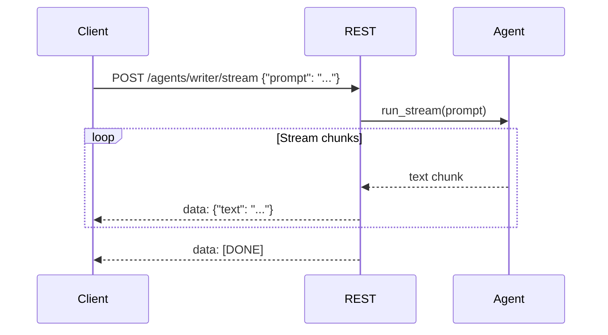
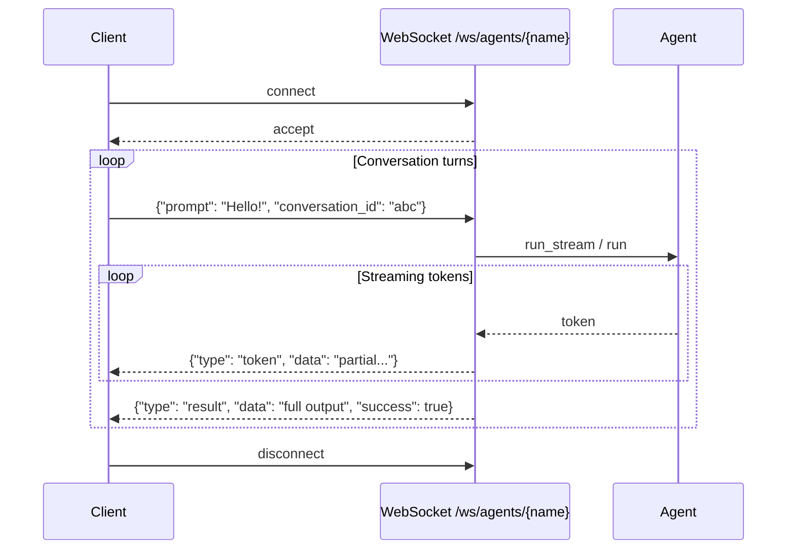

# Exposure REST Guide

Copyright 2026 Firefly Software Solutions Inc. Licensed under the Apache License 2.0.

The Exposure REST module provides a FastAPI application factory that auto-generates
REST endpoints for registered agents, with health checks, SSE streaming, middleware,
and CORS support.

---

## Architecture



---

## Quick Start

Install the REST extra:

```bash
uv add "fireflyframework-genai[rest]"
```

Create a FastAPI application:

```python
from fireflyframework_genai.exposure.rest import create_genai_app

app = create_genai_app(title="My GenAI Service", version="1.0.0")
```

Run with Uvicorn:

```bash
uvicorn myapp:app --reload
```

---

## Application Factory

The `create_genai_app` function creates a configured FastAPI application with:

- Agent routes auto-generated from the `AgentRegistry`.
- Health-check endpoints at `/health` and `/health/ready`.
- Request-ID middleware that injects or propagates `X-Request-ID` headers.
- CORS middleware with configurable origins.

```python
app = create_genai_app(
    title="Production GenAI API",
    version="2.0.0",
    enable_cors=True,
    cors_origins=["https://myapp.example.com"],
)
```

---

## Auto-Generated Endpoints

The agent router creates two endpoints for every registered agent:

- **GET /agents/** -- Lists all registered agents with their metadata.
- **POST /agents/{name}/run** -- Invokes an agent with a prompt and returns the response.

### Request Schema

```json
{
    "prompt": "Summarise this document.",
    "deps": {}
}
```

### Response Schema

```json
{
    "agent_name": "summariser",
    "output": "The document discusses...",
    "success": true,
    "error": null,
    "metadata": {}
}
```

---

## SSE Streaming

For long-running agent invocations, the REST layer supports Server-Sent Events (SSE).
The `sse_stream` function yields SSE-formatted events as the agent produces output.
Streaming uses the same request body as the run endpoint.



---

## Middleware

### Request ID

Every request receives a unique `X-Request-ID` header. If the client sends one, it
is propagated; otherwise, the middleware generates a UUID.

### CORS

Cross-Origin Resource Sharing is configured via the application factory. By default
it allows all origins. In production, restrict this to your known domains.

---

## Rate Limiting

The REST layer includes a sliding-window rate limiter that can be applied
as middleware to protect agents from excessive traffic.

```python
from fireflyframework_genai.exposure.rest.middleware import add_rate_limit_middleware

add_rate_limit_middleware(
    app,
    max_requests=100,
    window_seconds=60.0,
)
```

When a client exceeds the limit, the middleware returns a `429 Too Many Requests`
response with a JSON body `{"detail": "Rate limit exceeded"}`.

By default, the rate key is the client's IP address. Provide a custom
`key_func` to rate-limit by API key, user ID, or any other request attribute:

```python
add_rate_limit_middleware(
    app,
    max_requests=20,
    window_seconds=60.0,
    key_func=lambda request: request.headers.get("X-API-Key", "anonymous"),
)
```

The `RateLimiter` class can also be used standalone outside of middleware:

```python
from fireflyframework_genai.exposure.rest.middleware import RateLimiter

limiter = RateLimiter(max_requests=10, window_seconds=30.0)
if not limiter.is_allowed("client-123"):
    raise HTTPException(status_code=429)
```

---

## Authentication Middleware

The REST layer includes `add_auth_middleware()` that supports two authentication
modes:

- **API Key** — checked via the `X-API-Key` header.
- **Bearer Token** — checked via the `Authorization: Bearer <token>` header.

When both are configured, a request is accepted if **either** method succeeds.
Unauthenticated requests receive a `401 Unauthorized` response.

```python
from fireflyframework_genai.exposure.rest.middleware import add_auth_middleware

add_auth_middleware(
    app,
    api_keys=["key-abc-123", "key-def-456"],
    bearer_tokens=["token-xyz"],
    exclude_paths=["/health", "/health/ready", "/docs"],
)
```

The authentication middleware is **auto-wired** when the config fields
`auth_api_keys` or `auth_bearer_tokens` are set:

```bash
export FIREFLY_GENAI_AUTH_API_KEYS='["key-abc-123"]'
export FIREFLY_GENAI_AUTH_BEARER_TOKENS='["token-xyz"]'
```

---

## WebSocket Endpoint

The REST layer includes a bidirectional WebSocket endpoint for real-time,
multi-turn agent conversations at `/ws/agents/{name}`.



### Message Protocol

**Client → Server** (JSON):

```json
{
    "prompt": "Hello, agent!",
    "conversation_id": "optional-id",
    "deps": null
}
```

**Server → Client** (JSON, one or more):

```json
{"type": "token", "data": "partial text..."}
{"type": "result", "data": "full output", "success": true}
{"type": "error", "data": "error message", "success": false}
```

If no `conversation_id` is provided, the server generates one and sends it
back as `{"type": "conversation_id", "data": "generated-id"}`.

Each WebSocket connection gets an isolated memory scope to prevent cross-talk
between concurrent sessions.

---

## Conversation Management Endpoints

The agent router includes CRUD endpoints for managing conversations:

- **POST /agents/conversations** — Create a new conversation. Returns
  `{"conversation_id": "..."}`.
- **GET /agents/conversations/{conversation_id}** — Return the message history
  with `conversation_id`, `message_count`, and serialised `messages`.
- **DELETE /agents/conversations/{conversation_id}** — Clear a conversation's
  history.

Pass `conversation_id` in the run or stream request body for multi-turn
conversations:

```json
{
    "prompt": "What did we discuss earlier?",
    "conversation_id": "abc123"
}
```

---

## Health Checks

Two health endpoints are provided:

- **GET /health** — Returns `{"status": "healthy"}` if the application is running.
- **GET /health/ready** — Returns `{"status": "ready"}` when all agents are initialised.

These endpoints are suitable for Kubernetes liveness and readiness probes.
