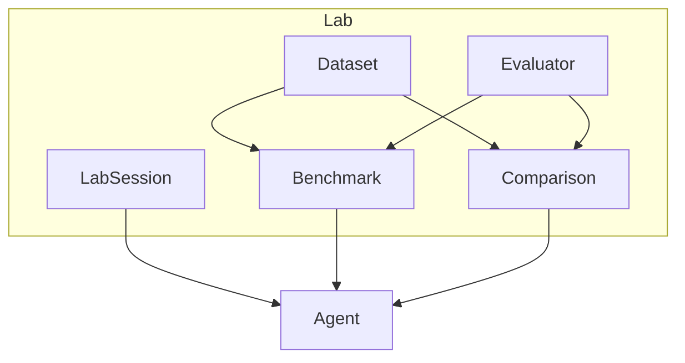
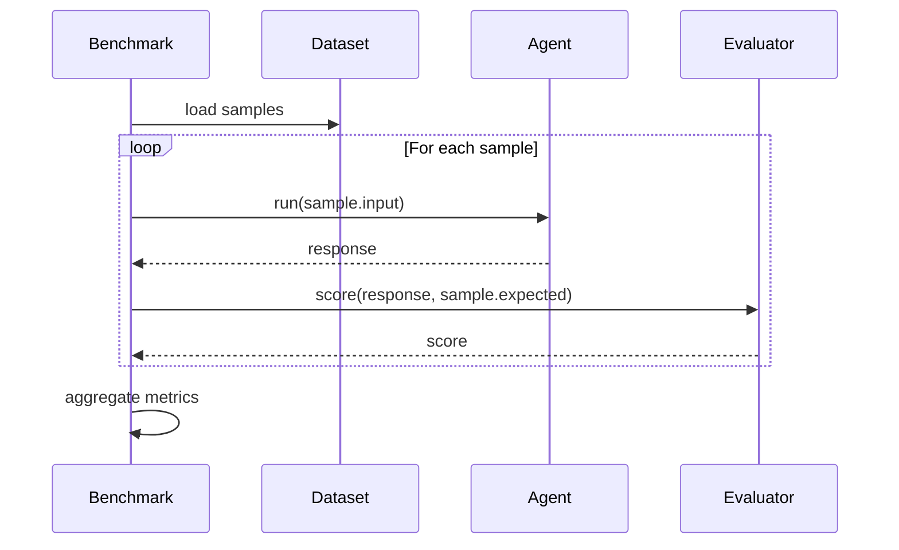

# Lab Guide

Copyright 2026 Firefly Software Solutions Inc. Licensed under the Apache License 2.0.

The Lab module provides interactive sessions, benchmarking, side-by-side comparison,
dataset management, and pluggable evaluators for developing and testing GenAI agents.

---

## Concepts

The Lab is a development and testing environment where engineers can iterate on agent
behaviour without deploying to production. It supports interactive exploration,
reproducible benchmarks, and structured evaluation.



---

## Interactive Sessions

A `LabSession` provides a conversational interface for testing an agent interactively.
Each exchange is recorded with timestamps and metadata.

```python
from fireflyframework_genai.lab import LabSession

session = LabSession(name="writing-test", agent=writer_agent)
response = await session.interact("Write a haiku about testing.")
print(response)

# Review the session history
for entry in session.history:
    print(f"[{entry.timestamp}] {entry.prompt} -> {entry.response}")
```

---

## Benchmarking

The `Benchmark` runs an agent against a list of prompts and measures latency metrics
(average, min, max, p95).

```python
from fireflyframework_genai.lab import Benchmark

bench = Benchmark(inputs=[
    "Translate 'hello' to French.",
    "Translate 'goodbye' to French.",
])
result = await bench.run(translator_agent)
print(f"Avg latency: {result.avg_latency_ms:.1f} ms, P95: {result.p95_latency_ms:.1f} ms")
```



---

## Side-by-Side Comparison

The `ModelComparison` class runs the same prompts through multiple agents and collects
their outputs side by side.

```python
from fireflyframework_genai.lab import ModelComparison

comparison = ModelComparison(prompts=[
    "Write a haiku about Python.",
    "Explain recursion in one sentence.",
])
entries = await comparison.compare({"writer_v1": agent_v1, "writer_v2": agent_v2})
for entry in entries:
    print(f"Input: {entry.prompt}")
    for agent_name, response in entry.responses.items():
        print(f" {agent_name}: {response}")
```

---

## Datasets

The `EvalDataset` class manages collections of `EvalCase` test inputs and optional
expected outputs. Datasets can be loaded from JSON files or built programmatically.

```python
from fireflyframework_genai.lab import EvalDataset, EvalCase

# Programmatically
dataset = EvalDataset(cases=[
    EvalCase(input="Hello", expected_output="Hi"),
    EvalCase(input="Goodbye", expected_output="Bye"),
])

# From a JSON file
dataset = EvalDataset.from_json("test_data.json")
```

---

## Evaluators

The `EvalOrchestrator` runs an agent against an `EvalDataset` with a pluggable scorer
function. A `Scorer` is any callable `(expected: str, actual: str) -> float`. The
framework ships with `exact_match_scorer` as a default.

```python
from fireflyframework_genai.lab import EvalOrchestrator, EvalDataset, EvalCase

# Custom scorer
def fuzzy_scorer(expected: str, actual: str) -> float:
    return 1.0 if expected.lower() in actual.lower() else 0.0

orchestrator = EvalOrchestrator(scorer=fuzzy_scorer)
report = await orchestrator.evaluate(my_agent, dataset)
print(f"Avg score: {report.avg_score:.2f} across {report.total_cases} cases")
```
