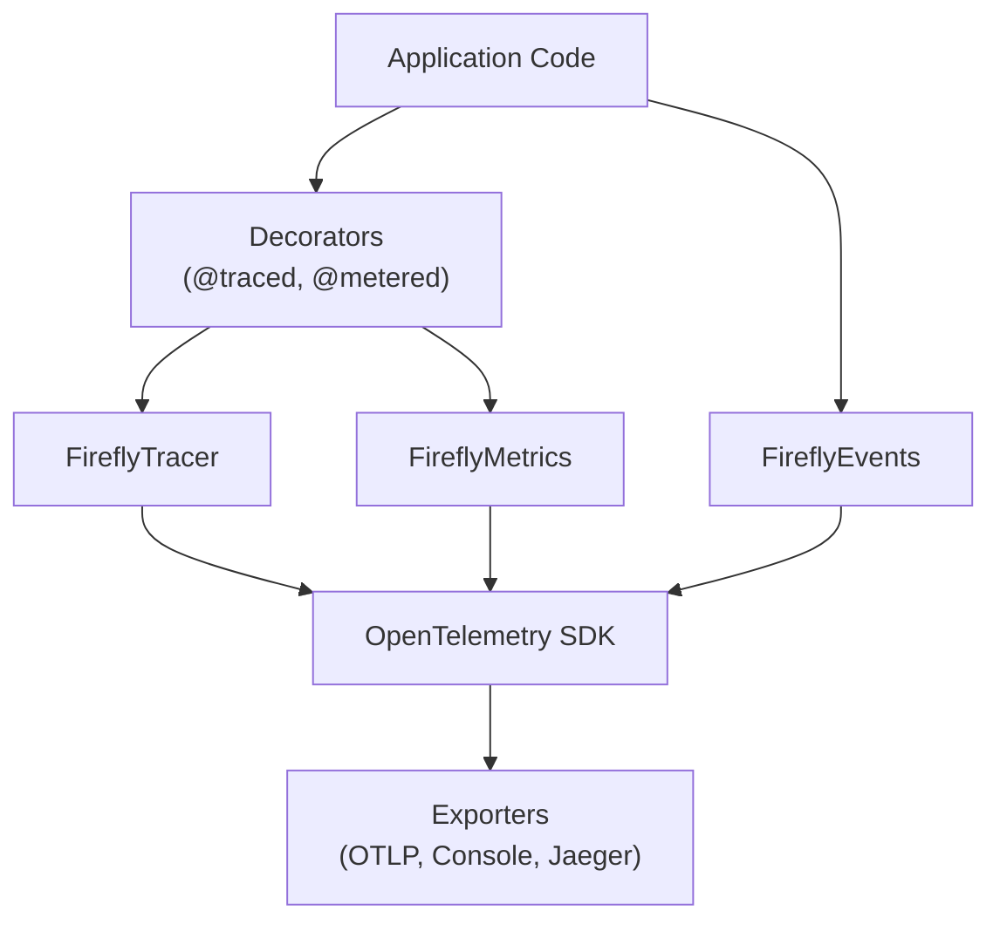
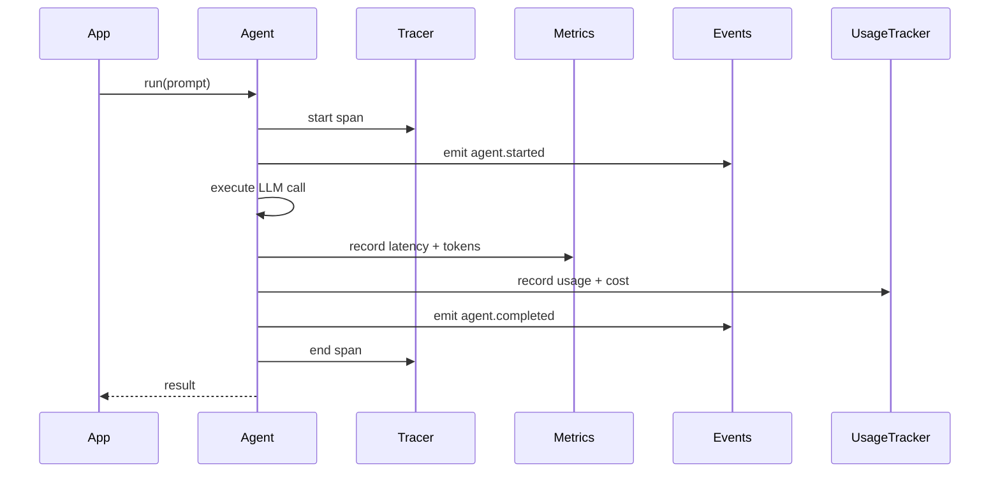

# Observability Guide

Copyright 2026 Firefly Software Solutions Inc. Licensed under the Apache License 2.0.

The Observability module provides OpenTelemetry-native tracing, custom metrics, and
event recording for GenAI workloads.

---

## Architecture



---

## Tracing

`FireflyTracer` wraps the OpenTelemetry `Tracer` and adds convenience methods for
creating spans with GenAI-specific attributes (model name, token counts, agent name).

```python
from fireflyframework_genai.observability import FireflyTracer

tracer = FireflyTracer(service_name="my-genai-app")

with tracer.start_span("agent.run", attributes={"agent.name": "writer"}) as span:
    result = await agent.run("Hello")
    span.set_attribute("tokens.total", result.usage.total_tokens)
```

### The @traced Decorator

For convenience, the `@traced` decorator automatically creates a span around any
function call:

```python
from fireflyframework_genai.observability import traced

@traced(name="process_request")
async def process_request(prompt: str) -> str:
    ...
```

### Distributed Trace Correlation

The framework supports **W3C Trace Context** propagation for correlating traces
across service boundaries (HTTP, message queues, pipelines).

**Trace Context Functions:**

```python
from fireflyframework_genai.observability.tracer import inject_trace_context, extract_trace_context

# Inject trace context into HTTP headers
headers = {}
inject_trace_context(headers)
# headers now contain: traceparent, tracestate

# Send request with trace context
response = await http_client.post(url, headers=headers)

# On receiving side, extract trace context
incoming_headers = request.headers
context = extract_trace_context(incoming_headers)
# Continue trace with extracted context
```

**REST API Integration:**

The framework's REST API automatically propagates trace context:

```python
# Middleware injects trace context into responses
# and extracts from incoming requests
from fireflyframework_genai.exposure.rest.middleware import add_trace_propagation_middleware

add_trace_propagation_middleware(app)
```

**Queue Integration:**

Message queue consumers/producers automatically propagate trace context:

```python
# Kafka example - trace context in message headers
from fireflyframework_genai.exposure.queues.kafka import KafkaConsumer

consumer = KafkaConsumer(
    topic="requests",
    handler=process_message,
)
# Trace context automatically extracted from message headers
```

**Pipeline Context:**

Traces flow through pipeline steps via `PipelineContext.correlation_id`:

```python
from fireflyframework_genai.pipeline.context import PipelineContext

# Create context with correlation ID for trace linking
context = PipelineContext(
    inputs={},
    correlation_id="trace-abc-123",
)

result = await pipeline.run(context)
# All steps share the same trace correlation ID
```

---

## Metrics

`FireflyMetrics` provides counters, histograms, and gauges for tracking GenAI-specific
measurements.

```python
from fireflyframework_genai.observability import FireflyMetrics

metrics = FireflyMetrics(service_name="my-genai-app")
metrics.increment("agent.invocations", labels={"agent": "writer"})
metrics.record_histogram("agent.latency_ms", 142.5, labels={"agent": "writer"})
```

### The @metered Decorator

```python
from fireflyframework_genai.observability import metered

@metered(name="agent_call")
async def call_agent(prompt: str) -> str:
    ...
```

---

## Events

`FireflyEvents` emits structured events (as OpenTelemetry log records) for significant
occurrences: agent started, tool invoked, reasoning step completed, error encountered.

```python
from fireflyframework_genai.observability import FireflyEvents

events = FireflyEvents()
events.emit("agent.started", {"agent": "writer", "model": "gpt-4o"})
```

---

## Exporters

The `configure_exporters` function sets up OpenTelemetry exporters based on the
framework's configuration:

```python
from fireflyframework_genai.observability import configure_exporters

configure_exporters(
    otlp_endpoint="http://localhost:4317",
    console=True,
)
```

Supported exporters:

- **OTLP** -- Sends traces and metrics to any OpenTelemetry-compatible collector.
- **Console** -- Prints spans and metrics to standard output (useful for development).

---

## Usage Tracking

The `UsageTracker` automatically records token usage, cost estimates, and latency
for every agent run, reasoning pattern step, and pipeline execution.

```python
from fireflyframework_genai.observability import default_usage_tracker

# After running agents, inspect accumulated usage
summary = default_usage_tracker.get_summary()
print(f"Total tokens: {summary.total_tokens}")
print(f"Total cost:   ${summary.total_cost_usd:.4f}")
print(f"Requests:     {summary.total_requests}")

# Filter by agent or pipeline correlation ID
agent_summary = default_usage_tracker.get_summary_for_agent("my-agent")
pipeline_summary = default_usage_tracker.get_summary_for_correlation("run-123")
```

### Bounded Record Storage

`UsageTracker` accepts a `max_records` parameter that limits how many records
are retained in memory. When the limit is exceeded, the oldest records are
evicted (FIFO). This prevents unbounded memory growth in long-running services.

```python
from fireflyframework_genai.observability.usage import UsageTracker

tracker = UsageTracker(max_records=5_000)
```

The default `max_records` is controlled by the `FIREFLY_GENAI_USAGE_TRACKER_MAX_RECORDS`
environment variable (default: `10_000`). Set to `0` for unlimited retention
(not recommended for production).

Note: cumulative cost (`cumulative_cost_usd`) is tracked independently and
is **not** affected by record eviction — it always reflects the total
lifetime cost.

### How It Works

`FireflyAgent.run()`, `run_sync()`, and `run_stream()` automatically extract
`result.usage()` from Pydantic AI results, compute cost via the configured cost
calculator, and feed a `UsageRecord` into the global `default_usage_tracker`.
For streaming, usage is captured when the stream context manager exits
(`__aexit__`), ensuring that token counts from streamed responses are tracked
transparently. Reasoning patterns do the same for each ephemeral LLM call in
`_structured_run()`. Pipeline runs aggregate all records by `correlation_id`
into `PipelineResult.usage`.

---

## Cost Calculation

Two cost calculator implementations are provided:

- **`StaticPriceCostCalculator`** — uses a built-in lookup table with prices for
  OpenAI, Anthropic, Google, DeepSeek, and Groq models. Supports exact and prefix
  matching (e.g. `openai:gpt-4o-2024-08-06` matches `openai:gpt-4o`).
- **`GenAIPricesCostCalculator`** — delegates to the optional `genai-prices` package
  for up-to-date pricing data.  Install with `pip install fireflyframework-genai[costs]`.

The `get_cost_calculator()` factory selects the best available calculator based on
the `FIREFLY_GENAI_COST_CALCULATOR` setting (`"auto"`, `"static"`, or `"genai_prices"`).

```python
from fireflyframework_genai.observability import get_cost_calculator

calc = get_cost_calculator()
cost = calc.estimate("openai:gpt-4o", input_tokens=1000, output_tokens=500)
print(f"Estimated cost: ${cost:.6f}")
```

---

## Budget Enforcement

Configure budget thresholds via environment variables:

```bash
export FIREFLY_GENAI_BUDGET_ALERT_THRESHOLD_USD=5.00
export FIREFLY_GENAI_BUDGET_LIMIT_USD=10.00
```

When cumulative cost exceeds the alert threshold, a `WARNING` is logged.
When it exceeds the hard limit, a more urgent warning is emitted.
Budget checking runs automatically on every `UsageTracker.record()` call.

To disable cost tracking entirely:

```bash
export FIREFLY_GENAI_COST_TRACKING_ENABLED=false
```

---

## API Quota Management

The `QuotaManager` provides production-grade quota enforcement with rate limiting,
daily budget caps, and adaptive backoff for 429 rate limit responses.

```python
from fireflyframework_genai.observability.quota import QuotaManager

quota = QuotaManager(
    daily_budget_usd=100.0,
    rate_limits={
        "openai:gpt-4o": 60,        # 60 requests/minute
        "anthropic:claude-opus-4": 50,
    },
    adaptive_backoff=True,
)

# Check before making request
if not quota.check_budget_available(cost_usd=0.05):
    raise QuotaError("Daily budget exceeded")

if not quota.check_rate_limit_available("openai:gpt-4o"):
    # Apply backoff delay
    delay = quota.get_backoff_delay("openai:gpt-4o")
    await asyncio.sleep(delay)

# Record usage after request
quota.record_request("openai:gpt-4o", cost_usd=0.05, tokens=1500)
```

### Rate Limiting

`RateLimiter` implements a **sliding window** algorithm for precise rate limiting:

```python
from fireflyframework_genai.observability.quota import RateLimiter

limiter = RateLimiter(max_requests=60, window_seconds=60.0)

if limiter.is_allowed("openai:gpt-4o"):
    # Make request
    limiter.record("openai:gpt-4o")
else:
    raise RateLimitError("Rate limit exceeded")
```

The sliding window ensures accurate rate limiting without bursts at window boundaries.

### Adaptive Backoff

`AdaptiveBackoff` automatically increases retry delays for 429 responses:

```python
from fireflyframework_genai.observability.quota import AdaptiveBackoff

backoff = AdaptiveBackoff(
    base_delay=1.0,        # Start at 1 second
    max_delay=60.0,        # Cap at 60 seconds
    multiplier=2.0,        # Double each time
    jitter_factor=0.1,     # Add 10% jitter
)

# After receiving 429 response
delay = backoff.next_delay("openai:gpt-4o")
await asyncio.sleep(delay)

# On success, reset
backoff.reset("openai:gpt-4o")
```

Exponential backoff with jitter prevents thundering herd issues when rate limits reset.

### Environment Configuration

```bash
# Enable quota management
export FIREFLY_GENAI_QUOTA_ENABLED=true

# Set daily budget cap
export FIREFLY_GENAI_QUOTA_BUDGET_DAILY_USD=100.0

# Configure per-model rate limits (JSON)
export FIREFLY_GENAI_QUOTA_RATE_LIMITS='{"openai:gpt-4o": 60, "anthropic:claude-opus-4": 50}'

# Enable adaptive backoff (default: true)
export FIREFLY_GENAI_QUOTA_ADAPTIVE_BACKOFF=true
```

### Integration with Agents

Quota enforcement can be integrated via middleware or direct checks:

```python
from fireflyframework_genai.agents import FireflyAgent
from fireflyframework_genai.agents.builtin_middleware import CostGuardMiddleware

# Budget enforcement via middleware
agent = FireflyAgent(
    name="quota-agent",
    model="openai:gpt-4o",
    middleware=[CostGuardMiddleware(budget_usd=10.0)],
)

# Or manual quota checks
quota = QuotaManager(daily_budget_usd=100.0)

async def call_with_quota(prompt):
    if not quota.check_budget_available():
        raise QuotaError("Daily budget exhausted")

    result = await agent.run(prompt)
    quota.record_request(agent.model, cost_usd=result.usage.total_cost)
    return result
```

---

## JSON Structured Logging

For production log aggregation (ELK, Datadog, CloudWatch), the framework
provides a `JsonFormatter` that emits log records as single-line JSON objects
with `timestamp`, `level`, `logger`, and `message` fields.

Enable JSON logging with the `format_style` parameter:

```python
from fireflyframework_genai import configure_logging

configure_logging("INFO", format_style="json")
```

Example output:

```json
{"timestamp": "2026-01-15T10:30:00+00:00", "level": "INFO", "logger": "fireflyframework_genai.agents.base", "message": "run agent='writer' prompt='Write a...'"}
```

The `JsonFormatter` class can also be used standalone with any Python logger:

```python
from fireflyframework_genai.logging import JsonFormatter
import logging

handler = logging.StreamHandler()
handler.setFormatter(JsonFormatter())
```

---

## Integration with Agents

Observability is designed to integrate transparently with the Agent layer. When an
agent is invoked, the framework automatically creates a trace span, records metrics,
emits events, and records usage for cost tracking. You do not need to instrument
agent code manually unless you want additional detail.


