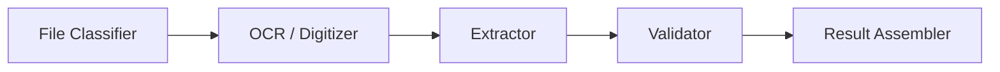
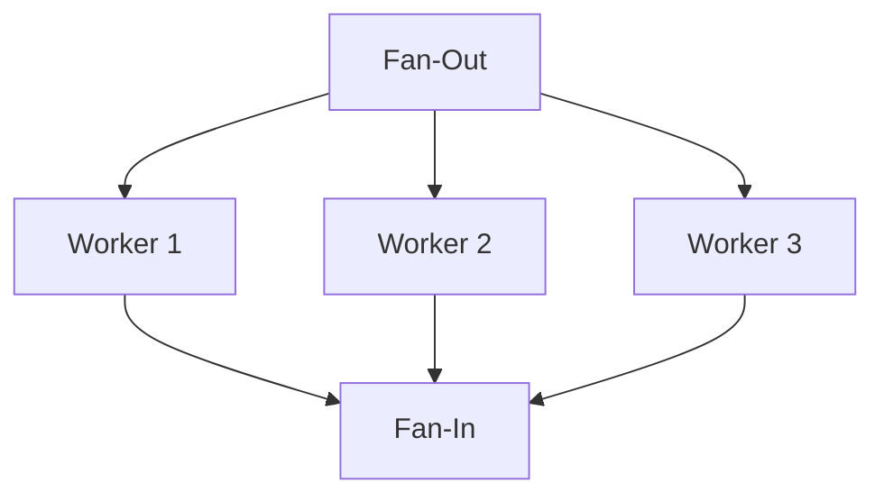

# Pipeline Guide

Copyright 2026 Firefly Software Solutions Inc. Licensed under the Apache License 2.0.

The Pipeline module provides a DAG-based orchestrator for composing multi-step GenAI
workflows. It supports parallel execution, conditional branching, retries, timeouts,
and fan-out/fan-in patterns -- everything needed to model real-world enterprise
processing pipelines.

---

## Concepts

A pipeline is defined as a Directed Acyclic Graph (DAG) of **nodes** connected by
**edges**. Each node wraps a **step executor** that does the actual work (call an
agent, run a reasoning pattern, execute a function). The **engine** schedules nodes
by topological level so that independent nodes run concurrently.



---

## Building a Pipeline

### Fluent Builder API

The `PipelineBuilder` provides a chainable API for constructing pipelines:

```python
from fireflyframework_genai.pipeline.builder import PipelineBuilder
from fireflyframework_genai.pipeline.steps import AgentStep, CallableStep

engine = (
    PipelineBuilder("invoice-pipeline")
    .add_node("classify", AgentStep(classifier_agent))
    .add_node("extract", AgentStep(extractor_agent))
    .add_node("validate", CallableStep(validate_fn))
    .chain("classify", "extract", "validate")
    .build()
)
result = await engine.run(inputs="<base64-encoded invoice>")
```

The builder auto-wraps compatible objects:
- A `FireflyAgent` is wrapped in `AgentStep`.
- An `async` callable is wrapped in `CallableStep`.
- A `StepExecutor` implementation is used directly.

### Manual DAG Construction

For full control, construct the DAG directly:

```python
from fireflyframework_genai.pipeline.dag import DAG, DAGNode, DAGEdge
from fireflyframework_genai.pipeline.engine import PipelineEngine

dag = DAG("my-pipeline")
dag.add_node(DAGNode(node_id="step_a", step=my_step))
dag.add_node(DAGNode(node_id="step_b", step=other_step))
dag.add_edge(DAGEdge(source="step_a", target="step_b"))

engine = PipelineEngine(dag)
result = await engine.run(inputs="hello")
```

---

## Step Executors

Step executors are objects that implement the `StepExecutor` protocol:

```python
class StepExecutor(Protocol):
    async def execute(self, context: PipelineContext, inputs: dict[str, Any]) -> Any:
        ...
```

The framework provides these built-in executors:

- **AgentStep** -- Runs a `FireflyAgent` with the input as the prompt.
- **ReasoningStep** -- Runs a reasoning pattern (ReAct, CoT, etc.) through an agent.
- **CallableStep** -- Wraps any `async` function `(context, inputs) -> output`.
- **BatchLLMStep** -- Processes multiple prompts concurrently through an agent for
  cost optimization. See [Batch Processing](#batch-processing-batchllmstep) below.
- **BranchStep** -- Routes execution to one of several downstream paths based on
  a predicate (see [Conditional Branching](#conditional-branching-branchstep) below).
- **FanOutStep** -- Splits input into a list for parallel downstream processing.
- **FanInStep** -- Merges outputs from multiple upstream nodes.

---

## Parallel Execution (Fan-Out / Fan-In)



```python
from fireflyframework_genai.pipeline.steps import FanOutStep, FanInStep

engine = (
    PipelineBuilder("parallel")
    .add_node("split", FanOutStep(lambda doc: doc.pages))
    .add_node("ocr_1", AgentStep(ocr_agent))
    .add_node("ocr_2", AgentStep(ocr_agent))
    .add_node("merge", FanInStep())
    .add_edge("split", "ocr_1")
    .add_edge("split", "ocr_2")
    .add_edge("ocr_1", "merge", input_key="page_1")
    .add_edge("ocr_2", "merge", input_key="page_2")
    .build()
)
```

---

## Batch Processing (BatchLLMStep)

`BatchLLMStep` processes multiple prompts through an agent concurrently, optimizing
for cost and throughput. It's ideal for bulk classification, extraction, or
summarization tasks.

```python
from fireflyframework_genai.pipeline.steps import BatchLLMStep
from fireflyframework_genai.pipeline.builder import PipelineBuilder

classifier = FireflyAgent(
    name="sentiment-classifier",
    model="openai:gpt-4o-mini",
    instructions="Classify sentiment as: positive, negative, or neutral.",
)

pipeline = (
    PipelineBuilder("batch-sentiment")
    .add_node("load", lambda ctx, inp: ["Review 1", "Review 2", "Review 3"])
    .add_node("classify", BatchLLMStep(
        classifier,
        prompts_key="load", # Get prompts from "load" step output
        batch_size=10, # Process up to 10 concurrently
    ))
    .add_edge("load", "classify")
    .build()
)

result = await pipeline.run(inputs={})
classifications = result.outputs["classify"].output # List of results
```

### Parameters

- **`agent`** — The `FireflyAgent` to use for processing.
- **`prompts_key`** — Key to access prompts from either:
  - Previous step output: `context.get_node_result(prompts_key).output`
  - Initial inputs: `inputs[prompts_key]`
- **`batch_size`** — Maximum concurrent requests (default: 50).
- **`wait_for_completion`** — Whether to wait for all results (default: `True`).
- **`poll_interval_seconds`** — Polling interval for batch jobs (default: 5.0).
- **`max_wait_seconds`** — Maximum wait time for completion (default: 3600).
- **`on_batch_complete`** — Optional callback for each batch completion.

### Accessing Previous Step Outputs

BatchLLMStep automatically tries two data sources in order:

1. **Node result**: `context.get_node_result(prompts_key).output`
2. **Initial inputs**: `inputs[prompts_key]`

This allows flexible data flow in pipelines:

```python
# Pattern 1: From previous step
async def load_documents(context, inputs):
    return ["Doc 1", "Doc 2", "Doc 3"] # Returns list directly

builder.add_node("load", load_documents)
builder.add_node("classify", BatchLLMStep(agent, prompts_key="load"))
builder.add_edge("load", "classify")

# Pattern 2: From initial inputs
pipeline.run(PipelineContext(inputs={"prompts": ["Q1", "Q2", "Q3"]}))
# BatchLLMStep with prompts_key="prompts" will find them
```

### With Middleware

BatchLLMStep respects all agent middleware including caching, circuit breakers,
and cost guards:

```python
from fireflyframework_genai.agents.prompt_cache import PromptCacheMiddleware
from fireflyframework_genai.resilience.circuit_breaker import CircuitBreakerMiddleware

classifier = FireflyAgent(
    name="batch-classifier",
    model="anthropic:claude-haiku-4",
    instructions="Classify documents...",
    middleware=[
        PromptCacheMiddleware(), # Cache system prompt
        CircuitBreakerMiddleware(failure_threshold=5), # Protect against failures
    ],
)

step = BatchLLMStep(classifier, prompts_key="documents", batch_size=20)
```

### Error Handling

By default, exceptions from individual prompts are captured and returned as
`Exception` objects in the results list. This prevents one failure from blocking
the entire batch:

```python
results = await step.execute(context, {"prompts": ["P1", "P2", "P3"]})
# results = [<output1>, Exception("error"), <output3>]

for i, result in enumerate(results):
    if isinstance(result, Exception):
        print(f"Prompt {i} failed: {result}")
```

---

## Conditional Execution

Nodes can be gated by a condition function. If the condition returns `False`, the node
is skipped (marked as `skipped=True` in the result) and downstream nodes receive no
input from it.

```python
dag.add_node(DAGNode(
    node_id="ocr",
    step=AgentStep(ocr_agent),
    condition=lambda ctx: ctx.metadata.get("needs_ocr", False),
))
```

### Conditional Branching (BranchStep)

`BranchStep` provides router-based conditional branching. The router callable
receives the node's input and returns a string key. Downstream nodes use
condition gates to check the branch key and execute only the matching path.

```python
from fireflyframework_genai.pipeline.steps import BranchStep, CallableStep

def classify_intent(inputs):
    text = inputs.get("input", "")
    return "positive" if "good" in text else "negative"

engine = (
    PipelineBuilder("branching")
    .add_node("branch", BranchStep(router=classify_intent))
    .add_node(
        "pos_handler",
        CallableStep(handle_positive),
        condition=lambda ctx: ctx.get_node_result("branch").output == "positive",
    )
    .add_node(
        "neg_handler",
        CallableStep(handle_negative),
        condition=lambda ctx: ctx.get_node_result("branch").output == "negative",
    )
    .add_edge("branch", "pos_handler")
    .add_edge("branch", "neg_handler")
    .build()
)
```

---

## Failure Strategies

Each node can be configured with a `FailureStrategy` that controls how the
pipeline behaves when the node fails:

- **`PROPAGATE`** -- Mark the node as failed but continue executing downstream
  nodes (they receive `None` inputs). This is the legacy behaviour.
- **`SKIP_DOWNSTREAM`** (default) -- Mark the node as failed and automatically
  skip all transitive downstream dependents.
- **`FAIL_PIPELINE`** -- Abort the entire pipeline immediately.

```python
from fireflyframework_genai.pipeline.dag import DAGNode, FailureStrategy

dag.add_node(DAGNode(
    node_id="critical_step",
    step=AgentStep(agent),
    failure_strategy=FailureStrategy.FAIL_PIPELINE,
))

dag.add_node(DAGNode(
    node_id="optional_step",
    step=AgentStep(agent),
    failure_strategy=FailureStrategy.PROPAGATE,
))
```

---

## Retries and Timeouts

Each node can be configured with retry limits, per-node timeouts, and a
`backoff_factor` for exponential backoff between retries:

```python
dag.add_node(DAGNode(
    node_id="extract",
    step=AgentStep(extractor_agent),
    retry_max=3,
    timeout_seconds=30.0,
    backoff_factor=1.5,
))
```

Retries use **exponential backoff with jitter**. The delay for attempt *n* is
`backoff_factor × 2^(n-1)` plus random jitter. On exhaustion the node is
marked as failed and the pipeline reports `success=False`.

---

## Pipeline Context

You can attach a `MemoryManager` to the `PipelineContext` so that all steps share conversation and working memory. `AgentStep` injects the memory into downstream agent runs; `ReasoningStep` passes it to patterns via the `memory` kwarg.

```python
from fireflyframework_genai.memory import MemoryManager
from fireflyframework_genai.pipeline.context import PipelineContext

memory = MemoryManager(working_scope_id="invoice-run-42")
ctx = PipelineContext(inputs=document_bytes, metadata={"source": "email"}, memory=memory)
result = await engine.run(context=ctx)
```

`PipelineContext` is the shared data bus that flows through the DAG. It carries:

- `inputs` -- The original pipeline input.
- `metadata` -- Arbitrary key-value pairs.
- `correlation_id` -- A unique ID for observability correlation.
- Node results from completed upstream nodes.

```python
from fireflyframework_genai.pipeline.context import PipelineContext

ctx = PipelineContext(
    inputs=document_bytes,
    metadata={"source": "email", "priority": "high"},
)
result = await engine.run(context=ctx)
```

---

## Pipeline Result

`PipelineResult` aggregates all node outcomes:

- `outputs` -- `dict[str, NodeResult]` for every node.
- `final_output` -- Output of the terminal node(s).
- `execution_trace` -- Ordered list of `ExecutionTraceEntry` events.
- `total_duration_ms` -- End-to-end elapsed time.
- `success` -- `True` only if all nodes succeeded or were intentionally skipped.
- `usage` -- Aggregated `UsageSummary` across all pipeline nodes (token counts, cost,
  latency) when cost tracking is enabled. `None` when disabled or no LLM calls were made.
- `failed_nodes` -- Property listing IDs of nodes that failed.

```python
result = await engine.run(inputs="test")
if result.success:
    print(result.final_output)
else:
    print("Failed nodes:", result.failed_nodes)
```

---

## Eager Scheduling

By default, the pipeline engine uses **eager scheduling**: as soon as a node
completes and its downstream dependents have all inputs satisfied, those
dependents are scheduled immediately via `asyncio.create_task()` rather than
waiting for the entire execution level to finish. This reduces end-to-end
latency for pipelines with unbalanced node durations.

Eager scheduling is transparent -- no API changes are needed. The engine still
respects topological ordering and condition gates.

---

## Pipeline Event Handler

The `PipelineEventHandler` protocol lets you receive real-time callbacks as
nodes start, complete, fail, or get skipped. Implement any subset of the
five hooks:

```python
from fireflyframework_genai.pipeline.engine import PipelineEventHandler

class MyHandler:
    async def on_node_start(self, node_id: str, pipeline_name: str) -> None:
        print(f"Starting: {node_id}")

    async def on_node_complete(self, node_id: str, pipeline_name: str, latency_ms: float) -> None:
        print(f"Completed: {node_id} in {latency_ms:.1f}ms")

    async def on_node_error(self, node_id: str, pipeline_name: str, error: str) -> None:
        print(f"Failed: {node_id}: {error}")

    async def on_node_skip(self, node_id: str, pipeline_name: str, reason: str) -> None:
        print(f"Skipped: {node_id}: {reason}")

    async def on_pipeline_complete(self, pipeline_name: str, success: bool, duration_ms: float) -> None:
        print(f"Pipeline {'succeeded' if success else 'failed'} in {duration_ms:.1f}ms")
```

Pass the handler when constructing the engine:

```python
from fireflyframework_genai.pipeline.engine import PipelineEngine

engine = PipelineEngine(dag, event_handler=MyHandler())
result = await engine.run(inputs="test")
```

This is useful for progress reporting in UIs, sending notifications on
failure, or feeding events to an observability pipeline.

---

## Boundary Nodes (Input / Output)

When building pipelines in Studio, you can use **Input** and **Output**
boundary nodes to define pipeline entry and exit points. These nodes are
compiled to pass-through `CallableStep` instances but carry configuration
metadata that enables the `ProjectRuntime` to auto-generate REST endpoints,
start queue consumers, or run cron schedulers.

- **Input node** -- Defines trigger type (`manual`, `http`, `queue`,
  `schedule`, `file_upload`) and an optional input schema.
- **Output node** -- Defines destination type (`response`, `queue`,
  `webhook`, `store`, `multi`) and an optional response schema.

The compiler enforces that a pipeline has exactly one Input node and at
least one Output node when boundary nodes are present.

```python
from fireflyframework_genai.studio.execution.io_nodes import (
    InputNodeConfig,
    OutputNodeConfig,
    QueueConfig,
)

# Queue-triggered pipeline
input_cfg = InputNodeConfig(
    trigger_type="queue",
    queue_config=QueueConfig(broker="kafka", topic_or_queue="events"),
)

# Response destination
output_cfg = OutputNodeConfig(destination_type="response")
```

See the [Input/Output Nodes Guide](input-output-nodes.md) for full
configuration details and the [Project API Guide](project-api.md) for the
auto-generated REST endpoints.
