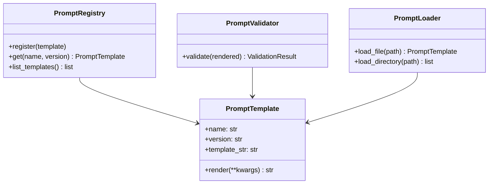
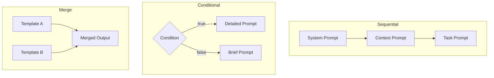

# Prompts Guide

Copyright 2026 Firefly Software Solutions Inc. Licensed under the Apache License 2.0.

The Prompts module provides a Jinja2-based template engine with versioning, composition
strategies, variable validation, and file-based loaders.

---

## Concepts

A prompt template is a parameterised text string that is rendered at runtime with
concrete values. Templates support Jinja2 syntax and can be composed, versioned, and
validated before rendering.



---

## Creating a Template

```python
from fireflyframework_genai.prompts import PromptTemplate

template = PromptTemplate(
    "greeting",
    "Hello, {{ name }}! You are a {{ role }}.",
    version="1.0.0",
)

rendered = template.render(name="Alice", role="developer")
```

---

## Versioning

The `PromptRegistry` supports multiple versions of the same template. When retrieving
a template, you can request a specific version or get the latest one.

```python
from fireflyframework_genai.prompts import PromptRegistry

registry = PromptRegistry()
registry.register(template_v1)
registry.register(template_v2)

latest = registry.get("greeting") # Returns v2
specific = registry.get("greeting", "1.0.0") # Returns v1
```

---

## Composition

Templates can be composed using three strategies:



- **SequentialComposer** -- Concatenates rendered templates in order.
- **ConditionalComposer** -- Selects a template based on a runtime predicate.
- **MergeComposer** -- Combines multiple templates into a single output with
  configurable separators.

---

## Validation

The `PromptValidator` checks that all required variables are present and that their
types match the expected schema before rendering. This prevents runtime errors in
production.

```python
from fireflyframework_genai.prompts import PromptValidator

validator = PromptValidator(max_tokens=4000, required_sections=["You are a"])
rendered = template.render(name="Alice", role="developer")
result = validator.validate(rendered)
if not result.valid:
    print(result.errors)
```

---

## Loading from Files

Templates can be loaded from individual files or entire directories. The loader
infers the template name from the filename and supports `.txt`, `.md`, and `.jinja2`
extensions.

```python
from fireflyframework_genai.prompts import PromptLoader

loader = PromptLoader()
template = loader.load_file("prompts/greeting.jinja2")
all_templates = loader.load_directory("prompts/")
```
