# Reasoning Patterns Guide

Copyright 2026 Firefly Software Solutions Inc. Licensed under the Apache License 2.0.

The Reasoning module provides pluggable reasoning strategies that structure how an
agent thinks through a problem. Rather than sending a single prompt and hoping for
a good answer, reasoning patterns decompose the task into structured, iterative
steps — each validated, traced, and stored in memory.

The framework ships with six production-ready patterns and makes it straightforward
to define custom ones.

---

## Architecture Overview

The reasoning system is built on three layers:

1. **Protocol** — `ReasoningPattern` is a `typing.Protocol` that any object can
   satisfy via duck typing: a single `async execute(agent, input, **kwargs)` method
   returning a `ReasoningResult`.
2. **Abstract base class** — `AbstractReasoningPattern` uses the Template Method
   design pattern to provide the execute loop, structured output, memory integration,
   trace recording, step counting, error handling, configurable prompts, and optional
   output review. Subclasses override a small set of hooks.
3. **Concrete patterns** — Six built-in implementations, each with its own reasoning
   strategy and prompt templates.

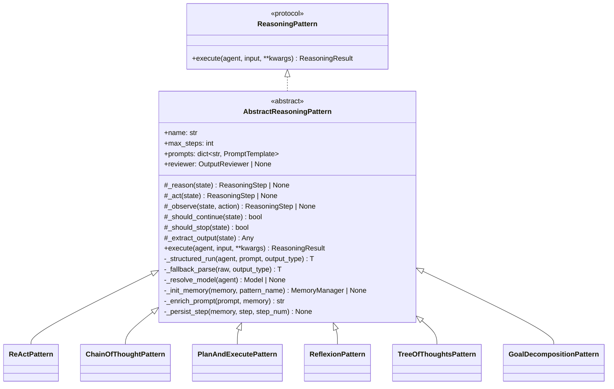

### The Execute Loop

The base class `execute()` method drives the standard reason-act-observe loop.
Patterns that need a different flow (Tree of Thoughts, Goal Decomposition) override
`execute()` entirely while reusing the infrastructure methods.

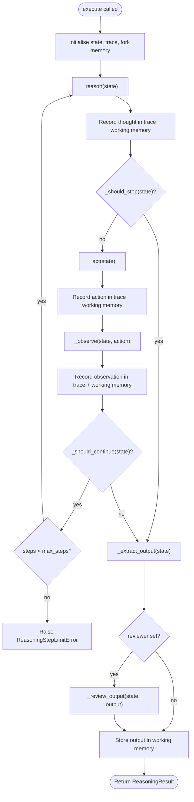

### Hook Reference

Subclasses override these hooks to define the pattern's behaviour:

- **`_reason(state)`** *(abstract)* — Generate a thought for the current state. Return a `ThoughtStep`, `PlanStep`, or `None`.
- **`_act(state)`** *(abstract)* — Perform an action (e.g. call the agent or a tool). Return an `ActionStep` or `None`.
- **`_observe(state, action)`** — Process the result of the action. Default: no-op.
- **`_should_stop(state)`** — Early exit before acting (checked after `_reason`). Default: `False`.
- **`_should_continue(state)`** — Continue the loop after observing. Default: `False` (single iteration).
- **`_extract_output(state)`** — Produce the final result. Default: `state["output"]`.

---

## Structured Output

All reasoning patterns use typed Pydantic models instead of unstructured text. This
replaces fragile magic stop-phrases (`FINISH`, `CONCLUSION:`, `SATISFIED`) and regex
parsing with explicit schema validation.

### The `_structured_run` Mechanism

When a pattern needs structured output, it calls `_structured_run(agent, prompt, output_type)`:

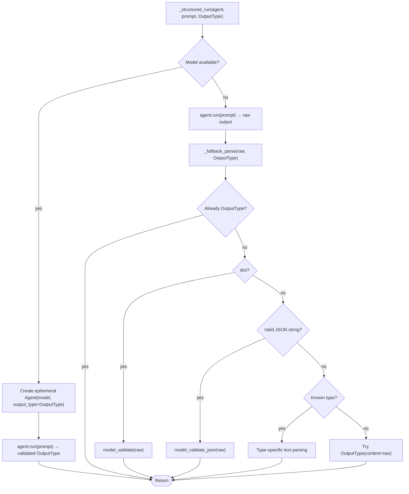

The model is resolved from:
1. The pattern's constructor `model` parameter.
2. The agent's underlying model (via `_resolve_model()`).
3. If neither is available, the fallback parse cascade handles raw text.

### Model Catalogue

- **`ReasoningThought`** — Content, confidence (0.0–1.0), `is_final` flag, and `final_answer`. Used by Chain of Thought and ReAct.
- **`ReasoningAction`** — Tool name, arguments dict, and reasoning.
- **`ReasoningPlan`** — Goal string and `steps: list[PlanStepDef]`. Each `PlanStepDef` carries `id`, `description`, `dependencies`, `status` (`StepStatus` enum: pending/running/completed/failed/skipped), and `output`.
- **`ReflectionVerdict`** — `is_satisfactory` boolean, `issues` list, and `suggestions` list. Used by Reflexion.
- **`BranchEvaluation`** — `branch_id` (0-based), `score` (0.0–1.0), and `reasoning`. Used by Tree of Thoughts.
- **`BranchList`** — `branches: list[str]`. Structured branch generation for Tree of Thoughts.
- **`GoalDecompositionResult`** — `goal` and `phases: list[GoalPhase]`. Each `GoalPhase` has `name`, `description`, and `tasks`.
- **`ReasoningResult[T]`** — Generic result with typed `output: T`, `trace`, `steps_taken`, and `success`.

```python
from fireflyframework_genai.reasoning.models import (
    ReasoningThought,
    ReasoningPlan,
    PlanStepDef,
    StepStatus,
    ReflectionVerdict,
    BranchEvaluation,
    BranchList,
    GoalDecompositionResult,
    GoalPhase,
)

# Structured thought — the is_final flag replaces magic stop-phrases
thought = ReasoningThought(
    content="The answer is 42",
    is_final=True,
    final_answer="42",
    confidence=0.95,
)

# Structured plan with step dependency tracking
plan = ReasoningPlan(
    goal="Build a REST API",
    steps=[
        PlanStepDef(id="step_1", description="Design schema"),
        PlanStepDef(id="step_2", description="Implement endpoints", dependencies=["step_1"]),
    ],
)
```

---

## Reasoning Trace

Every pattern records its intermediate steps in a `ReasoningTrace` — an ordered
list of typed `ReasoningStep` objects. The trace captures the full chain of thought,
making every reasoning run inspectable for observability, explainability, and debugging.

Step types:

- **`ThoughtStep`** — The agent's internal reasoning. Fields: `content`, `confidence`.
- **`ActionStep`** — A tool invocation or external action. Fields: `tool_name`, `tool_args`.
- **`ObservationStep`** — The result of an action. Fields: `content`, `source`.
- **`ReflectionStep`** — Self-evaluation of progress. Fields: `critique`, `should_retry`.
- **`PlanStep`** — A plan or sub-goal. Fields: `description`, `sub_steps`.

Each step carries a `kind` discriminator field (`"thought"`, `"action"`, `"observation"`,
`"reflection"`, `"plan"`) for easy filtering and serialisation.

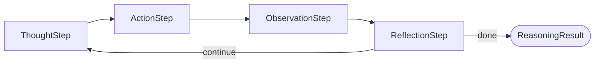

```python
result = await pattern.execute(my_agent, "Explain quantum computing")
for step in result.trace.steps:
    print(f"[{step.kind}] {step.content if hasattr(step, 'content') else step.tool_name}")
```

---

## Logging & Debugging

Every reasoning pattern and the `FireflyAgent` emit structured log messages
under the `fireflyframework_genai` logger hierarchy. Use `configure_logging`
to turn on framework-level logging without affecting other libraries:

```python
from fireflyframework_genai import configure_logging

configure_logging("INFO") # pattern lifecycle, step progress, timing
configure_logging("DEBUG") # + LLM call durations, prompt enrichment, memory ops
```

Or use the one-liner shortcut:

```python
from fireflyframework_genai import enable_debug

enable_debug() # equivalent to configure_logging("DEBUG")
```

Key events logged at **INFO** level:

- Pattern start / iteration / completion with elapsed time.
- Plan generation step count and descriptions (Plan-and-Execute).
- Branch generation and evaluation scores (Tree of Thoughts).
- Phase and task progress (Goal Decomposition).
- Critique verdicts and retry decisions (Reflexion).
- Thought content previews and `is_final` signals (CoT, ReAct).
- Pipeline stage transitions and per-pattern timing.

### Step Timeout

All patterns accept a `step_timeout` parameter (in seconds) that guards
individual LLM calls against indefinite hangs. When a call exceeds the
timeout, a `ReasoningError` is raised.

```python
from fireflyframework_genai.reasoning import PlanAndExecutePattern

pattern = PlanAndExecutePattern(
    max_steps=10,
    step_timeout=120.0, # 120 s per LLM call
)
```

The timeout is applied to both `_structured_run()` calls and direct
`agent.run()` calls within patterns that make their own LLM invocations
(e.g. Plan-and-Execute step execution).

---

## Pattern Catalogue

### ReAct (Reasoning + Acting)

The ReAct pattern (Yao et al., 2022) interleaves reasoning with action in a loop.
Each iteration produces a structured `ReasoningThought`; when `is_final=True`,
the loop exits and the final answer is returned.

**Iteration flow:**

1. **Thought** — The agent analyses the current state via `_structured_run(ReasoningThought)` and decides whether it can answer or needs to act.
2. **Early stop** — If `is_final=True`, the loop breaks before acting.
3. **Action** — The agent takes a step toward the answer using the action prompt.
4. **Observation** — The action result is recorded in state and working memory.
5. **Continue** — The loop repeats until `is_final=True` or `max_steps` is reached.

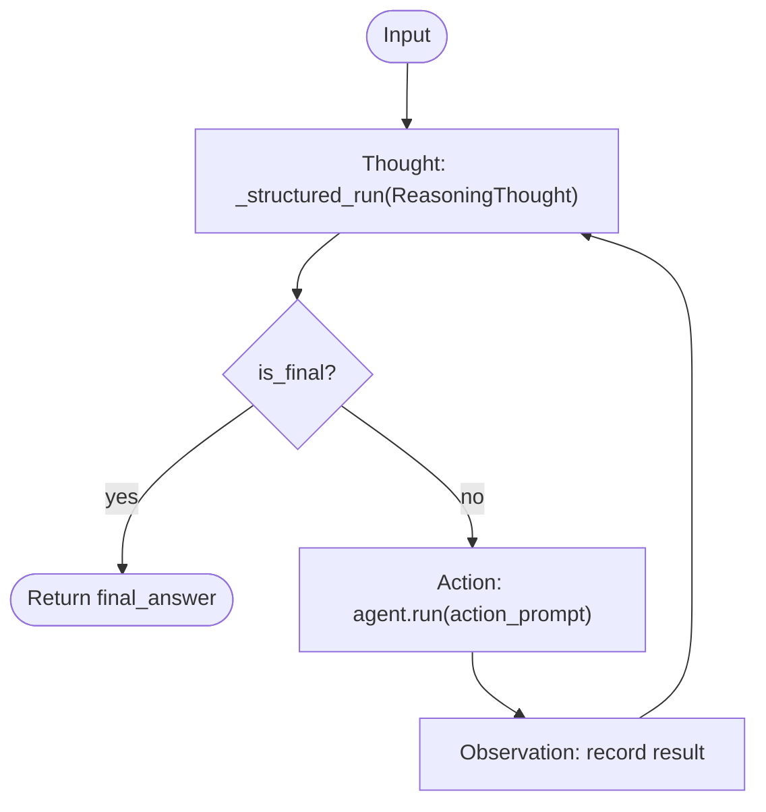

```python
from fireflyframework_genai.reasoning import ReActPattern

pattern = ReActPattern(max_steps=5)
result = await pattern.execute(my_agent, "What is the population of Tokyo?")
print(result.output) # The final answer
print(result.steps_taken) # Number of iterations
```

**Prompt slots:** `"thought"`, `"action"`

---

### Chain of Thought

Chain of Thought (CoT) prompts the agent to reason step by step. Unlike ReAct, CoT
does not interleave actions — each iteration generates a single `ReasoningThought`
that builds on all previous steps. The chain concludes when `is_final=True`.

**Iteration flow:**

1. **Step** — The prompt includes the problem and all previous reasoning steps. The agent produces a `ReasoningThought` via `_structured_run`.
2. The thought is appended to the chain for the next iteration.
3. When `is_final=True`, the `final_answer` (or last thought content) is returned.

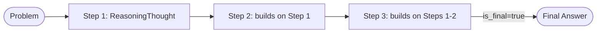

```python
from fireflyframework_genai.reasoning import ChainOfThoughtPattern

pattern = ChainOfThoughtPattern(max_steps=10)
result = await pattern.execute(
    my_agent,
    "If a train travels 60 km/h for 2.5 hours, how far does it go?",
)
```

**Prompt slots:** `"step"`

---

### Plan-and-Execute

The Plan-and-Execute pattern first generates a structured `ReasoningPlan` with typed
`PlanStepDef` items, then executes each step sequentially. Each step's status is
tracked as it progresses through the `StepStatus` lifecycle. When `allow_replan=True`,
the plan can be revised after a step failure.

**Flow:**

1. **Plan** — Generate a `ReasoningPlan` via `_structured_run`. The plan is persisted to working memory.
2. **Execute** — For each `PlanStepDef`:
   - Set status to `running`.
   - Execute via the step execution prompt (includes results from completed steps).
   - On success: status → `completed`, output stored.
   - On failure: status → `failed`, optionally trigger replan.
3. **Result** — The list of all step outputs is returned.

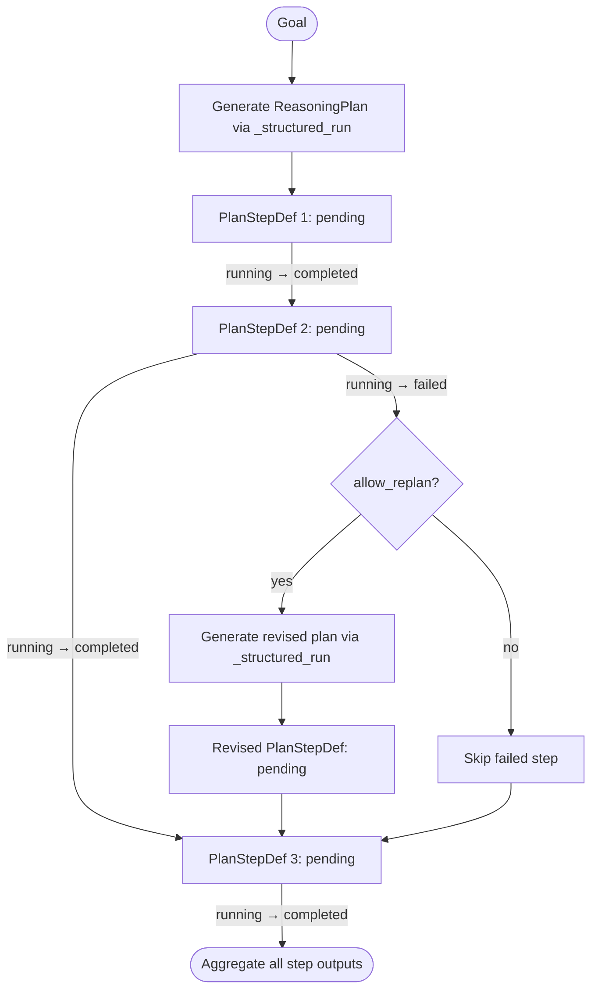

```python
from fireflyframework_genai.reasoning import PlanAndExecutePattern

pattern = PlanAndExecutePattern(max_steps=15, allow_replan=True)
result = await pattern.execute(
    my_agent,
    "Research and summarise the top 3 Python web frameworks.",
)
# result.output is a list of step outputs
```

**Prompt slots:** `"plan"`, `"execute_step"`, `"replan"`

---

### Reflexion

Reflexion adds a structured self-evaluation loop. The agent first produces an answer,
then critiques it via a `ReflectionVerdict`. If `is_satisfactory=False`, the issues
and suggestions are fed back into a retry prompt, and the agent produces an improved
answer.

**Iteration flow:**

1. **Execute** — The agent produces an answer (or retries with feedback from the previous verdict).
2. **Reflect** — The answer is critiqued via `_structured_run(ReflectionVerdict)`.
3. If `is_satisfactory=False`, the loop continues with specific issues and suggestions injected into the retry prompt.
4. If `is_satisfactory=True`, the current answer is returned.

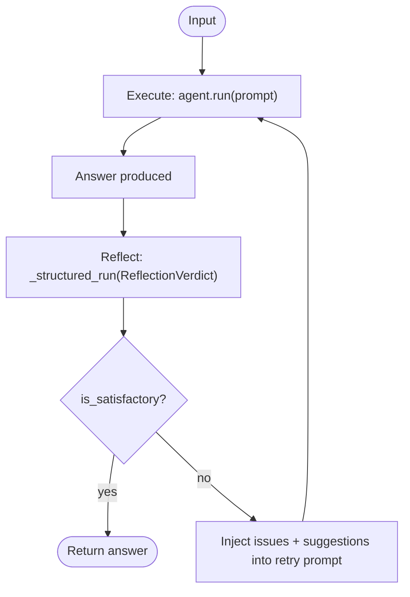

```python
from fireflyframework_genai.reasoning import ReflexionPattern

pattern = ReflexionPattern(max_steps=3)
result = await pattern.execute(
    my_agent,
    "Write a unit test for a binary search function.",
)
```

**Prompt slots:** `"critique"`, `"retry"`

---

### Tree of Thoughts

Tree of Thoughts (ToT) explores multiple reasoning branches in parallel and
evaluates each with a structured `BranchEvaluation`. The highest-scoring branch
is selected. This pattern overrides `execute()` entirely with its own
branch-evaluate-select flow.

**Flow:**

1. **Branch** — Generate `branching_factor` distinct approaches via `_structured_run(BranchList)`.
2. **Evaluate** — Score each branch via `_structured_run(BranchEvaluation)`. The `branch_id` is corrected if the LLM returns the wrong index.
3. **Select** — The branch with the highest `score` is returned.

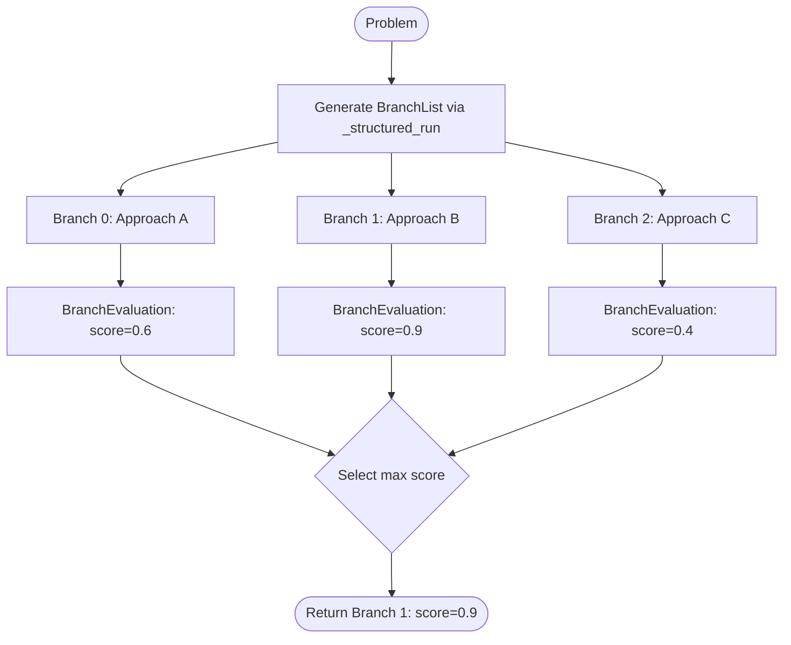

```python
from fireflyframework_genai.reasoning import TreeOfThoughtsPattern

pattern = TreeOfThoughtsPattern(branching_factor=3, max_depth=3)
result = await pattern.execute(
    my_agent,
    "Design an API for a task management system.",
)
```

**Prompt slots:** `"branch"`, `"evaluate"`

---

### Goal Decomposition

Goal Decomposition hierarchically breaks a high-level goal into structured
`GoalPhase` objects, each with concrete tasks. This pattern overrides `execute()`
entirely. Individual tasks can optionally be delegated to another reasoning pattern
(e.g. ReAct) via the `task_pattern` parameter.

**Flow:**

1. **Decompose** — Generate a `GoalDecompositionResult` via `_structured_run`. The result is persisted to working memory.
2. **Plan** — For each phase, use the phase's `tasks` list (or generate tasks via the plan-phase prompt if empty).
3. **Execute** — Execute each task either directly (via the task execution prompt) or by delegating to `task_pattern.execute()`.
4. **Result** — The list of all task outputs is returned.

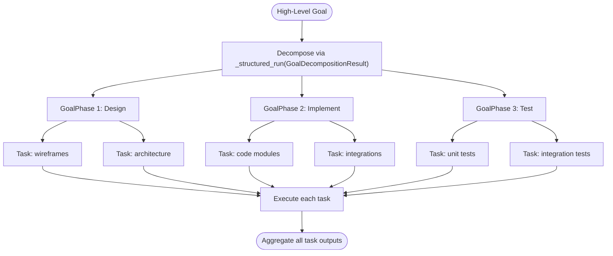

```python
from fireflyframework_genai.reasoning import GoalDecompositionPattern

pattern = GoalDecompositionPattern(max_steps=20)
result = await pattern.execute(
    my_agent,
    "Build a customer feedback analysis pipeline.",
)

# Delegate tasks to a sub-pattern:
from fireflyframework_genai.reasoning import ReActPattern

pattern = GoalDecompositionPattern(
    max_steps=20,
    task_pattern=ReActPattern(max_steps=5),
)
```

**Prompt slots:** `"decompose"`, `"plan_phase"`, `"execute_task"`

---

## Memory Integration

Reasoning patterns integrate with the framework's `MemoryManager` to maintain
working-memory context across iterations. When `memory` is passed to `execute()`,
the pattern automatically manages an isolated working-memory scope.

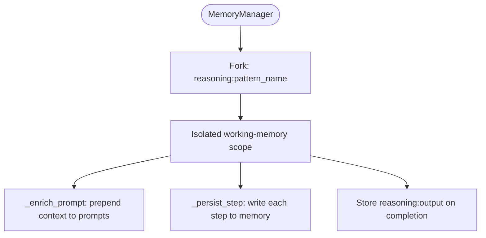

**Lifecycle within a pattern execution:**

1. **Fork** — `_init_memory()` forks the `MemoryManager` into a scoped working-memory slot (e.g. `reasoning:react`). This isolates the pattern's state from other concurrent reasoning runs.
2. **Enrich** — Before each LLM call, `_enrich_prompt()` prepends working memory context to the prompt. This gives the LLM access to all prior reasoning steps.
3. **Persist** — After each reason/act/observe step, `_persist_step()` writes the step summary to working memory under namespaced keys (`reasoning:step:N`, `reasoning:last_step`).
4. **Store output** — On completion, the final output is stored under `reasoning:output`.

```python
from fireflyframework_genai.memory import MemoryManager
from fireflyframework_genai.reasoning import ReActPattern

memory = MemoryManager()
pattern = ReActPattern(max_steps=10)

# Memory is automatically forked, enriched, and persisted
result = await pattern.execute(my_agent, "Research topic X", memory=memory)
```

When using `FireflyAgent.run_with_reasoning()`, the agent's attached memory is
passed automatically — see the [Agents Guide](agents.md#reasoning-patterns).

---

## Pipeline

The `ReasoningPipeline` chains multiple patterns sequentially. The output of one
pattern becomes the input to the next. A pipeline is itself a `ReasoningPattern`,
so pipelines can be nested.

When `memory` is passed, it flows through to every pattern. Each pattern forks the
memory into its own scope (`reasoning:<pattern_name>`), so subsequent patterns can
read earlier patterns' outputs via the shared backing store.

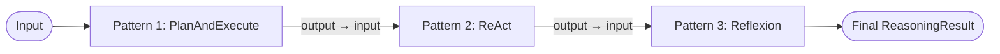

```python
from fireflyframework_genai.reasoning import (
    PlanAndExecutePattern,
    ReActPattern,
    ReasoningPipeline,
)

pipeline = ReasoningPipeline([
    PlanAndExecutePattern(max_steps=15),
    ReActPattern(max_steps=10),
])
result = await pipeline.execute(
    my_agent,
    "Analyse last quarter's sales data and produce a report.",
)
```

The returned `ReasoningResult` contains a merged trace spanning all patterns and
a total `steps_taken` count.

---

## Configurable Prompts

Every pattern uses `PromptTemplate` instances for its LLM calls. By default, the
built-in templates from `reasoning.prompts` are used. You can override any prompt
by passing a `prompts` dict to the pattern constructor. Slots that are not overridden
use the built-in defaults.

```python
from fireflyframework_genai.prompts.template import PromptTemplate, PromptVariable
from fireflyframework_genai.reasoning import ReActPattern

custom_thought = PromptTemplate(
    "my:react:thought",
    "Think step by step about: {{ context }}",
    variables=[PromptVariable(name="context")],
)
pattern = ReActPattern(prompts={"thought": custom_thought})
```

### Prompt Slots per Pattern

- **ReActPattern**: `"thought"`, `"action"`
- **ChainOfThoughtPattern**: `"step"`
- **PlanAndExecutePattern**: `"plan"`, `"execute_step"`, `"replan"`
- **ReflexionPattern**: `"critique"`, `"retry"`
- **TreeOfThoughtsPattern**: `"branch"`, `"evaluate"`
- **GoalDecompositionPattern**: `"decompose"`, `"plan_phase"`, `"execute_task"`

All built-in templates are registered in the global `prompt_registry` under the
`reasoning:` namespace (e.g. `"reasoning:react:thought"`, `"reasoning:cot:step"`).
Templates can also be retrieved from the registry at runtime:

```python
from fireflyframework_genai.prompts.registry import prompt_registry

thought_prompt = prompt_registry.get("reasoning:react:thought")
```

---

## Output Reviewer Integration

Any pattern can be paired with an `OutputReviewer` from the validation module.
When set, the final output is validated after `_extract_output()` and retried if
it does not match the expected schema. If all retries fail, the raw output is
returned with a warning logged (non-fatal by default).

```python
from fireflyframework_genai.validation import OutputReviewer
from fireflyframework_genai.reasoning import ReActPattern
from pydantic import BaseModel

class MyOutput(BaseModel):
    answer: str
    confidence: float

reviewer = OutputReviewer(output_type=MyOutput, max_retries=2)
pattern = ReActPattern(reviewer=reviewer)
result = await pattern.execute(my_agent, "What is 2+2?")
```

See the [Validation Guide](validation.md) for full `OutputReviewer` documentation.

---

## Pattern Registry

The `ReasoningPatternRegistry` provides framework-wide discovery of reasoning
patterns by name. All six built-in patterns can be registered at application
startup, and custom patterns can be added dynamically.

```python
from fireflyframework_genai.reasoning.registry import reasoning_registry
from fireflyframework_genai.reasoning import ReActPattern

reasoning_registry.register("react", ReActPattern)

# Look up and instantiate later
pattern_cls = reasoning_registry.get("react")
pattern = pattern_cls(max_steps=5)
```

---

## Creating a Custom Pattern

To create a custom reasoning pattern, extend `AbstractReasoningPattern` and override
the template method hooks. The base class handles the loop, tracing, memory, step
counting, and error handling for you.

```python
from fireflyframework_genai.reasoning.base import AbstractReasoningPattern
from fireflyframework_genai.reasoning.models import ReasoningThought
from fireflyframework_genai.reasoning.trace import ThoughtStep, ReasoningStep

class MyCustomPattern(AbstractReasoningPattern):
    def __init__(self, *, max_steps: int = 10, step_timeout: float | None = None, **kwargs):
        super().__init__("my_custom", max_steps=max_steps, step_timeout=step_timeout, **kwargs)

    async def _reason(self, state: dict) -> ReasoningStep | None:
        agent = state["agent"]
        memory = state.get("memory")
        prompt = f"Reason about: {state['input']}"
        prompt = self._enrich_prompt(prompt, memory) # inject working memory
        thought = await self._structured_run(agent, prompt, ReasoningThought)
        state["last_thought"] = thought
        if thought.is_final:
            state["output"] = thought.final_answer or thought.content
        return ThoughtStep(content=thought.content, confidence=thought.confidence)

    async def _act(self, state: dict) -> ReasoningStep | None:
        # Optional: take an action based on the thought
        return None

    async def _should_continue(self, state: dict) -> bool:
        thought = state.get("last_thought")
        return thought is None or not thought.is_final

    async def _extract_output(self, state: dict):
        return state.get("output")
```

Register it to make it available framework-wide:

```python
from fireflyframework_genai.reasoning.registry import reasoning_registry

reasoning_registry.register("my_custom", MyCustomPattern)
```

---

## Examples

The `examples/` directory contains runnable scripts for every pattern:

- `reasoning_cot.py` — Chain of Thought
- `reasoning_react.py` — ReAct
- `reasoning_reflexion.py` — Reflexion
- `reasoning_plan.py` — Plan-and-Execute
- `reasoning_tot.py` — Tree of Thoughts
- `reasoning_goal.py` — Goal Decomposition
- `reasoning_pipeline.py` — Pipeline (chaining patterns)
- `reasoning_memory.py` — Memory integration

Run any example with:

```bash
export OPENAI_API_KEY="sk-..."
uv run python examples/reasoning_cot.py
```

See [examples/README.md](../examples/README.md) for the full list.
