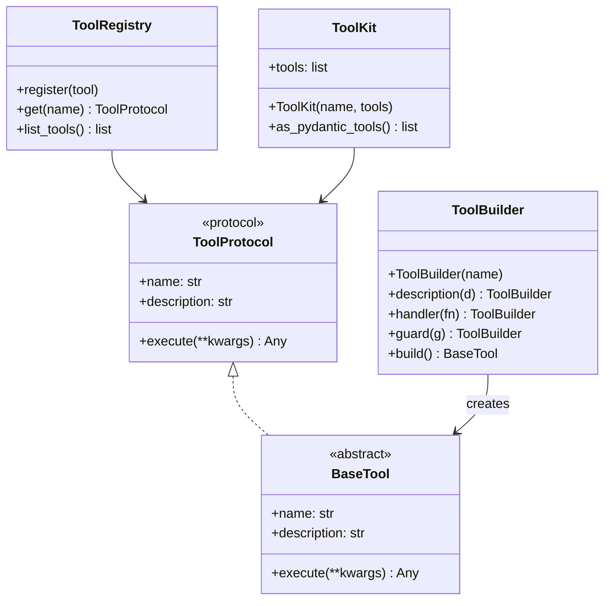
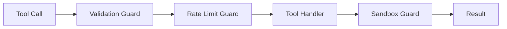
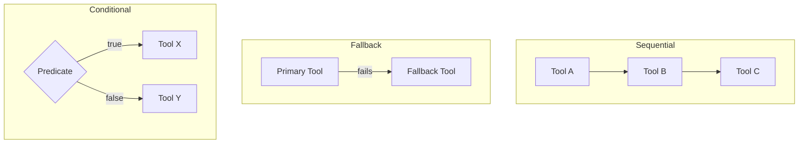

# Tools Guide

Copyright 2026 Firefly Software Solutions Inc. Licensed under the Apache License 2.0.

The Tools module provides a protocol-driven system for defining, guarding, composing,
and registering tools that agents can invoke.

---

## Concepts

A tool is any callable that an agent can use to interact with external systems or
perform computations. The framework wraps tools with metadata, guards, and composition
logic.



---

## Creating a Tool

### Using the Decorator

```python
from fireflyframework_genai.tools import firefly_tool

@firefly_tool(name="calculator", description="Evaluate a math expression")
async def calculator(expression: str) -> str:
    return str(eval(expression))
```

### Using the Builder

The fluent `ToolBuilder` lets you construct tools step by step:

```python
from fireflyframework_genai.tools import ToolBuilder

tool = (
    ToolBuilder("weather")
    .description("Get current weather for a city")
    .handler(get_weather_fn)
    .build()
)
```

---

## Guards

Guards wrap tool execution to enforce policies. They run before and/or after the
tool's handler.



### Built-in Guards

- **ValidationGuard** -- Validates input arguments against a schema before execution.
- **RateLimitGuard** -- Enforces a maximum number of calls within a time window.
- **ApprovalGuard** -- Requires explicit approval before execution (useful for
  destructive operations).
- **SandboxGuard** -- Restricts the execution environment (filesystem paths, network
  access).
- **CompositeGuard** -- Chains multiple guards together.

### Applying Guards

```python
from fireflyframework_genai.tools import guarded
from fireflyframework_genai.tools.guards import RateLimitGuard

@guarded(RateLimitGuard(max_calls=10, period_seconds=60))
@firefly_tool(name="search", description="Search the web")
async def search(query: str) -> str:
    ...
```

---

## Composition

Tools can be composed into higher-level operations:

- **SequentialComposer** -- Runs tools in order, passing each output as input to the next.
- **FallbackComposer** -- Tries tools in order until one succeeds.
- **ConditionalComposer** -- Selects a tool based on a predicate.



---

## Built-in Tools

The framework ships with nine ready-to-use tools in `tools/builtins/`.

### Concrete tools (ready to use)

- **DateTimeTool** -- Get the current date, time, or Unix timestamp with timezone conversion. Actions: `now`, `date`, `time`, `timestamp`, `timezones`.
- **CalculatorTool** -- Safely evaluate math expressions using AST-based parsing (no `eval`). Supports arithmetic, functions (`sqrt`, `sin`, `cos`, `log`, etc.), and constants (`pi`, `e`).
- **JsonTool** -- Parse, validate, extract (dot-path), format, and list keys of JSON data.
- **TextTool** -- Text utilities: count (words/chars/sentences/lines), extract (regex), truncate, replace, and split.
- **HttpTool** -- Make HTTP requests (GET, POST, PUT, DELETE). Uses `asyncio.to_thread` to keep the event loop non-blocking.
- **FileSystemTool** -- Read, write, and list files within a sandboxed base directory. Path-traversal attacks are rejected.
- **ShellTool** -- Execute shell commands restricted to an explicit allow-list. Empty allow-list rejects all commands (safe default).

### Abstract tools (subclass to use)

- **SearchTool** -- Web search abstraction. Subclass and implement `_search()` with your provider (Tavily, SerpAPI, Brave, etc.).
- **DatabaseTool** -- SQL/NoSQL query abstraction. Subclass and implement `_execute_query()` with your driver. Read-only mode enforced by default.

```python
from fireflyframework_genai.tools.builtins import (
    DateTimeTool,
    CalculatorTool,
    JsonTool,
    TextTool,
)

datetime_tool = DateTimeTool(default_timezone="America/New_York")
json_tool = JsonTool()
text_tool = TextTool()
calculator = CalculatorTool()
```

---

## Using Built-in Tools with Agents

`FireflyAgent` automatically converts `BaseTool` and `ToolKit` instances into
Pydantic AI tools. You can pass them directly to the `tools` parameter:

```python
from fireflyframework_genai.agents import FireflyAgent
from fireflyframework_genai.tools.builtins import DateTimeTool, CalculatorTool

agent = FireflyAgent(
    name="assistant",
    model="openai:gpt-4o",
    tools=[DateTimeTool(), CalculatorTool()], # auto-converted
)
```

You can also use a `ToolKit` to group tools:

```python
from fireflyframework_genai.tools.toolkit import ToolKit
from fireflyframework_genai.tools.builtins import DateTimeTool, JsonTool, TextTool

kit = ToolKit("utilities", [DateTimeTool(), JsonTool(), TextTool()])
agent = FireflyAgent(name="helper", model="openai:gpt-4o", tools=[kit])
```

Plain async functions and `pydantic_ai.Tool` objects are passed through unchanged.

---

## HttpTool with Connection Pooling

`HttpTool` provides HTTP client functionality with optional connection pooling
for improved performance in production deployments.

### Basic Usage

```python
from fireflyframework_genai.tools.builtins import HttpTool

http_tool = HttpTool()

# Make requests
response = await http_tool.run("GET", "https://api.example.com/data")
print(response["status"]) # 200
print(response["body"]) # Response text
```

### Connection Pooling

Enable connection pooling to reuse TCP connections across requests, reducing
latency and improving throughput:

```python
from fireflyframework_genai.tools.builtins import HttpTool

http_tool = HttpTool(
    use_pool=True, # Enable connection pooling (default: True)
    pool_size=100, # Max concurrent connections (default: 100)
    pool_max_keepalive=20, # Max keepalive connections (default: 20)
    timeout=30.0, # Request timeout in seconds
)
```

Connection pooling uses `httpx.AsyncClient` under the hood, providing:

- **TCP connection reuse** — Eliminates handshake overhead for repeated requests
- **HTTP/2 support** — Automatic upgrade when server supports it
- **Automatic keepalive** — Maintains connection pools efficiently
- **Thread-safe** — Safe for concurrent use across agents

### Configuration

```bash
# Enable connection pooling (default: true)
export FIREFLY_GENAI_HTTP_POOL_ENABLED=true

# Configure pool size
export FIREFLY_GENAI_HTTP_POOL_SIZE=100
export FIREFLY_GENAI_HTTP_POOL_MAX_KEEPALIVE=20

# Set default timeout
export FIREFLY_GENAI_HTTP_POOL_TIMEOUT=30.0
```

### Fallback to urllib

If `httpx` is not installed, `HttpTool` automatically falls back to `urllib`
with `asyncio.to_thread()` for non-blocking I/O:

```python
# Works even without httpx installed
http_tool = HttpTool(use_pool=False) # Forces urllib
```

### Performance Comparison

With connection pooling enabled:

- **Latency**: 50-70% reduction for repeated requests to the same host
- **Throughput**: 2-3x improvement for high-volume workloads
- **Memory**: Minimal overhead (~10KB per pooled connection)

### Usage with Agents

```python
from fireflyframework_genai.agents import FireflyAgent
from fireflyframework_genai.tools.builtins import HttpTool

agent = FireflyAgent(
    name="api-agent",
    model="openai:gpt-4o",
    tools=[HttpTool(use_pool=True, pool_size=50)],
)

# Agent can make efficient HTTP requests with connection reuse
result = await agent.run("Fetch data from https://api.example.com/users")
```

### Cleanup

When using connection pooling, close the client when done to release resources:

```python
http_tool = HttpTool(use_pool=True)

try:
    response = await http_tool.run("GET", "https://api.example.com")
finally:
    await http_tool.close() # Release connection pool
```

Or use as an async context manager:

```python
async with HttpTool(use_pool=True) as http_tool:
    response = await http_tool.run("GET", "https://api.example.com")
# Connections automatically released
```

---

## CachedTool

`CachedTool` wraps any `ToolProtocol` implementation and transparently
memoises results using a TTL-based in-memory cache keyed on the tool's
input arguments. This is ideal for deterministic tools (lookups, calculations)
where repeated calls with the same arguments should avoid redundant work.

```python
from fireflyframework_genai.tools.cached import CachedTool
from fireflyframework_genai.tools.builtins import HttpTool

cached_http = CachedTool(HttpTool(), ttl_seconds=600.0, max_entries=256)
result = await cached_http.execute(url="https://api.example.com/data")
# Second call with same args returns cached result
result2 = await cached_http.execute(url="https://api.example.com/data")
```

Parameters:

- **`ttl_seconds`** — Time-to-live in seconds for cached entries (default: 300).
  Pass `0` to disable caching (pass-through).
- **`max_entries`** — Maximum entries before FIFO eviction (default: 1024).

Cache management methods:

- **`invalidate(**kwargs)`** — Remove a specific entry by its arguments.
- **`clear()`** — Drop all cached entries. Returns the number evicted.
- **`cache_size`** — Current number of entries in the cache.

`CachedTool` conforms to `ToolProtocol`, so it integrates transparently with
`FireflyAgent`, `ToolKit`, and `ToolRegistry`.

---

## Tool Timeout

`BaseTool` supports an optional `timeout` parameter (in seconds) that wraps
the tool's `_execute` call in `asyncio.wait_for`. If the call exceeds the
timeout, a `ToolTimeoutError` is raised.

```python
from fireflyframework_genai.tools.builtins import HttpTool

# Timeout HTTP calls after 10 seconds
http_tool = HttpTool(timeout=10.0)

try:
    result = await http_tool.execute(url="https://slow-api.example.com")
except ToolTimeoutError:
    print("Tool timed out")
```

This is useful for enforcing SLAs and preventing runaway tool executions
in production pipelines.

---

## Tool Registry

The `ToolRegistry` provides global tool lookup by name:

```python
from fireflyframework_genai.tools.registry import ToolRegistry

registry = ToolRegistry()
registry.register(my_tool)
tool = registry.get("my_tool")
```
