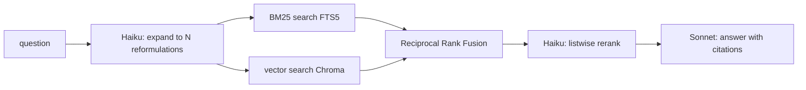

# Use Case: Corpus Search (`CorpusAgent`)

Copyright 2026 Firefly Software Solutions Inc. Licensed under the Apache License 2.0.

| | |
|---|---|
| Status | Design — pre-implementation |
| Date | 2026-04-29 |
| Branch | `javi/markitdown` |
| Supersedes | An earlier draft of this doc that included a knowledge-graph + extractors design — superseded by this corpus-search-first approach. |

This guide specifies a modular agent built on `fireflyframework-agentic` that watches
or scans a folder for new documents, ingests them via `markitdown`, and exposes a
hybrid (BM25 + vector) search query interface with LLM query expansion and answer
synthesis. No knowledge graph, no entity extractors at V1; structured extraction
(BPMN, person profiles) is deferred to V2 as **post-processing tools that operate on
the corpus**, not as ingest-time work.

The product is the qmd / GraphRAG-without-the-graph pattern: drop documents in a
folder, ask questions in natural language, get answers with citations.

---

## 1. Goal

A two-mode agent on top of `fireflyframework-agentic`:

- **Ingest mode** — scan a folder (or watch it), convert each file via `markitdown`,
  chunk, embed via OpenAI, and persist in a single SQLite file (chunks + FTS5) plus a
  Chroma vector store.
- **Query mode** — given a natural-language question, expand it via Haiku into 3–5
  reformulations, run BM25 + vector search for each, fuse the rankings via Reciprocal
  Rank Fusion (RRF), and synthesise an answer with `[chunk_id]` citations via Sonnet.

V1 ships **both modes end-to-end**. No reranker; RRF + Sonnet's reasoning over the
fused chunks does the work.

V2 (deferred) adds **post-processing extractors** — `extract_bpmn(doc_id)`,
`extract_person(name)`, `list_entities(type)` — that operate on the corpus, run an
LLM extraction, and emit a structured artefact (e.g. `.bpmn` XML, profile JSON). No
graph layer is required for these.

V3 (only if needed) adds a property-graph layer for fast cross-document structured
queries; the V2 extractors then become graph populators rather than one-shots.

---

## 2. Storage & deployment constraint (firm)

All persistent state lives on disk under a single root folder (default `./kg/`). All
dependencies are Python libraries — no daemons, no servers, no docker, no external
services beyond LLM/embedding API calls. The agent runs as a single Python process.

| Concern | Mechanism |
|---|---|
| Chunk store + FTS5 + ledger | SQLite (`./kg/corpus.sqlite`, WAL mode) |
| Chunk vectors | Chroma `PersistentClient` (`./kg/chroma/`) |
| File watching | `watchfiles` (in-process) |
| Document loading | `markitdown[pdf,docx,pptx,xlsx]` |

Network calls in V1 are limited to:
- **Embeddings** — Azure OpenAI by default (`EMBEDDING_BINDING_HOST` +
  `EMBEDDING_BINDING_API_KEY`). Plain OpenAI is supported by passing
  `--embed-model openai:<model>` (uses `OPENAI_API_KEY`).
- **Anthropic** — query expansion (Haiku) and answer synthesis (Sonnet).
  `ANTHROPIC_API_KEY` is **only required for `query`** — `ingest` never calls
  Anthropic, so it can run with embedding credentials alone.

---

## 3. Decisions consolidated

| # | Decision |
|---|---|
| Pipeline shape | Linear ingest (no fan-out, no extractors); single-call query |
| Trigger | Batch CLI primary; watcher (`watchfiles`) wraps the same code path |
| Chunk store | SQLite with FTS5 over chunk content (BM25 ranking) |
| Vector store | Chroma `PersistentClient`, OpenAI embeddings |
| Ledger | Co-located in `corpus.sqlite` as the `ingestions` table |
| Re-ingestion | Doc-id replace (delete chunks for `doc_id`, then re-chunk and re-embed) |
| Query expansion | Haiku, 3–5 reformulations per question |
| Hybrid retrieval | BM25 (FTS5) + vector (Chroma) per reformulation, fused via RRF (k=60) |
| Reranker | **Haiku listwise reranker** between retrieval and answer — wider initial pool (default 20) → top-K (default 5) by judged relevance, halving Sonnet's input and improving precision |
| Answer synthesis | Sonnet 4.6 with retrieved chunks as context, `[chunk_id]` citations |
| LLM (expansion) | `anthropic:claude-haiku-4-5-20251001`; env `ANTHROPIC_API_KEY` |
| LLM (answer) | `anthropic:claude-sonnet-4-6` |
| Embeddings (default) | `azure:text-embedding-3-small` — env `EMBEDDING_BINDING_HOST` + `EMBEDDING_BINDING_API_KEY` |
| Embeddings (alternative) | `openai:text-embedding-3-small` — env `OPENAI_API_KEY` |
| Concurrency | Files processed serially in V1 |
| Config surface | CLI flags only (no config file) |
| Default `--root` | `./kg` |
| Default top-K (per-modality retrieval) | BM25=30, vector=30 |
| Default rerank pool | 20 fused candidates fed to the reranker |
| Default top-K (post-rerank, fed to Sonnet) | 5 |
| Embed retry on transient errors | Exponential backoff + Retry-After honouring; 5 attempts default |
| FTS5 query sanitisation | Free-text questions stripped of `?`, `"`, `(`, `)`, `:`, `*`, etc. before MATCH |
| V2 (deferred) | Per-doc / per-entity extraction tools as post-processing over the corpus |

---

## 4. Architecture

### 4.1 Pipeline overview

**Ingest (per file):**


**Query (per question):**



The reranker reads each candidate's content against the question and
narrows the RRF pool (default 20) down to the top-K (default 5) that
actually answer the question — better precision and faster Sonnet
than feeding the raw RRF top-10 directly.

### 4.2 Framework additions

```
src/fireflyframework_agentic/
├── content/loaders/                      [NEW]
│   └── markitdown.py                     # MarkitdownLoader -> Document(content, metadata)
└── pipeline/triggers/                    [NEW]
    └── folder_watcher.py                 # FolderWatcher (watchfiles + stability + reconciliation)
```

`pyproject.toml` adds optional extras:

- `[markitdown]` — `markitdown[pdf,docx,pptx,xlsx]`.
- `[watch]` — `watchfiles`.
- `[corpus-search]` — convenience umbrella that pulls the above + `vectorstores-chroma` + `openai-embeddings`.

### 4.3 The agent (composes framework primitives)

```
examples/corpus_search/
├── __init__.py                # exports CorpusAgent, IngestionResult, Answer
├── agent.py                   # CorpusAgent — high-level facade
├── corpus.py                  # SqliteCorpus + sanitize_fts_query helper
├── retrieval/
│   ├── __init__.py
│   ├── expander.py            # QueryExpander — Haiku reformulations
│   ├── hybrid.py              # HybridRetriever — BM25 + vector + RRF
│   ├── reranker.py            # HaikuReranker — listwise relevance rerank
│   └── answerer.py            # AnswerAgent — Sonnet final answer + cited_sources
├── ingest/
│   ├── __init__.py
│   ├── pipeline.py            # async ingest_one(...) function
│   ├── ledger.py              # IngestLedger
│   └── retry.py               # embed_with_retry — exponential backoff + Retry-After
├── cli.py                     # python -m examples.corpus_search ingest|query|show-chunk
├── __main__.py
└── tests/
```

### 4.4 Default storage layout

```
./kg/
├── corpus.sqlite              # chunks, chunks_fts (FTS5), ingestions
└── chroma/                    # OpenAI embeddings of chunks
```

---

## 5. Component contracts

### 5.1 SQLite schema

```sql
PRAGMA journal_mode = WAL;
PRAGMA synchronous = NORMAL;
PRAGMA foreign_keys = ON;

CREATE TABLE chunks (
  chunk_id      TEXT PRIMARY KEY,         -- "<doc_id>-<index>"
  doc_id        TEXT NOT NULL,
  source_path   TEXT NOT NULL,
  index_in_doc  INTEGER NOT NULL,
  content       TEXT NOT NULL,
  metadata      TEXT NOT NULL              -- JSON (mime_type, title, hash, ...)
);
CREATE INDEX idx_chunks_doc ON chunks(doc_id);

CREATE VIRTUAL TABLE chunks_fts USING fts5(
  content,
  content='chunks',
  content_rowid='rowid',
  -- Porter must wrap unicode61 (FTS5 wrapping-tokenizer syntax). The order
  -- here is the form FTS5 actually accepts; it's *not* alphabetical-ish.
  tokenize='porter unicode61 remove_diacritics 2'
);

-- Auto-sync triggers (FTS5 external-content pattern)
CREATE TRIGGER chunks_ai AFTER INSERT ON chunks BEGIN
  INSERT INTO chunks_fts(rowid, content) VALUES (new.rowid, new.content);
END;
CREATE TRIGGER chunks_ad AFTER DELETE ON chunks BEGIN
  INSERT INTO chunks_fts(chunks_fts, rowid, content) VALUES('delete', old.rowid, old.content);
END;
CREATE TRIGGER chunks_au AFTER UPDATE ON chunks BEGIN
  INSERT INTO chunks_fts(chunks_fts, rowid, content) VALUES('delete', old.rowid, old.content);
  INSERT INTO chunks_fts(rowid, content) VALUES (new.rowid, new.content);
END;

CREATE TABLE ingestions (
  doc_id              TEXT PRIMARY KEY,
  source_path         TEXT NOT NULL,
  content_hash        TEXT NOT NULL,
  status              TEXT NOT NULL,       -- 'success' | 'failed' | 'load_failed'
  ingested_at         TEXT NOT NULL,       -- ISO 8601
  attempt             INTEGER NOT NULL DEFAULT 1
);
```

The `porter` stemmer in the FTS5 tokenizer enables matching "running" with "run",
"queries" with "query", etc. Combined with `remove_diacritics 2`, the BM25 side
handles English morphology and accents reasonably well.

### 5.2 `SqliteCorpus`

```python
class SqliteCorpus:
    def __init__(self, path: Path) -> None: ...
    async def initialise(self) -> None: ...
    async def upsert_chunks(self, chunks: Sequence[StoredChunk]) -> None: ...
    async def delete_by_doc_id(self, doc_id: str) -> int: ...
    async def bm25_search(self, query: str, *, top_k: int = 30) -> list[ChunkHit]: ...
    async def get_chunks(self, chunk_ids: list[str]) -> list[StoredChunk]: ...
    async def query(self, sql: str, params: dict | None = None) -> list[dict]: ...
    async def close(self) -> None: ...
```

`StoredChunk(chunk_id, doc_id, source_path, index_in_doc, content, metadata)`,
`ChunkHit(chunk_id, score, content, metadata)`.

`bm25_search` issues:

```sql
SELECT c.chunk_id, c.content, c.metadata, bm25(chunks_fts) AS score
FROM chunks_fts
JOIN chunks c ON c.rowid = chunks_fts.rowid
WHERE chunks_fts MATCH :q
ORDER BY score
LIMIT :k;
```

The query string is run through `sanitize_fts_query` first — FTS5 reserves
`?`, `"`, `(`, `)`, `:`, `*`, `+`, `-`, `^`, `!`, etc. as syntax, so a
natural-language question like "What is the best region?" would otherwise
raise `OperationalError`. The sanitiser strips non-word characters,
tokenises on whitespace, double-quotes each token (defending against
tokens that happen to be FTS5 keywords like `OR`/`AND`/`NOT`), and joins
with `OR` so any document with any of the words can match. Stopword
penalisation comes for free via BM25's IDF.

Any `OperationalError` that survives the sanitiser is logged at WARNING
and the search returns an empty list (no silent failure).

### 5.3 `QueryExpander`

```python
class QueryExpander:
    def __init__(self, model: str): ...
    async def expand(self, question: str, *, n_variants: int = 4) -> list[str]: ...
```

Internally builds a small `FireflyAgent` with a Pydantic output schema returning a
list of strings. Prompt:

> Generate {n} alternative ways to phrase the same question that might match
> different wording in source documents. Include synonyms and related concepts.
> Return a JSON list of strings.

The original question is always included in the returned list (so total = `n + 1`).

### 5.4 `HybridRetriever`

```python
class HybridRetriever:
    def __init__(self, corpus: SqliteCorpus, vector_store: VectorStoreProtocol, embedder: EmbeddingProtocol): ...
    async def retrieve(
        self,
        queries: Sequence[str],
        *,
        top_k_per_query: int = 30,
        top_k_final: int = 10,
    ) -> list[ChunkHit]: ...
```

For each query in the list:

1. **BM25** via `corpus.bm25_search(query, top_k=top_k_per_query)`.
2. **Vector**: embed query, then `vector_store.search(query_embedding, top_k=top_k_per_query)`.

Fuse all `2N` rankings (N variants × 2 modalities) via Reciprocal Rank Fusion:

```
score(chunk) = Σ over rankings r: 1 / (k + rank_r(chunk))    # k = 60
```

Return the top `top_k_final` by RRF score, deduplicated by `chunk_id`, with their
content materialised from the corpus. In the V1 pipeline, `top_k_final` is the
**rerank pool size** (default 20) — the reranker (section 5.5) narrows further.

### 5.5 `HaikuReranker`

```python
class HaikuReranker:
    def __init__(self, model: str): ...
    async def rerank(
        self, question: str, hits: Sequence[ChunkHit], *, top_k: int
    ) -> list[ChunkHit]: ...
```

Listwise relevance reranker between hybrid retrieval and answer synthesis.
RRF is purely positional — it can rank a mediocre chunk highly because two
retrievers happen to agree. The reranker reads each candidate's content
against the question via a small LLM (Haiku by default) and returns the
chunks the LLM judges most relevant.

System prompt:

> You receive a question and a list of candidate text chunks. Return the
> chunk_ids of the chunks that most directly help answer the question,
> ordered from most to least relevant. Do NOT include chunks that don't
> contain information relevant to the question, even if that means
> returning fewer than the requested count. Quality over quantity.

Output schema: `RerankerResult(top_chunk_ids: list[str])`. Hallucinated ids
(returned by the LLM but not in the input hits) and duplicates are dropped
silently. On LLM error, falls back to `hits[:top_k]` (retrieval order).

Short-circuits without an LLM call when:
- `hits` is empty
- `top_k <= 0`
- `top_k >= len(hits)` (nothing to rerank away)

Logs the kept chunk_ids + source paths at INFO for visibility.

### 5.6 `AnswerAgent`

```python
class AnswerAgent:
    def __init__(self, model: str): ...
    async def answer(self, question: str, hits: Sequence[ChunkHit]) -> Answer: ...
```

`Answer(text, citations: list[str], cited_sources: list[CitedSource])` —
Pydantic model. The LLM populates `text` and `citations` (chunk_ids it
referenced); the agent enriches `cited_sources` post-LLM-call from the
hits already in scope.

```python
class CitedSource(BaseModel):
    chunk_id: str
    source_path: str   # absolute path the chunk was loaded from
    snippet: str       # first 200 chars of the chunk's actual content
```

This split keeps the LLM's output schema simple (just chunk_ids) while
giving CLI / API consumers human-readable filenames alongside the inline
`[chunk_id]` markers.

Sonnet receives the question and the chunks formatted as:

```
[chunk-id-1] (source: filename.pdf)
content of chunk 1...

[chunk-id-2] (source: other.docx)
content of chunk 2...
```

System prompt instructs Sonnet to answer **only from the provided chunks**, cite
using `[chunk_id]` inline, and explicitly say "I don't have enough information" if
the chunks don't support an answer. Hallucinated citations (chunk_ids the LLM
made up that aren't in the hits) are dropped from `cited_sources` post-call.

Empty hits short-circuits to the canned no-info answer **without an LLM call**.

### 5.7 `IngestLedger`

```python
class IngestLedger:
    def __init__(self, corpus: SqliteCorpus): ...
    async def should_skip(self, doc_id: str, content_hash: str) -> bool: ...
    async def upsert(self, doc_id: str, source_path: str, content_hash: str, *, status: str) -> None: ...
```

Wraps the `ingestions` table. Statuses: `success`, `failed`, `load_failed`. No
`partial` status (no fan-out → no partial state).

### 5.8 `CorpusAgent` (high-level facade)

```python
class CorpusAgent:
    def __init__(
        self,
        *,
        root: Path,
        embed_model: str,
        expansion_model: str,
        answer_model: str,
        rerank_model: str,
        rerank_pool: int = 20,
    ) -> None: ...

    async def ingest_one(self, path: Path) -> IngestionResult: ...
    async def ingest_folder(self, folder: Path) -> list[IngestionResult]: ...
    async def watch(self, folder: Path) -> AsyncIterator[IngestionResult]: ...
    async def query(self, question: str, *, top_k: int = 5) -> Answer: ...
    async def close(self) -> None: ...
    async def __aenter__(self) -> "CorpusAgent": ...
    async def __aexit__(self, *args) -> None: ...
```

`IngestionResult(doc_id, source_path, status, n_chunks)`.

Lazy initialisation: the corpus + embedder + vector store are constructed
on the first `ingest_*`/`watch`/`query` call (`_ensure_corpus_ready`). The
LLM-driven retrieval stack — `QueryExpander`, `HaikuReranker`, `AnswerAgent`
— is constructed only on the first `query()` call (`_ensure_query_ready`).
This means **pure-ingest usage does not require `ANTHROPIC_API_KEY`**.

---

## 6. Data flow

### 6.1 Ingest (per file)

`doc_id = sha256(absolute_path)[:16]` — deterministic across watcher restarts.

1. **Load**: `MarkitdownLoader.load(path)` → `Document(content, metadata)`. On error → ledger `load_failed`, stop.
2. **Hash + skip check**: compute `content_hash = sha256(file_bytes)`. If `ledger.should_skip(doc_id, content_hash)` → return early.
3. **Chunk**: `TextChunker(chunk_size=600, chunk_overlap=80).chunk(content)` → list of chunks.
4. **Reset (corpus first)**: `corpus.delete_by_doc_id(doc_id)`. Then best-effort `vector_store.delete(prior_chunk_ids)` — wrapped in `contextlib.suppress` so a vector-store hiccup doesn't strand the corpus in the prior state. Orphan vectors are harmless: they get overwritten on the next successful ingest of this doc.
5. **Embed (with retry)**: `embed_with_retry(embedder, contents, max_attempts=5)` → embeddings. Honours `Retry-After` headers from Azure 429 responses; exponential backoff (1s → 2s → 4s → 8s → 16s, capped at 60s) on rate-limit / 5xx / connection errors. Non-retryable errors (400 BadRequest, validation, etc.) propagate immediately.
6. **Store**: `corpus.upsert_chunks(stored_chunks)` and `vector_store.upsert(VectorDocument[...])` with `chunk_id` as IDs.
7. **Ledger**: `ledger.upsert(doc_id, path, content_hash, status="success")`.

Linear pipeline; the framework's `PipelineBuilder` is overkill for this — a single
async function suffices.

### 6.2 Query (per question)

1. **Expand**: `expander.expand(question, n_variants=4)` → list of 5 strings (original + 4 variants). Each variant is logged at INFO for visibility. On LLM failure, falls back to just the original question.
2. **Retrieve**: `retriever.retrieve(queries, top_k_per_query=30, top_k_final=20)` → up to 20 fused candidates. BM25 and vector are run for each variant; queries are sanitised before FTS5 MATCH.
3. **Rerank**: `reranker.rerank(question, candidates, top_k=5)` → top 5 by LLM-judged relevance. Hallucinated chunk_ids are dropped; on Haiku failure, falls back to `candidates[:top_k]`.
4. **Answer**: `answerer.answer(question, top_hits)` → `Answer(text, citations, cited_sources)`. The agent enriches `cited_sources` post-call so consumers can show users the source filename per citation.

If retrieval returns no hits, or the reranker filters everything out, the answer
agent is told explicitly and short-circuits to "I don't have enough information."
without an LLM call.

---

## 7. Error handling

- **`load_markitdown` raises** → ledger `load_failed`, no chunks/vectors written.
- **`embed` raises after exhausting retries** (5 attempts default) → ledger `failed`; cleanup via `delete_by_doc_id`.
- **Transient embed errors** (429, 5xx, network) → automatic retry with exponential backoff; only fatal after `max_attempts`.
- **Vector-store delete of prior chunks fails during re-ingest** → logged at WARNING, ingest proceeds (corpus is the source of truth; orphan vectors will be overwritten on next successful ingest).
- **`upsert` raises** → ledger `failed`; cleanup via `delete_by_doc_id`.
- **`expand` raises during query** → fall back to the original question only (no expansion).
- **FTS5 MATCH error** → query sanitiser strips most special chars before MATCH; any remaining `OperationalError` is logged at WARNING and `bm25_search` returns `[]`.
- **`rerank` raises** → falls back to retrieval order (`candidates[:top_k]`).
- **Empty retrieval / empty rerank** → answer agent returns "I don't have enough information." with empty citations and **no LLM call**.

Re-ingestion is always full-replace (delete-by-doc-id then re-chunk + re-embed).
There is no "rerun-only-failed" path.

---

## 8. Testing strategy

### 8.1 Unit (no LLM)

- `SqliteCorpus`: round-trip upsert, delete-by-doc-id, BM25 search returns hits.
- `IngestLedger`: state transitions.
- `MarkitdownLoader`: smoke tests with HTML / PDF / DOCX fixtures.
- `FolderWatcher`: debounce + stability via simulated `watchfiles` events.
- `HybridRetriever.fuse` (RRF math): given two ranked lists, fused order matches expected.

### 8.2 Integration (fake LLM)

- Full ingest of a tiny fixture: assert chunks in SQLite, vectors in Chroma, ledger row.
- Re-ingest same hash → skipped.
- Re-ingest changed hash → old chunks gone, new chunks present.
- Query path with stub `QueryExpander` and stub `AnswerAgent` returning canned data.

### 8.3 End-to-end (real LLM, gated)

- Drop a small fixture markdown file → run ingest CLI → ask a question → assert citations point to fixture chunks. Skipped unless `OPENAI_API_KEY` and `ANTHROPIC_API_KEY` are set.

### 8.4 Regression

- All existing examples (`basic_agent.py`, `idp_pipeline.py`, etc.) continue to pass.

---

## 9. CLI

Single entry point with three subcommands:

```bash
# Ingest (default: Azure OpenAI for embeddings, no Anthropic key needed)
python -m examples.corpus_search ingest \
    --folder ./drop \
    [--root ./kg] \
    [--embed-model azure:text-embedding-3-small] \
    [--watch] \
    [--verbose]

# Query (requires ANTHROPIC_API_KEY for expansion / rerank / answer)
python -m examples.corpus_search query "who is the CEO of OpenAI?" \
    [--root ./kg] \
    [--embed-model azure:text-embedding-3-small] \
    [--expansion-model anthropic:claude-haiku-4-5-20251001] \
    [--rerank-model anthropic:claude-haiku-4-5-20251001] \
    [--rerank-pool 20] \
    [--answer-model anthropic:claude-sonnet-4-6] \
    [--top-k 5] \
    [--verbose]

# Show a single chunk's content + source (no LLM, no embedding — just SQLite)
python -m examples.corpus_search show-chunk <chunk-id> \
    [--root ./kg]
```

API keys read from environment / `.env` (matching the dotenv refactor in `examples/`).
The CLI validates exactly the credentials needed for the chosen subcommand:

| Subcommand | `--embed-model` prefix | Required env vars |
|---|---|---|
| `ingest` | `azure:` (default) | `EMBEDDING_BINDING_HOST`, `EMBEDDING_BINDING_API_KEY` |
| `ingest` | `openai:` | `OPENAI_API_KEY` |
| `query` | (uses defaults) | `EMBEDDING_BINDING_HOST`, `EMBEDDING_BINDING_API_KEY`, `ANTHROPIC_API_KEY` |
| `show-chunk` | n/a | none — reads SQLite only |

---

## 10. V2 trajectory — post-processing extraction tools

When BPMN export and similar structured outputs become a real need, add CLI
subcommands and / or query-agent tools that operate **over the existing corpus**:

```bash
# Per-document BPMN extraction: read chunks for doc X, LLM extract, emit .bpmn XML
python -m examples.corpus_search extract-bpmn --doc-id <id> > out/<id>.bpmn

# Per-entity profile aggregation: search corpus, LLM aggregates, emit JSON
python -m examples.corpus_search extract-profile "Sam Altman" > sam.json
```

Each extractor:

1. Selects relevant chunks from the corpus (single doc for BPMN; search-driven for profile).
2. Runs an LLM extraction call with a Pydantic schema.
3. Emits a structured artefact to disk (XML, JSON, etc.).

Optionally caches the artefact under `./kg/cache/extractions/`. No persistent graph
storage; the artefact files *are* the output.

V3 (only if structured cross-document queries become a hot path) adds a property-
graph layer; the V2 extractors then become graph populators rather than one-shots.

---

## 11. Risks & mitigations

| Risk | Mitigation |
|---|---|
| `markitdown` PDF rendering quality varies | Start with markitdown; fall back to `pdfplumber` (the IDP example's approach) per format if quality issues surface in practice. |
| Embedding cost at scale | OpenAI `text-embedding-3-small` is ~$0.02 / 1M tokens; cheap. Larger corpora can swap to local embeddings (deferred). |
| Retrieval misses on rare entity names | Combination of Haiku query expansion (synonym variants), FTS5 with `unicode61 remove_diacritics 2` + porter stemmer, OR-tokenised sanitised MATCH, and a Haiku listwise reranker over a 20-candidate pool. Vector + BM25 + RRF + rerank stack catches most variants. |
| Sonnet hallucinates beyond chunks | System prompt restricts to provided chunks; `Answer.citations` field enforces explicit grounding; tests can spot-check that answer claims appear in cited chunks. |
| Watcher misses files during downtime | Startup scan reconciles against the ledger. |
| Single-writer SQLite under future parallel ingest | V1 is serial. A future `--concurrency N` serialises writes through a small queue. |

---

## 12. Open assumptions

1. **CLI subcommand naming**: `ingest` and `query`. If you prefer `index` instead of `ingest`, easy rename.
2. **Default `--root` is `./kg/`** even though there is no graph in V1; the directory name is preserved for V2/V3 continuity.
3. **Default embeddings are Azure OpenAI** (`EMBEDDING_BINDING_HOST` + `EMBEDDING_BINDING_API_KEY`). Plain OpenAI is supported via `--embed-model openai:<name>` (uses `OPENAI_API_KEY`). Embedding failures retry transparently up to 5 attempts; persistent failures are document-level failures.
4. **License header** on each new file follows the existing repo convention (Apache 2.0, "Copyright 2026 Firefly Software Solutions Inc.").
5. **No conversation memory** in V1 query mode — each `query()` call is independent. Multi-turn / conversational mode is V2.

---

## 13. Glossary

- **Corpus** — the markdown'd, chunked, embedded set of documents under `./kg/`.
- **BM25** — Best Matching 25, the standard term-frequency ranking used by SQLite FTS5; powers the lexical half of hybrid search.
- **RRF** — Reciprocal Rank Fusion. Given multiple ranked result lists, scores each item as `Σ 1 / (k + rank_i)` with `k=60`, producing a single fused ranking. No ML, no training.
- **Doc-id replace** — re-ingestion semantic: deleting all chunks and vectors for a `doc_id` before re-running ingest.
- **`CorpusAgent`** — the high-level facade combining `MarkitdownLoader`, `TextChunker`, `OpenAIEmbedder`, `SqliteCorpus`, Chroma, the optional `FolderWatcher`, plus the query stack (`QueryExpander`, `HybridRetriever`, `AnswerAgent`).
