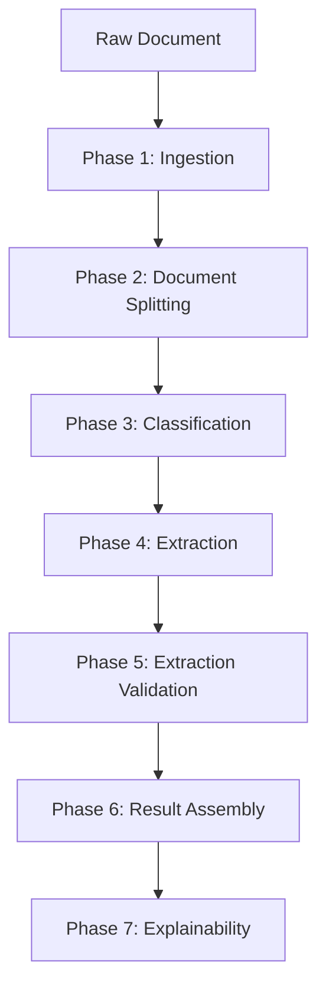

# Use Case: Intelligent Document Processing (IDP)

Copyright 2026 Firefly Software Solutions Inc. Licensed under the Apache License 2.0.

This guide demonstrates how to build a production-grade Intelligent Document Processing
pipeline using fireflyframework-genai. The pipeline takes a raw document (PDF, image,
or scanned file), splits it into logical sub-documents, classifies each one, extracts
structured data, validates the results, assembles a final output, and generates an
LLM-powered explainability narrative -- all orchestrated as a 7-node DAG pipeline with
agents, reasoning patterns, chunking, compression, validation, and explainability.

---

## Pipeline Overview



The seven phases map directly to DAG nodes. Each phase uses a specialised agent and
the framework's content, validation, reasoning, and explainability modules.

> **Running example:** See `examples/idp_pipeline.py` for a complete, runnable
> implementation that downloads a real 33-page Unilever PDF and processes it through
> all seven phases.

---

## Phase 1: Ingestion

The ingestion phase downloads or reads the raw document (PDF, image, or scanned file)
and converts it into text. For text-based PDFs, a tool like `pdfplumber` extracts
the raw text with page markers. The extracted text is then chunked and compressed
if needed.

```python
from fireflyframework_genai.content.chunking import TextChunker
from fireflyframework_genai.content.compression import ContextCompressor, TruncationStrategy

# Chunk the extracted text
chunker = TextChunker(chunk_size=20_000, chunk_overlap=200, strategy="token")
chunks = chunker.chunk(raw_text)

# Compress if necessary
compressor = ContextCompressor(strategy=TruncationStrategy(max_tokens=100_000))
compressed = compressor.compress(raw_text, max_tokens=100_000)
```

---

## Phase 2: Document Splitting

Real-world PDFs often contain multiple logical documents (e.g. a certificate of
incorporation followed by bylaws). The splitting phase uses a `FireflyAgent` to
analyse page-level summaries and detect document boundaries.

```python
from fireflyframework_genai.agents import FireflyAgent

splitter_agent = FireflyAgent(
    name="document_splitter",
    model="openai:gpt-4o",
    instructions="Analyse page summaries and detect document boundaries.",
    output_type=dict,
    auto_register=False,
)

# Feed page summaries (first ~120 chars per page) to the agent
result = await splitter_agent.run(split_prompt.render(page_summaries=summaries))
# Returns boundaries like: [{"title": "Certificate", "page_start": 1, "page_end": 4}, ...]
```

Each detected sub-document is then processed independently through the remaining
pipeline phases (classify, extract, validate).

---

## Phase 3: Classification

The classifier agent categorises each sub-document (certificate of incorporation,
bylaws, corporate filing, etc.) using `create_classifier_agent` with category
descriptions and a Plan-and-Execute reasoning pattern for systematic analysis.

```python
from fireflyframework_genai.agents.templates import create_classifier_agent

DOCUMENT_TYPES = ["certificate_of_incorporation", "bylaws", "corporate_filing", "amendment", "other"]
DOCUMENT_TYPE_DESCRIPTIONS = {
    "certificate_of_incorporation": "The founding charter filed with the Secretary of State...",
    "bylaws": "The internal governance rules adopted by the board...",
    # ...
}

classifier_agent = create_classifier_agent(
    categories=DOCUMENT_TYPES,
    descriptions=DOCUMENT_TYPE_DESCRIPTIONS,
    name="idp_classifier",
    model="openai:gpt-4o",
)

# Classify with Plan-and-Execute reasoning
result = await classifier_agent.run_with_reasoning(
    sub_document.text, pattern="plan_and_execute"
)
```

For multi-page documents, use `ImageTiler` to split large scans:

```python
from fireflyframework_genai.content.chunking import ImageTiler

tiler = ImageTiler(tile_width=1024, tile_height=1024, overlap=64)
tiles = tiler.compute_tiles(image_width=4096, image_height=6144)
```

---

## Phase 4: Extraction

The extraction agent pulls structured fields from each sub-document using
`create_extractor_agent` wrapped in an `OutputReviewer` for automatic retry on
validation failures. A custom retry prompt avoids resending the full document text
on each retry, focusing only on the errors.

```python
from fireflyframework_genai.agents.templates import create_extractor_agent
from fireflyframework_genai.validation import OutputReviewer, OutputValidator
from fireflyframework_genai.validation.rules import RegexRule, FormatRule, EnumRule

extractor_agent = create_extractor_agent(
    CorporateDocumentData,  # Pydantic model
    name="idp_extractor",
    model="openai:gpt-4o",
)

# Custom retry prompt that doesn't resend the full document
retry_prompt = """Your previous extraction had validation errors:
{errors}
Please correct the JSON output. Key reminders:
- doc_type must be one of the allowed values
- dates must be ISO 8601 (YYYY-MM-DD) or empty string
"""

reviewer = OutputReviewer(
    output_type=CorporateDocumentData,
    validator=field_validator,
    max_retries=4,
    retry_prompt=retry_prompt,
)
result = await reviewer.review(extractor_agent, extraction_prompt)
```

---

## Phase 5: Extraction Validation

The validation phase uses the framework's `OutputValidator` and `GroundingChecker`
to ensure extracted fields conform to business rules and are grounded in the source
text. If validation fails, the `ReflexionPattern` drives self-correction.

```python
from fireflyframework_genai.validation.rules import (
    OutputValidator,
    RegexRule,
    FormatRule,
    EnumRule,
)
from fireflyframework_genai.validation.qos import GroundingChecker
from fireflyframework_genai.reasoning import ReflexionPattern

# -- Structural validation --
validator = OutputValidator({
    "company_name": [RegexRule("company_name", r".{2,}")],
    "doc_type": [EnumRule("doc_type", DOCUMENT_TYPES)],
    "incorporation_state": [RegexRule("incorporation_state", r"^[A-Z][a-zA-Z\s]+$|^$")],
    "filing_number": [RegexRule("filing_number", r"^[\w\s\-./]+$|^$")],
    "effective_date": [FormatRule("effective_date", "iso_date")],
})
validation_report = validator.validate(extracted_data)

if not validation_report.valid:
    # Self-correct with Reflexion
    reflexion = ReflexionPattern(max_steps=2)
    corrected = await reflexion.execute(
        extractor_agent,
        f"The previous extraction had errors: {validation_report.errors}. "
        f"Re-extract from the document.",
    )
    extracted_data = corrected.output

# -- Grounding check --
grounding = GroundingChecker()
score, field_map = grounding.check(
    source_text=sub_document.text,
    extracted_fields=extracted_data if isinstance(extracted_data, dict) else {},
)
print(f"Grounding score: {score:.0%}")
```

---

## Phase 6: Result Assembly

The assembly phase merges classification, extraction, and validation results from
all sub-documents into a unified output object.

```python
assembled = {
    "pipeline": "idp-pipeline",
    "source_pdf": pdf_url,
    "total_pages": page_count,
    "sub_document_count": len(sub_documents),
    "documents": [
        {
            "doc_id": sub_doc.doc_id,
            "title": sub_doc.title,
            "pages": f"{sub_doc.page_start}-{sub_doc.page_end}",
            "classification": classification_result,
            "extraction": extraction_result,
            "validation": validation_result,
        }
        for sub_doc in sub_documents
    ],
}
```

---

## Phase 7: Explainability

The final phase uses the framework's explainability module to produce a comprehensive
audit report. A `FireflyAgent` reads the trace records, audit trail, and assembled
output to generate a human-readable narrative covering the full pipeline run.

```python
from fireflyframework_genai.agents import FireflyAgent
from fireflyframework_genai.explainability import TraceRecorder, AuditTrail, ReportBuilder

# The trace recorder and audit trail have been collecting data throughout the pipeline
recorder = TraceRecorder()
audit = AuditTrail()

# LLM-powered narrative generation
explainer_agent = FireflyAgent(
    name="idp_explainer",
    model="openai:gpt-4o",
    instructions="You are an expert technical writer producing an explainability report.",
    auto_register=False,
)
narrative = await explainer_agent.run(
    explainability_prompt.render(
        trace_records=recorder.decisions,
        audit_trail=audit.entries,
        assembled_output=assembled,
    )
)

# Structured report
report = ReportBuilder()
report.add_decisions(recorder.decisions)
report.add_explanation(narrative.output)
json_report = report.build_json()
```

---

## Wiring It All as a DAG Pipeline

Add memory to persist conversation across phases and carry facts like classification
results into later steps.

```python
from fireflyframework_genai.memory import MemoryManager
memory = MemoryManager(working_scope_id="idp-session")
```

Instead of running each phase manually, wire the entire flow as a DAG pipeline.
This gives you parallel execution, retries, timeouts, condition gates, and a full
execution trace for observability.

```python
from fireflyframework_genai.pipeline.builder import PipelineBuilder
from fireflyframework_genai.pipeline.steps import CallableStep
from fireflyframework_genai.pipeline.context import PipelineContext

# -- Build the 7-node pipeline DAG --

idp_pipeline = (
    PipelineBuilder("idp-pipeline")
    .add_node("ingest", CallableStep(ingest_step_fn))
    .add_node("split", CallableStep(split_step_fn))
    .add_node("classify", CallableStep(classify_step_fn))
    .add_node("extract", CallableStep(extract_step_fn))
    .add_node("validate", CallableStep(validate_step_fn))
    .add_node("assemble", CallableStep(assemble_step_fn))
    .add_node("explain", CallableStep(explain_step_fn))
    .chain("ingest", "split", "classify", "extract", "validate", "assemble", "explain")
    .build()
)

# -- Execute --

ctx = PipelineContext(
    inputs=document_bytes,
    metadata={"source": "email-inbox", "tenant_id": "acme-corp"},
)
result = await idp_pipeline.run(context=ctx)

if result.success:
    print(f"Nodes executed: {len(result.execution_trace)}")
    print(f"Total duration: {result.total_duration_ms}ms")
    for entry in result.execution_trace:
        print(f"  {entry.node_id}: {entry.status} ({entry.duration_ms}ms)")
else:
    print(f"Pipeline failed at: {result.failed_nodes}")
```

---

## Exposing the Pipeline via REST

Register the pipeline as a REST endpoint so it can be called from external systems:

```python
from fireflyframework_genai.exposure.rest import create_genai_app

# The IDP agents are already registered in the AgentRegistry.
# The REST app auto-generates endpoints for each agent.
app = create_genai_app()

# The pipeline itself can be exposed as a custom endpoint:
from fastapi import UploadFile

@app.post("/idp/process")
async def process_document(file: UploadFile):
    content = await file.read()
    ctx = PipelineContext(inputs=content, metadata={"filename": file.filename})
    result = await idp_pipeline.run(context=ctx)
    return result.model_dump()
```

---

## Key Framework Features Used

This use case exercises the following framework capabilities:

- **Agents** -- `FireflyAgent`, `create_classifier_agent` (with category descriptions),
  `create_extractor_agent` for structured data extraction.
- **Content chunking** -- `TextChunker`, `ImageTiler`, `BatchProcessor` for large docs.
- **Context compression** -- `TruncationStrategy` to fit within token budgets.
- **Reasoning patterns** -- `PlanAndExecute` for systematic classification, `Reflexion`
  for self-correction on validation failures.
- **Document splitting** -- LLM-powered boundary detection to handle multi-document PDFs.
- **Output validation** -- `RegexRule`, `FormatRule`, `EnumRule` for structural checks;
  `OutputReviewer` with custom retry prompts for automatic re-extraction.
- **QoS guards** -- `GroundingChecker` to detect ungrounded (hallucinated) fields.
- **Security** -- `PromptGuardMiddleware` (27 injection patterns) and
  `OutputGuardMiddleware` (PII, secrets, harmful content scanning) for defence-in-depth.
- **DAG pipeline** -- `PipelineBuilder`, `PipelineEngine` for 7-node orchestration with
  retries, exponential backoff with jitter, timeouts, and condition gates.
  `PipelineEventHandler` for real-time progress callbacks. `BranchStep` for
  conditional routing.
- **Tools** -- `CachedTool` for memoising deterministic tool calls; tool timeouts
  via `BaseTool(timeout=...)` for SLA enforcement.
- **Delegation** -- Four strategies: `RoundRobinStrategy`, `CapabilityStrategy`,
  `ContentBasedStrategy` (LLM routing), `CostAwareStrategy` (cheapest model selection).
- **Explainability** -- `TraceRecorder`, `AuditTrail`, `ReportBuilder`, plus an LLM
  agent for generating comprehensive human-readable narratives.
- **Memory** -- `MemoryManager` with working memory for inter-phase data sharing,
  `export_conversation()` / `import_conversation()` for backup and migration,
  `create_llm_summarizer()` for LLM-based conversation compression.
- **Middleware** -- 8 built-in middleware: Logging, PromptGuard, OutputGuard, CostGuard
  (with `warn_only`, `per_call_limit_usd`), Observability, Explainability, Cache,
  Validation.
- **Logging** -- `configure_logging` for structured framework-wide logging.
- **Exposure** -- REST API with authentication middleware (`add_auth_middleware`),
  WebSocket endpoint (`/ws/agents/{name}`), conversation CRUD endpoints, and
  SSE streaming.
- **Observability** -- `PipelineResult.execution_trace` for per-node timing and status;
  bounded `UsageTracker` with `max_records` for production memory management.
