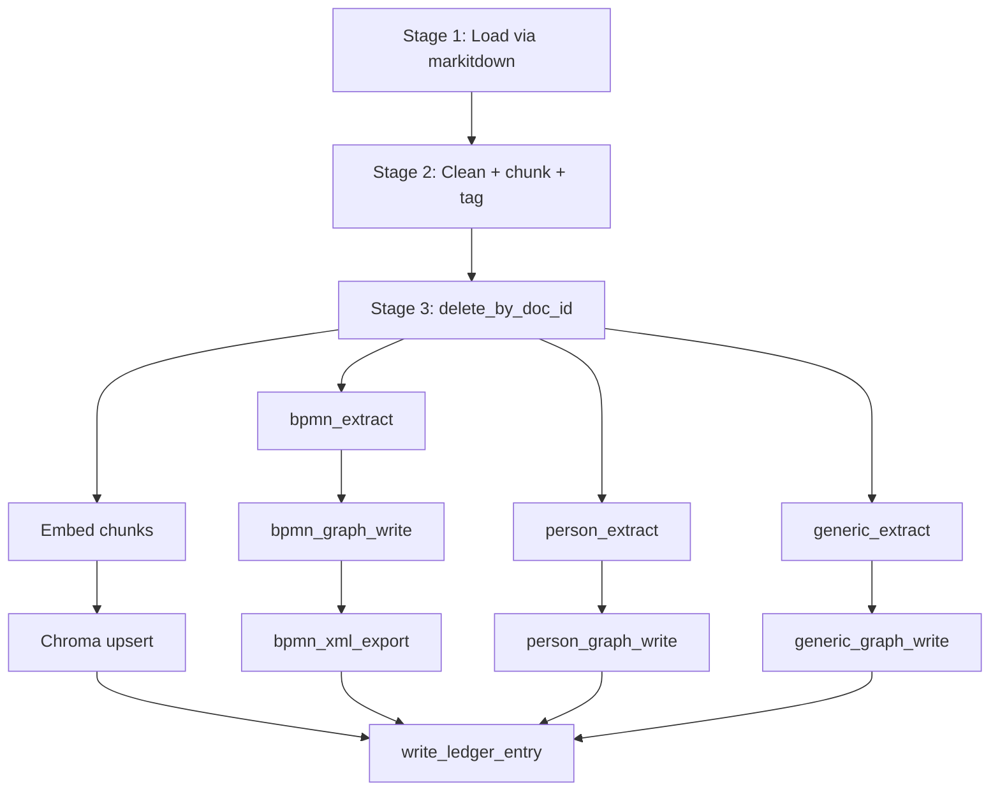

# Use Case: Knowledge-Graph Ingestion (`KGIngestAgent`)

Copyright 2026 Firefly Software Solutions Inc. Licensed under the Apache License 2.0.

| | |
|---|---|
| Status | Design — pre-implementation |
| Date | 2026-04-28 |
| Branch | `javi/markitdown` |

This guide specifies a modular agent built on `fireflyframework-agentic` that watches
or scans a folder for new documents, ingests them via `markitdown`, runs a configurable
fan-out of LLM extractors over each document, and writes the results into a
knowledge graph plus a chunk vector index. V1 ships three extractors — `bpmn`,
`person`, and `generic` — and emits a `.bpmn` 2.0 XML artifact for the BPMN extractor.

---

## 1. Goal

A **modular** ingestion agent: drop a file into a folder, get nodes and edges in the
graph plus a `.bpmn` file alongside it (when applicable). The unit of modularity is the
**extractor**: a Python plugin defining a system prompt, a Pydantic output schema, and a
mapping from that schema to graph nodes and edges. V1 includes:

- **`bpmn`** — process-modeling entities (`Task`, `Gateway`, `SequenceFlow`,
  `StartEvent`, `EndEvent`, `Pool`, `Lane`). Emits a `.bpmn` 2.0 XML file as a
  downstream artifact.
- **`person`** — `Person`, `Organization`, and employment-style relations.
- **`generic`** — open-world entity-relation extraction for everything else, modeled
  on the LightRAG-style entity/relation pattern (the prompt template carries
  attribution to that public source in its file header; the name "LightRAG" does
  not appear elsewhere in the codebase).

V1 scope is **ingestion + BPMN export**. Natural-language Q&A over the graph is V2.
Chunk vectors are still written during ingestion so V2 retrieval is ready when needed.

---

## 2. Storage & deployment constraint (firm)

All persistent state lives on disk under a single root folder (default `./kg/`).
All dependencies are Python libraries — no daemons, no servers, no docker, no external
services, no cloud-only stores. The agent runs as a single Python process.

| Concern | Mechanism |
|---|---|
| Graph + ledger | SQLite (`./kg/graph.sqlite`, WAL mode) |
| Chunk vectors | Chroma `PersistentClient` (`./kg/chroma/`) |
| BPMN outputs | `./kg/out/<doc_id>.bpmn` |
| File watching | `watchfiles` (in-process) |
| Document loading | `markitdown[pdf,docx,pptx,xlsx]` |
| BPMN serialization | In-house lxml-based serializer (~150 LOC) |

The only network calls in the V1 pipeline are to **Anthropic** (extractor LLM) and
**OpenAI** (chunk embeddings). No backend depends on anything outside the Python
process or its on-disk state.

---

## 3. Decisions consolidated

| # | Decision |
|---|---|
| Pipeline shape | Fan-out across enabled extractors per document; same graph, different node labels |
| Trigger | Batch CLI primary; watcher (`watchfiles`) wraps the same code path |
| Graph backend | SQLite behind a new `GraphStoreProtocol` (swappable) |
| Vector store | Chroma `PersistentClient` |
| Ledger | Co-located in `graph.sqlite` as the `ingestions` table |
| Extractor registration | Code-based plugin contract; prompts live as Jinja files |
| Re-ingestion | Doc-id replace (delete by `source_doc_id`, then re-extract) |
| Failure isolation | Per-extractor `SKIP_DOWNSTREAM`; ledger marks `partial` if any extractor failed |
| LLM (extraction) | `anthropic:claude-haiku-4-5-20251001`; env `ANTHROPIC_API_KEY` |
| Embeddings | `openai:text-embedding-3-small`; env `OPENAI_API_KEY` |
| Concurrency | Files processed serially in V1 |
| Config surface | CLI flags only (no config file) |
| Default `--root` | `./kg` |
| Default `--extractors` | `bpmn,person,generic` (all enabled) |

---

## 4. Architecture

### 4.1 Pipeline overview



Five logical stages map onto a DAG built with the framework's existing primitives
(`PipelineBuilder`, `CallableStep`, `AgentStep`, `EmbeddingStep`, `BranchStep`). Each
extractor branch carries `FailureStrategy.SKIP_DOWNSTREAM`; the ledger fan-in always
runs.

### 4.2 Framework additions

Three additive modules. No breaking changes to existing surfaces.

```
src/fireflyframework_agentic/
├── graphstores/                          [NEW]
│   ├── __init__.py
│   ├── protocol.py                       # GraphStoreProtocol, Node, Edge
│   └── sqlite.py                         # SqliteGraphStore implementation
├── content/loaders/                      [NEW dir]
│   └── markitdown.py                     # MarkitdownLoader -> Document(content, metadata)
└── pipeline/triggers/                    [NEW dir]
    └── folder_watcher.py                 # FolderWatcher (events + stability + reconciliation)
```

`pyproject.toml` adds optional extras:

- `[graph-sqlite]` — empty placeholder (sqlite is stdlib); reserved alongside a
  potential future `[graph-duckdb]`.
- `[markitdown]` — `markitdown[pdf,docx,pptx,xlsx]`.
- `[watch]` — `watchfiles`.
- `[kg-ingest]` — convenience umbrella that pulls all of the above.

### 4.3 The agent (composes framework primitives)

```
examples/kg_ingest/
├── __init__.py                # exports KGIngestAgent
├── agent.py                   # KGIngestAgent — high-level facade
├── extractors/
│   ├── __init__.py            # EXTRACTORS registry
│   ├── base.py                # Extractor protocol
│   ├── bpmn.py                # schema + mapper + .bpmn post-step
│   ├── person.py              # schema + mapper
│   └── generic.py             # schema + mapper (Entity/Relation)
├── prompts/
│   ├── bpmn.j2
│   ├── person.j2
│   └── generic.j2             # header notes inspiration; no "LightRAG" in code
├── pipeline.py                # build_pipeline(extractors, paths) -> PipelineEngine
├── ledger.py                  # IngestLedger (reads/writes ingestions table)
├── bpmn_serializer.py         # in-house BPMN 2.0 XML emitter (lxml)
├── cli.py                     # python -m examples.kg_ingest --folder ./drop [--watch]
└── tests/
    ├── test_extractors.py
    ├── test_graph_store.py
    ├── test_pipeline.py
    └── fixtures/
```

### 4.4 Default storage layout

```
./kg/
├── graph.sqlite               # nodes, edges, ingestions (single SQLite file)
├── chroma/                    # Chroma PersistentClient
└── out/
    └── <doc_id>.bpmn          # one per document the BPMN extractor succeeded on
```

---

## 5. Component contracts

### 5.1 Extractor protocol

```python
class Extractor(Protocol):
    name: str                                                              # registry key
    output_schema: type[BaseModel]                                         # what the agent returns
    prompt: PromptTemplate                                                 # Jinja, declared variables
    def build_agent(self, model: str) -> FireflyAgent: ...                 # via create_extractor_agent
    def to_graph(
        self, doc: IngestedDoc, output: BaseModel
    ) -> tuple[list[Node], list[Edge]]: ...
    post_step: PostExtractStep | None = None                               # e.g. BPMN-XML emitter
```

Adding a new extractor = drop a Python file under `extractors/` and register it in
`EXTRACTORS`.

### 5.2 `GraphStoreProtocol`

```python
class GraphStoreProtocol(Protocol):
    async def upsert_nodes(self, nodes: Sequence[Node]) -> None: ...
    async def upsert_edges(self, edges: Sequence[Edge]) -> None: ...
    async def delete_by_doc_id(self, doc_id: str) -> int: ...
    async def query(self, sql: str, params: dict) -> list[dict]: ...
    async def close(self) -> None: ...
```

`Node`: `(label, key, properties, source_doc_id, extractor_name, chunk_ids)`.
`Edge`: `(label, source_label, source_key, target_label, target_key, properties, source_doc_id, extractor_name)`.

### 5.3 SQLite schema

```sql
PRAGMA journal_mode = WAL;
PRAGMA synchronous = NORMAL;
PRAGMA foreign_keys = ON;

CREATE TABLE nodes (
  source_doc_id   TEXT NOT NULL,
  label           TEXT NOT NULL,
  key             TEXT NOT NULL,
  properties      TEXT NOT NULL,                  -- JSON; includes 'aliases' array where applicable
  extractor_name  TEXT NOT NULL,
  chunk_ids       TEXT NOT NULL,                  -- JSON array
  PRIMARY KEY (source_doc_id, label, key)
);
CREATE INDEX idx_nodes_doc       ON nodes(source_doc_id);
CREATE INDEX idx_nodes_label     ON nodes(label);
CREATE INDEX idx_nodes_label_key ON nodes(label, key);          -- exact-match lookup (person/org by name)

CREATE TABLE edges (
  source_doc_id   TEXT NOT NULL,
  label           TEXT NOT NULL,
  source_label    TEXT NOT NULL,
  source_key      TEXT NOT NULL,
  target_label    TEXT NOT NULL,
  target_key      TEXT NOT NULL,
  properties      TEXT NOT NULL,                  -- JSON
  extractor_name  TEXT NOT NULL
);
CREATE INDEX idx_edges_doc                ON edges(source_doc_id);
CREATE INDEX idx_edges_endpoints          ON edges(source_label, source_key, target_label, target_key);
CREATE INDEX idx_edges_endpoints_reverse  ON edges(target_label, target_key, source_label, source_key);

-- Full-text search over node names + descriptions + aliases for fuzzy keyword lookup.
-- Auto-populated from `nodes` via triggers; uses unicode61 with diacritic stripping.
CREATE VIRTUAL TABLE nodes_fts USING fts5(
  source_doc_id  UNINDEXED,
  label          UNINDEXED,
  key,                                             -- canonical name
  text,                                            -- key + aliases + description, space-joined
  tokenize='unicode61 remove_diacritics 2'
);

-- Triggers (sketch — implementation-time): AFTER INSERT/UPDATE/DELETE on `nodes`
-- INSERT/UPDATE/DELETE the corresponding `nodes_fts` row, materialising
-- `text` from `key`, `properties->>'$.description'`, and the joined
-- `properties->>'$.aliases'` array.

-- Symmetric FTS over edge properties (e.g. WORKS_AT.role, BPMN flow conditions,
-- relation descriptions). Lets queries like "list all CEOs" match across
-- "CEO" / "Chief Executive Officer" / "chief executive" in one call.
CREATE VIRTUAL TABLE edges_fts USING fts5(
  source_doc_id  UNINDEXED,
  label          UNINDEXED,
  source_label   UNINDEXED,
  source_key     UNINDEXED,
  target_label   UNINDEXED,
  target_key     UNINDEXED,
  text,                                            -- materialised from properties (role + condition + description)
  tokenize='unicode61 remove_diacritics 2'
);

-- Triggers (implementation-time): AFTER INSERT/UPDATE/DELETE on `edges`
-- maintain `edges_fts.text` from the joined string content of edge properties.

CREATE TABLE ingestions (
  doc_id              TEXT PRIMARY KEY,
  source_path         TEXT NOT NULL,
  content_hash        TEXT NOT NULL,
  status              TEXT NOT NULL,              -- success | partial | failed | load_failed
  partial_extractors  TEXT,                       -- JSON array of failed extractor names
  ingested_at         TEXT NOT NULL,              -- ISO 8601
  attempt             INTEGER NOT NULL DEFAULT 1
);
```

JSON columns are queried via SQLite's built-in JSON1 (`json_extract`, `json_each`).
FTS5 is available if V2 wants keyword search.

### 5.4 Generic extractor schema

```python
class Entity(BaseModel):
    name: str                                  # canonical name (most formal/complete form)
    aliases: list[str] = []                    # other forms used in the same document
    type: str
    description: str

class Relation(BaseModel):
    source: str                                # references Entity.name
    target: str                                # references Entity.name
    type: str
    description: str

class GenericExtraction(BaseModel):
    entities: list[Entity]
    relations: list[Relation]
```

Graph mapping: each `Entity` becomes a node with `label="Entity"`, `key=name`,
`properties={type, description, aliases}`. Each `Relation` becomes an edge with
`label=relation.type.upper()`, source/target keyed by entity `name`. Names are deduped
within a document. Aliases are indexed by FTS5 alongside `key` and `description`,
making fuzzy lookups robust to within-doc spelling variation. Cross-doc resolution is
V2 (section 10).

### 5.5 BPMN extractor schema (sketch)

```python
class BpmnNode(BaseModel):
    id: str
    type: Literal["Task", "Gateway", "StartEvent", "EndEvent", "Pool", "Lane"]
    name: str
    parent: str | None = None                           # for Pool/Lane containment

class BpmnFlow(BaseModel):
    source_id: str
    target_id: str
    condition: str | None = None

class BpmnExtraction(BaseModel):
    nodes: list[BpmnNode]
    flows: list[BpmnFlow]
```

The BPMN XML post-step queries the graph by `source_doc_id` and emits BPMN 2.0 XML via
the in-house serializer (`bpmn_serializer.py`).

### 5.6 Person extractor schema (sketch)

```python
class Person(BaseModel):
    name: str                                  # canonical / most formal form found in the doc
    aliases: list[str] = []                    # other forms used in the same doc ("Sam", "S. Altman")
    title: str | None = None
    bio: str | None = None

class Organization(BaseModel):
    name: str                                  # canonical name
    aliases: list[str] = []                    # "OpenAI Inc.", "OpenAI, Inc.", abbreviations
    type: str | None = None

class WorksAt(BaseModel):
    person: str                                # references Person.name
    organization: str                          # references Organization.name
    role: str | None = None
    start: str | None = None
    end: str | None = None

class PersonExtraction(BaseModel):
    persons: list[Person]
    organizations: list[Organization]
    employments: list[WorksAt]
```

The prompt instructs the LLM to pick the most formal name as `name` and list any
other forms found in the same document as `aliases`. The graph mapper stores
`aliases` as a JSON property on the node; the FTS5 trigger then materialises both
the canonical name and aliases into the searchable `text` column, so a fuzzy query
for `"Sam"` retrieves the canonical `"Sam Altman"` node.

The prompt also nudges the LLM toward canonical short forms for common employment
roles ("CEO" rather than "Chief Executive Officer", "CTO" rather than "Chief
Technology Officer", "VP" rather than "Vice President"). This is soft normalization
without an enforced enum — original phrasings are kept when qualitatively distinct.
`edges_fts` (section 5.3) handles whatever long-form variations remain at query
time.

**Within-doc disambiguation only.** Cross-doc resolution (the same human extracted
from two different documents under different formal names) is a V2 feature — see
section 10.

### 5.7 `IngestLedger`

Thin wrapper over the `ingestions` table. Operations:

- `should_skip(path) -> bool` — returns `True` if `status='success'` and
  `content_hash` matches the file's current content.
- `record_attempt(doc_id, source_path, content_hash) -> int` — bumps `attempt`,
  returns the new value.
- `upsert(doc_id, status, partial_extractors)` — finalises a row after pipeline
  completion.

### 5.8 `KGIngestAgent` (high-level facade)

```python
class KGIngestAgent:
    def __init__(
        self,
        root: Path,
        extractors: list[Extractor],
        model: str,
        embed_model: str,
    ): ...

    async def ingest_one(self, path: Path) -> IngestionResult: ...
    async def ingest_folder(self, folder: Path) -> list[IngestionResult]: ...
    async def watch(self, folder: Path) -> AsyncIterator[IngestionResult]: ...
    async def close(self) -> None: ...
```

`ingest_one` is the unit of work. `ingest_folder` calls it serially. `watch` calls it
in response to filesystem events.

---

## 6. Data flow per file

`doc_id = sha256(absolute_path)[:16]` — deterministic across watcher restarts.

1. **Load**: `MarkitdownLoader.load(path)` returns `Document(content, metadata)`. On
   exception → ledger `load_failed`, stop.
2. **Preprocess**: `TextChunker` splits into chunks with metadata
   `{doc_id, source_path, content_hash, chunk_id}`.
3. **Reset**: `graph_store.delete_by_doc_id(doc_id)` and the equivalent vector-store
   delete clear any prior state for this document.
4. **Fan-out** (parallel branches):
   - `embed_chunks` → vector-store upsert.
   - `bpmn_extract` (`AgentStep`) → `bpmn_graph_write` → `bpmn_xml_export`
     (`out/<doc_id>.bpmn`).
   - `person_extract` → `person_graph_write`.
   - `generic_extract` → `generic_graph_write`.
5. **Fan-in**: `write_ledger_entry` runs unconditionally and records the run's status.

Each extractor branch uses `FailureStrategy.SKIP_DOWNSTREAM`: if `*_extract` fails,
its `*_graph_write` (and the BPMN XML export) is skipped, but other branches proceed.

---

## 7. Error handling & idempotency

| Failure | Behaviour |
|---|---|
| `load_markitdown` raises | Ledger `load_failed`. No graph or vector writes. |
| `preprocess` raises | Ledger `failed`. No writes. |
| One extractor fails (timeout, schema, LLM error) | Branch `SKIP_DOWNSTREAM`. Other branches proceed. Ledger `partial`, `partial_extractors` lists the failures. |
| All extractors and embedding fail | Ledger `failed`. Doc has nothing in graph or vectors. |
| Mixed success | Ledger `partial`. |

**Re-ingestion always full-replaces.** Re-running a `partial` doc deletes all of its
prior nodes, edges, and chunk vectors via `delete_by_doc_id`, then re-runs every
extractor. There is no "rerun-only-failed" shortcut in V1.

**Watcher specifics:**

- `watchfiles.awatch` event stream.
- 500 ms debounce on rapid-fire events for the same path.
- Stability check: file size unchanged across two polls 200 ms apart before
  processing (prevents reading a half-written file).
- On startup, scan the folder and reconcile against the ledger to catch files dropped
  while the watcher was down.

---

## 8. Testing strategy

### 8.1 Unit (no LLM)

- Each extractor's `to_graph(...)`: fixture Pydantic instance → asserted node and
  edge shape.
- Prompt template rendering for each extractor.
- `SqliteGraphStore` round-trips: upsert, query, delete-by-doc-id.
- `IngestLedger` state transitions.
- `MarkitdownLoader` smoke test against small fixtures (one PDF, one DOCX, one HTML).
- `FolderWatcher` debounce + stability via simulated `watchfiles` event stream.
- `bpmn_serializer` golden-file test against a known-shape `BpmnExtraction`.

### 8.2 Integration (fake LLM)

- Full pipeline with stub extractor agents that return canned Pydantic outputs.
  Verify nodes, edges, chunks, ledger row, and BPMN file end-state in a tmpdir.
- Failure injection: one extractor raises → ledger `partial`, others land; re-ingest
  full-replaces and now lands all three.
- Re-ingest with same hash → skipped via ledger.

### 8.3 End-to-end (real LLM, gated)

- Drop a small fixture PDF in tmpdir → run batch CLI → assert non-empty nodes,
  non-empty edges, BPMN XML file exists. Skipped unless both `ANTHROPIC_API_KEY` and
  `OPENAI_API_KEY` are set.

### 8.4 Regression

- All existing examples (`basic_agent.py`, `idp_pipeline.py`, etc.) must continue to
  pass; framework changes are additive behind extras.

---

## 9. CLI surface

```bash
python -m examples.kg_ingest \
    --folder ./drop \
    [--root ./kg] \
    [--extractors bpmn,person,generic] \
    [--model anthropic:claude-haiku-4-5-20251001] \
    [--embed-model openai:text-embedding-3-small] \
    [--watch] \
    [--verbose]
```

Both API keys read from the environment or a `.env` file (matching the recent
`python-dotenv` refactor across the existing examples).

---

## 10. V2 trajectory (out of scope; noted only)

- **Q&A / query agent** over `(graph, vectors, FTS)` using
  `anthropic:claude-sonnet-4-6` with tool-use. Likely architecture: a small set of
  typed retrieval tools (`find_entity`, `find_relations`, `neighbors`,
  `chunk_search`) backed by FTS5, the endpoint indexes, and Chroma; a raw-SQL
  escape hatch for novel queries; and a result-blending layer. V1 ships **no** NL
  query interface — direct SQL via `graph_store.query()` or `sqlite3` is the V1
  surface for retrieving data. The FTS and index additions in V1 are precisely the
  substrate this agent needs.
- **Canonical role vocabulary** for the Person extractor — a closed set of
  ~30 normalised employment roles (C-suite, founders, directors, VPs, ICs, board
  positions) plus an LLM normalization pass at ingest that maps free-text titles
  to a canonical entry while preserving the original as `role_text`. Adds an
  indexed `role_canonical` column on `WORKS_AT` for instant strict filtering.
  Replaces V1's fuzzy-at-query approach with structured-at-ingest precision.
- **Cross-document entity resolution.** V1 disambiguates only within a single
  document — "Sam Altman" in Doc A and "Samuel Altman" in Doc B remain separate
  `Person` nodes. V2 adds a resolution pass at ingest or as a periodic batch:
  candidate match via name embeddings (or `nodes_fts MATCH`) over existing nodes,
  then an LLM merge decision ("is this the same entity?"). Merged nodes get a
  canonical record with provenance back to the contributing per-doc records.
- `--concurrency N` for parallel file processing (write-serialised through a queue).
- Optional collapse of Chroma into the same SQLite file via `sqlite-vss` if a single-
  file backing becomes a hard requirement.
- Optional `DuckDBGraphStore` sibling implementation if columnar analytics or
  DuckPGQ-style pattern matching become useful.

---

## 11. Risks & mitigations

| Risk | Mitigation |
|---|---|
| `markitdown` PDF rendering quality varies | Start with markitdown; fall back to per-format adapters (e.g. `pdfplumber`, as the IDP example uses) if quality issues surface in practice. |
| BPMN extractor schema may not capture every diagram nuance | V1 supports the common subset (Task, Gateway, SequenceFlow, StartEvent, EndEvent, Pool, Lane). Out-of-schema elements are logged as warnings; the BPMN file emits with the recognised subset. |
| LLM extraction hallucinations | Wrap extractor agents with `OutputValidator` + `GroundingChecker` (already in framework). |
| Cost runaway (3x LLM per doc) | `CostGuardMiddleware` budget cap; `--model` flag for cheaper variants. |
| Single-writer SQLite under future parallel ingest | V1 is serial. A future `--concurrency N` serialises writes through a small queue; reads remain concurrent in WAL mode. |
| Watcher misses a file during downtime | Startup scan reconciles against the ledger; missed files are picked up on next launch. |
| **No cross-doc entity resolution in V1** — same entity under different names across documents creates separate nodes (e.g. "Sam Altman" in one doc, "Samuel Altman" in another) | Mitigated for retrieval by FTS5 over names + aliases + descriptions: a fuzzy query returns all variants. True merging into a single canonical record is a V2 feature (section 10). |

---

## 12. Open assumptions

1. OpenAI embeddings (`text-embedding-3-small`) require `OPENAI_API_KEY` in env;
   embedding failures are treated as document-level failures.
2. An `EmbedderProtocol` is available (or added) so the embedding provider is
   swappable; OpenAI is the V1 default. Local embedding is a future option but **not**
   V1.
3. Provenance from a graph node back to source chunk text is via `chunk_ids` joined
   to Chroma by `(doc_id, chunk_id)` — supported by the existing
   `VectorStoreProtocol`.
4. License header on each new file follows the existing repo convention
   ("Copyright 2026 Firefly Software Solutions Inc. Licensed under the Apache
   License 2.0.").

---

## 13. Glossary

- **Extractor** — A pluggable component combining an LLM system prompt, a Pydantic
  output schema, and a function from that schema to graph nodes and edges.
- **Doc-id replace** — The re-ingestion semantic: deleting all nodes, edges, and chunk
  vectors carrying a given `source_doc_id` before re-running every extractor.
- **Partial** — A document for which at least one extractor failed but at least one
  succeeded; recorded in the ledger so an operator can re-run after fixing the
  failing prompt.
- **`KGIngestAgent`** — The high-level facade combining `MarkitdownLoader`,
  `TextChunker`, the graph store, the vector store, the extractor registry, the
  ledger, and the optional folder watcher.
