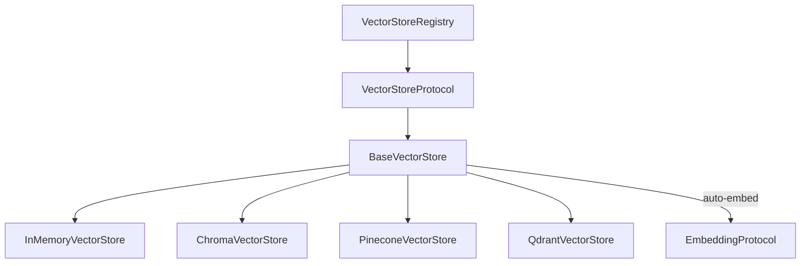

# Vector Stores Guide

Copyright 2026 Firefly Software Solutions Inc. Licensed under the Apache License 2.0.

The Vector Stores module provides pluggable storage and retrieval backends for
embedding vectors. It supports in-memory, ChromaDB, Pinecone, and Qdrant backends
with a unified API for upserting, searching, and deleting documents.

---

## Architecture



- **VectorStoreProtocol** -- Duck-typed protocol with `upsert()`, `search()`, `search_text()`, `delete()`.
- **BaseVectorStore** -- Abstract base providing auto-embedding, `search_text` convenience, and error wrapping.
- **Concrete Backends** -- Backend-specific implementations that override `_upsert()`, `_search()`, `_delete()`.
- **VectorStoreRegistry** -- Named registry for managing multiple store instances.

---

## Quick Start

```python
from fireflyframework_genai.embeddings.providers import OpenAIEmbedder
from fireflyframework_genai.vectorstores import InMemoryVectorStore, VectorDocument

# Create a store with auto-embedding
embedder = OpenAIEmbedder()
store = InMemoryVectorStore(embedder=embedder)

# Upsert documents (auto-embeds if embedding is None)
docs = [
    VectorDocument(id="1", text="Python is great for AI"),
    VectorDocument(id="2", text="JavaScript runs in browsers"),
    VectorDocument(id="3", text="Rust is fast and safe"),
]
await store.upsert(docs)

# Search by text (embeds the query, then searches)
results = await store.search_text("programming languages for machine learning", top_k=2)
for r in results:
    print(f"{r.document.text} (score: {r.score:.3f})")
```

---

## Backends

### In-Memory

Zero-dependency, brute-force cosine similarity. Ideal for development and testing.

```python
from fireflyframework_genai.vectorstores import InMemoryVectorStore

store = InMemoryVectorStore(embedder=my_embedder)
```

No extra install required.

### ChromaDB

```python
from fireflyframework_genai.vectorstores import ChromaVectorStore

# Ephemeral (in-process)
store = ChromaVectorStore(collection_name="my_docs", embedder=my_embedder)

# With a persistent/remote client
import chromadb
client = chromadb.HttpClient(host="localhost", port=8000)
store = ChromaVectorStore(collection_name="my_docs", client=client, embedder=my_embedder)
```

Install: `pip install fireflyframework-genai[vectorstores-chroma]`

### Pinecone

```python
from fireflyframework_genai.vectorstores import PineconeVectorStore

store = PineconeVectorStore(
    index_name="my-index",
    api_key="...",           # falls back to PINECONE_API_KEY env var
    embedder=my_embedder,
)
```

Install: `pip install fireflyframework-genai[vectorstores-pinecone]`

### Qdrant

```python
from fireflyframework_genai.vectorstores import QdrantVectorStore

store = QdrantVectorStore(
    collection_name="my_collection",
    url="http://localhost:6333",    # default
    api_key="...",                  # for Qdrant Cloud
    vector_size=1536,               # must match your embedder dimensions
    embedder=my_embedder,
)
```

Install: `pip install fireflyframework-genai[vectorstores-qdrant]`

---

## Core Types

### VectorDocument

```python
from fireflyframework_genai.vectorstores import VectorDocument

doc = VectorDocument(
    id="unique-id",              # required
    text="The document text",    # required
    embedding=[0.1, 0.2, ...],  # optional (auto-embedded if None)
    metadata={"source": "web"}, # optional key-value metadata
    namespace="default",        # optional namespace scoping
)
```

### SearchResult

```python
from fireflyframework_genai.vectorstores import SearchResult

# Returned by search() and search_text()
result.document   # VectorDocument
result.score      # float (0.0 to 1.0, higher = more similar)
```

### SearchFilter

```python
from fireflyframework_genai.vectorstores import SearchFilter

# Supported operators: eq, ne, gt, lt, gte, lte, in
filters = [
    SearchFilter(field="source", operator="eq", value="web"),
    SearchFilter(field="year", operator="gte", value=2024),
]
results = await store.search(query_embedding, filters=filters)
```

Note: Filter operator support varies by backend. `eq` is universally supported.
InMemoryVectorStore supports all 7 operators. External backends support `eq` and `in`.

---

## Namespaces

All operations accept a `namespace` parameter to isolate documents:

```python
await store.upsert(docs, namespace="project-a")
await store.upsert(docs, namespace="project-b")

# Search only within a namespace
results = await store.search_text("query", namespace="project-a")

# Delete only within a namespace
await store.delete(["id-1"], namespace="project-a")
```

---

## Auto-Embedding

When a `BaseVectorStore` has an embedder configured, documents without embeddings
are automatically embedded during `upsert()`:

```python
store = InMemoryVectorStore(embedder=my_embedder)

# These docs have no embedding -- they'll be auto-embedded
docs = [VectorDocument(id="1", text="Hello")]
await store.upsert(docs)  # embedder.embed() called automatically
```

The `search_text()` method embeds the query string before searching:

```python
# Equivalent to: embedding = await embedder.embed_one(query); store.search(embedding)
results = await store.search_text("my query")
```

---

## Registry

```python
from fireflyframework_genai.vectorstores import VectorStoreRegistry, InMemoryVectorStore

registry = VectorStoreRegistry()
registry.register("memory", InMemoryVectorStore(embedder=my_embedder))

store = registry.get("memory")
await store.upsert(docs)
```

---

## Configuration

Global defaults via environment variables (prefix `FIREFLY_GENAI_`):

| Setting | Env Variable | Default |
|---------|-------------|---------|
| `default_vector_store` | `FIREFLY_GENAI_DEFAULT_VECTOR_STORE` | `memory` |
| `vector_store_namespace` | `FIREFLY_GENAI_VECTOR_STORE_NAMESPACE` | `default` |

---

## Pipeline Integration (RAG)

Build retrieval-augmented generation workflows using pipeline steps:

```python
from fireflyframework_genai.pipeline import Pipeline, PipelineStep, RetrievalStep

# RetrievalStep embeds the query and searches the store
retrieval = RetrievalStep(
    store=my_store,
    embedder=my_embedder,
    top_k=5,
)

pipeline = Pipeline(
    steps=[
        PipelineStep(name="retrieve", executor=retrieval),
        # ... further steps (e.g., prompt augmentation, agent call)
    ]
)
result = await pipeline.execute("What is RAG?")
```

---

## Custom Backend

Subclass `BaseVectorStore` and implement three methods:

```python
from fireflyframework_genai.vectorstores.base import BaseVectorStore
from fireflyframework_genai.vectorstores.types import SearchFilter, SearchResult, VectorDocument

class MyVectorStore(BaseVectorStore):
    async def _upsert(self, documents: list[VectorDocument], namespace: str) -> None:
        # Store documents (embeddings are guaranteed to be present)
        ...

    async def _search(
        self,
        query_embedding: list[float],
        top_k: int,
        namespace: str,
        filters: list[SearchFilter] | None,
    ) -> list[SearchResult]:
        # Return top_k most similar documents
        ...

    async def _delete(self, ids: list[str], namespace: str) -> None:
        # Remove documents by ID within the namespace
        ...
```

See also: [Embeddings Guide](embeddings.md) for embedding provider setup.
